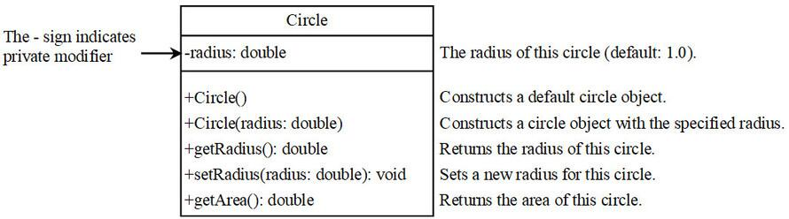
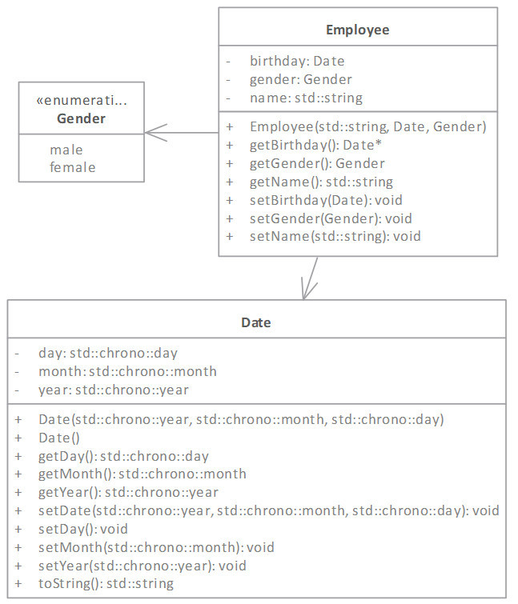

# Immutable Objects and Classes

不可变对象和类。

**immutable object**: The contents of an object cannot be changed(except through memberwise copy) once the object is created.

**不可变对象**：一旦对象创建后，对象的内容不可被改变（除了通过成员拷贝外）。

**immutable class**: The class of immutable object.

**不可变类**：不可变对象所属的类。

成员拷贝，也就是把其它对象通过成员拷贝的方式赋值给当前对象，这就改了内容。

~~~C++
circle_1 = circle_2;
~~~

图1.不可变类举例

Circle 类。

属性 radius，类型为 double。

前面的正负号表示访问控制属性，正号 + 表示 public，符号 - 表示 private。

如何要将 Circle 类变为不可变类。
我们把 set...() 这样的函数删掉就好了。这样 Circle 类的对象创建之后，就没法修改 radius 了。

## Another case: pointer member

另一种情况：指针成员。

满足下面条件的未必是不可变类：

- all private data fields.

  所有数据域均为私有属性。

- no mutators.

  无更改函器函数。

显然，数据成员我们都会设为 private，所以一般是无法修改的，但从数据域外考虑，如果成员函数返回了指向私有成员的指针，或者私有成员的引用，那么我们在类外就能修改私有成员了。

图2.

Employee 类。

数据成员中的 birthday 类型为 Data 类。

而 Employ 的函数中，getBirthday() 返回的是 Data* 指针。

~~~C++
int main() {
	Employee empJack("Jack", Date(1970, 5, 3), Gender::male);
	Date *birthday = empJack.getBirthday();//这里返回了指向私有成员 birthday 的指针
	birthday -> setYear(2010);//也就使得我们可以修改私有成员 birthday 1970->2010
	cout << "birth year after the change is " <<
		empJack.getBirthDate() -> getYear() << endl;
	return 0;
}
~~~

So，这个 Employee 类并不是不可变类。

## How to make a class immutable?

如何让类成为不可变类。

- Mark all data fields private.

  所有数据域均设置为私有属性。

- No mutator functions

  没有更改器函数。

- No accessor that would return a reference/pointer to a mutable data field object

  没有能够返回可变数据域对象引用或指针的访问器。

下面补充一下我自己的测试：

~~~C++
#include <iostream>
class Student{
private:
    std::string name = "moe";
    int number = 2;
public:
    Student(){};
    Student(std::string name, int number){
        this->name = name;
        this->number = number;
    }
    std::string getName(){ return name; }
    int getNumber(){ return number; }
    int* getNumber_pointer(){ return &number; }
};
int main() {
    Student mio{"mio",1};
    std::cout << mio.getName() << std::endl;//mio
    std::cout << mio.getNumber() << std::endl;//1
    
    int * p = mio.getNumber_pointer();
    *p = 3;
    std::cout << mio.getNumber() << std::endl;//3
	
    Student mugi{"mugi",2};
    mio = mugi;
    std::cout << mio.getName() << std::endl;//mugi
    std::cout << mio.getNumber() << std::endl;//2
    return 0;
}
~~~