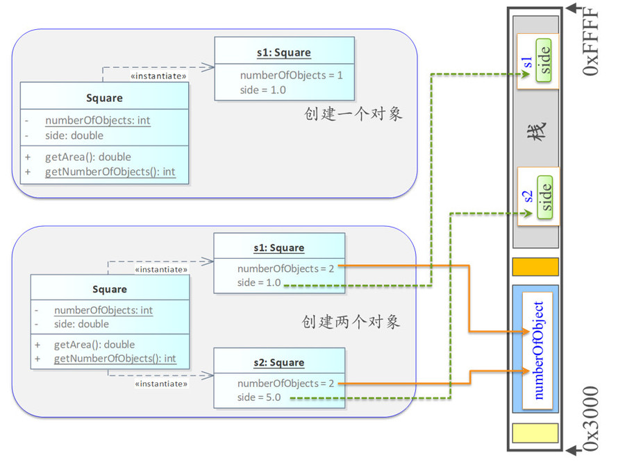

# Instance Members and Static Members

实例成员与静态成员。

## Declaration and Definition of Static Members

声明与定义静态成员。

#### 静态成员的声明

Inside a class definition, "static" declares members that are not bound to class instances.

在类定义中，关键字 static 声明 不绑定到类实例的成员（该成员无需创建对象即可访问）。

#### 静态数据成员的定义

- 声明为 "constexpr" 类型的静态数据成员必须在类中声明并初始化。自 C++17 起，可不在类外定义。
- 声明为 "inline"（C++17 起）或者 "const int" 类型的静态数据成员可以在类中声明并初始化。
- 其它**必须在类外**声明并初始化，且不带 static 关键字。

静态数据成员的定义规则复杂，So，一般都在类外定义，大部分情况下不会出错。报错了再改。

## Static member

静态成员。

静态数据成员具有**静态存储期（static storage duration）**，从 C++11 始，如果静态数据成员在线程中，则有线程存储期特性。

静态存储期：

- The storage for the object is allocated when the program begins and deallocated when the program ends.

  对象的存储在程序开始时分配，而在程序结束时回收。

- Only one instance of the object exists.

  只存在对象的一个示例。

  也就是无论使用属于的类创建了多少对象，但静态成员只有一个。

- 静态存储期对象未明确初始化时会自动**零初始化（Zero-Initialization）**，即初始化为 0。

## Example

~~~C++
#include <iostream>
class Square{
private:
    double side;
    static int numberOfObjects;//静态数据成员声明
public:
    static int test;//静态数据成员声明
public:
    Square():Square(1.0){
    }
    Square(double side){
        this->side = side;
        numberOfObjects ++;
    }
    int getNumberOfObjects() { return numberOfObjects; }
    static int static_getNumberOfObjects() { return numberOfObjects; }
};

int Square::numberOfObjects;//这里是静态数据成员定义与初始化，虽然我们没有写 = 0，但静态数据成员未明确初始化时是会自动零初始化，即初始化为0
int Square::test;//同上

int main(){
    Square s1{};
	//通过非静态的函数成员访问静态数据成员，可以。
    std::cout << s1.getNumberOfObjects() << std::endl;//1
    //通过静态函数成员访问静态数据成员，可以。
    std::cout << s1.static_getNumberOfObjects() << std::endl;//1
    
    //对于静态函数，可以使用 类名::静态函数名 调用
    std::cout << Square::static_getNumberOfObjects << std::endl;//1
    //对于非静态还是，则使用 类名::非静态函数名，不行。
    //std::cout << Square::getNumberOfObjects() << std::endl;//编译出错

    //对 public 的静态成员，也可直接使用 类名::静态成员名 来访问。
    //但对于非静态成员，因其和对象绑定，则无法通过 类名::静态成员名 访问
    std::cout << Square::test << std::endl;//0
    
    Square s2{5.0};
    std::cout << s2.getNumberOfObjects() << std::endl;//2
    return 0;
}
//输出结果：
//1
//1
//1
//0
//2
~~~

可见，s1，s2 都是共用的一个 numberOfObjects。

图1.

分析一下它们所处的内存空间。

s1，s2 都由编译器管理，处于栈区。
其各自实例成员 side 处于栈区。
但静态成员 numberOfObjects 处于全局区/静态区。

无论创建了多少个 Square 类的对象 s1,s2,...,sn ，numberOfObjects 都只有一个。

所以一个简单的应用就是，我们可以利用静态成员来统计一共创建的多少个该类的对象。

顺带一提：static 修饰的函数只能被包含该函数的源程序文件中的其他函数使用。

~~~c++
//test.cpp
#include <string>
void print(std::string s);
int main(){
    std::string s = "hello world";
    print(s);
    return 0;
}
//test_1.cpp
#include <iostream>
#include <string>
void print(std::string s){
    std::cout << s;
}
//g++ test.cpp test_1.cpp -o test.exe
//正常通过
//输出结果：
//hello world
~~~

加上 static：

~~~C++
//test.cpp
#include <string>
static void print(std::string s);//去掉这里 static，不去掉 test_1.cpp 中的 static 仍然会报错，不过报错信息不一样。
int main(){
    std::string s = "hello world";
    print(s);
    return 0;
}
//test_1.cpp
#include <iostream>
#include <string>
static void print(std::string s){
    std::cout << s;
}
//g++ test.cpp test_1.cpp -o test.exe
//报错:
//test.cpp:3:13: warning: 'void print(std::__cxx11::string)' used but never defined
//static void print(std::string s);
~~~

