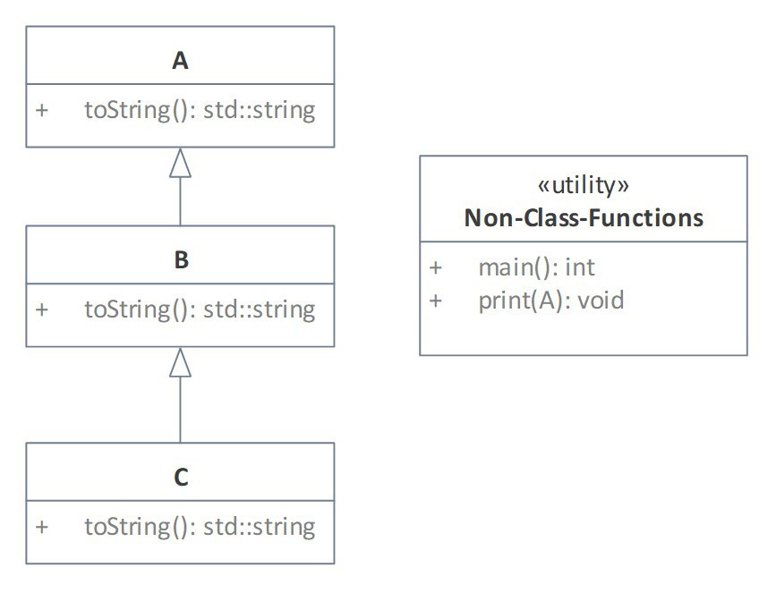
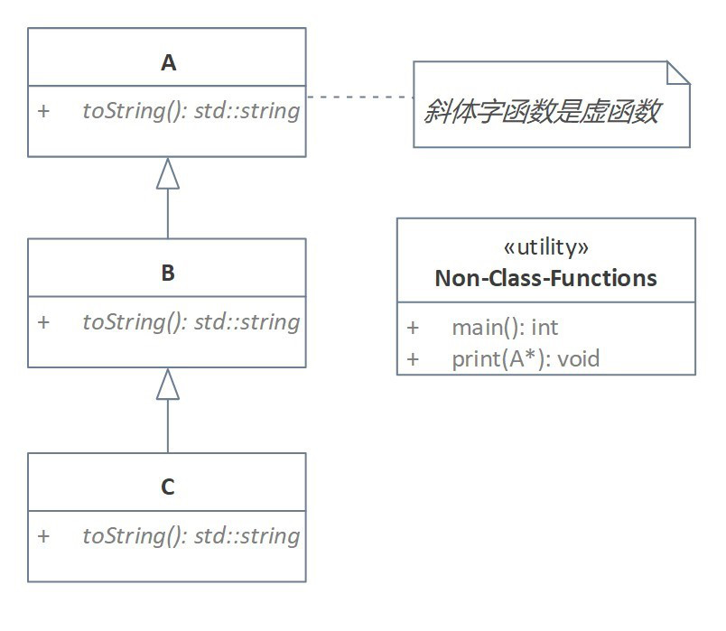

# Implementation of Run-time Polymorphism

实现运行时多态。

## Why Run-time Polymorphism?

为何要使用运行时多态？

举例说明：

图1.例子

有三个类，C 继承 B 继承 A。A,B,C 各自都有 toString() 函数，用于输出该类对象的一些信息。

其它，我们有 main() 函数，和 print() 函数。

print() 函数的作用是调用每个类的 toString() 函数，因此 print() 函数需要接收一个 A or B or C 类型的对象。

因此，我们需要写三个重载函数：

~~~C++
void print(A obj);
void print(B obj);
void print(C obj);
~~~

这样比较麻烦。

我们可以用多态来解决这个麻烦。

## How do we implement run-time polymorphism?

如何实现运行时多态？

**virtual function（虚函数）**

使用虚函数。

在正常的函数前加上了关键字 virtual，这个函数就是虚函数。

~~~C++
struct A{
    virtual std::string toString(){//前面加上 virtual 表示为虚函数
        return "A"
    }
}
~~~

**Override（覆写）**：redefining a virtual function in a derived class.

在派生类中重定义一个虚函数。
这句话意思是，把基类里面需要多态的函数写成虚函数，然后在派生类中重定义这个函数。
更好的说法也许是，在派生类中对（基类中的）虚函数进行重定义。

图2. A,B,C 中 toString() 都为虚函数

我们把 A,B,C 三个类中的 toString() 函数都改为虚函数。图中虚函数以斜体表示。

然后想要使用 print() 函数调用 A,B,C 对于的 toString() 函数时，传递给 print() 函数实参为指向 A or B or C 类型的指针，形参为基类指针类型 A*。
或实参为 A or B or C 类型对象，形参为基类引用类型 A&。

## Example of polymorphic

多态的例子。

#### 用哪个同名虚函数？

- 不由指针类型决定，而由指针所指的实际对象的类型所决定。
- 运行时，检查指针所指对象类型。

#### 用途

可以用父类指针访问子类对象成员。

~~~C++
#include <iostream>
#include <iostream>
#include <string>

class A{
public:
    //将基类中的同名函数声明为 virtual
    virtual std::string toString(){ return "A"; }
};
class B : public A{
public:
    //B,C 中的同名函数写不写 virtual 都行
    //在 C++11 primer（第五版） 15.3 虚函数 中写道：
    //当我们在派生类中覆盖了某个虚函数时，可以再一次使用 virtual 关键字指出该函数的性质。
    //然而这么做并非必须，因为一旦某个函数中被声明成虚函数，则在所有派生类中它都是虚函数。
    std::string toString(){ return "B"; }
};
class C : public B{
public:
    //B,C 中的同名函数写不写 virtual 都行
    virtual std::string toString(){ return "C"; }
};

void print(A* p){//参数类型修改为基类指针类型 A*
    std::cout << p->toString() << std::endl;
	//用 (*p).toString() 也行
    //std::cout << (*p).toString() << std::endl;
}

//使用基类引用类型
void print(A& p){
    std::cout << p.toString() << std::endl;
}

int main(){
    A a;
    B b;
    C c;
    print(&a);//call A.toString()
    print(&b);//call B.toString()
    print(&c);//call C.toString()
    
	print(a);//call A.toString()
    print(b);//call B.toString()
    print(c);//call C.toString()
    return 0;
}
//output
//A
//B
//C
//A
//B
//C
~~~

## 虚函数的传递性

If a function is defined **virtual** in a base class, it is automatically **virual** in all its derived classes.

如果基类定义了虚同名函数，那么派生类中的同名函数自动变为虚函数。

虚函数的代价：

- Virtual function table. 虚函数表

  与普通函数不同，虚函数有虚函数表。

- Run-time binding. 运行时联编/动态联编

  调用虚函数时，需要进行动态联编，这又额外开销的逻辑。

- More overhead in run-time than non-virtual function. 比非虚函数开销大

## override

测试一下，如果我们将 B 类中的 toString() 错写成 tostring()。

~~~C++
#include <iostream>
#include <iostream>
#include <string>

class A{
public:
    virtual std::string toString(){ return "A"; }
};
class B : public A{
public:
    //错写成 tostring()
    std::string tostring(){ return "B"; }
};
class C : public B{
public:
    virtual std::string toString(){ return "C"; }
};
void print(A* p){
    std::cout << p->toString() << std::endl;
}
void print(A& p){
    std::cout << p.toString() << std::endl;
}

int main(){
    A a;
    B b;
    C c;
    print(&a);
    print(&b);
    print(&c);
    
	print(a);
    print(b);
    print(c);
    return 0;
}
//output
//A
//A
//C
//A
//A
//C
~~~

可见，由于 B 中并没有 toString()，所以会沿着继承链向上找到 A 中的 toString()。

这种 bug 比较难找，因为编译器并不会报错，程序是通过编译并且能运行的。

为了防止这种错误，C++11 引入了 override 关键字，表明使用 override 修饰的函数是对基类函数的覆写，自然要求该函数与基类中被覆写的函数，函数名、参数、返回值都要相同。

这样，加上 override 修饰后，我们写错了，编译器就会报错，提示这个 override 修饰的函数并没有覆写基类中的函数。

所以最好对于 virtual 最好加上 override 修饰。

~~~C++
class A{
public:
    virtual std::string toString(){ return "A"; }
};
class B : public A{
public:
    //错写成 tostring()
    //由于加上了 override，会报错
    std::string tostring() override { return "B"; }
};
class C : public B{
public:
    virtual std::string toString() override { return "C"; }
};
~~~

