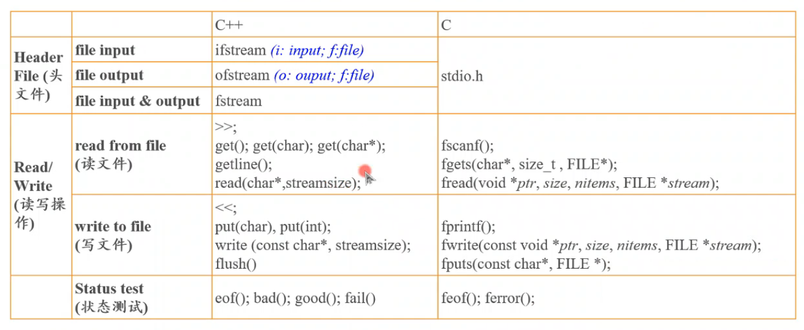
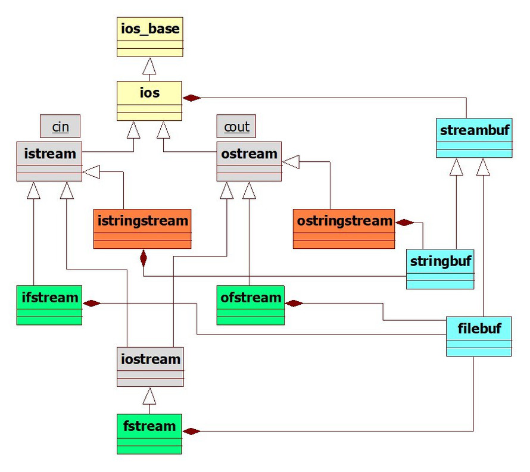

# Introduction to the Input and Output Classes

输入输出类介绍。


## Comparision of File Manipulation between C and C++

C 与 C++ 文件操作对比。



<center>图1.C,C++文件操作区别</center>

## What is a stream?

什么是流？

A stream is a sequence of data.

流是一个数据序列。

## Hierarchy of C++ I/O Stream classes

C++ I/O 流类层次。



<center>图2.C++I/O流类层次</center>

该图中，不同类型的类标为了不同的颜色。

黄色的 ios_base, ios 是所有 stream class 的基类。
其中定义了很多在流操作时需要使用的常量，因为 ios_base 名字比较长，而且 ios 也是继承自 ios_base，所以我们往往以 ios 为前缀  ios::valName 来使用其中的常量。

灰色的 istream, ostream, iostream 是一般输入输出流。cin, cout 分别是 istream, ostream 的对象。

橙色的 istringstream, ostringstream 是用于字符串输入输出的类。

绿色的 ifstream, ofstream, fstream 是用于文件操作的类。

青色的 streambuf, stringbuf, filebuf 是用于给流提供缓冲功能的类。C++ 的 I/O 流会在内存中开辟一个缓冲区。

C++ 的流类主要有五类：

1. 流基类（ios_base和ios）
2. 标准输入输出流类（istream/ostream/iostream）
3. 字符串流类（istringstream/ostringstream）
4. 文件流类（ifstream/ofstream/fstream）
5. 缓冲区类（streambuf/stringbuf/filebuf）

标准输入输出流对象 cin 和 cout 分别是类 istream 和 ostream 的实例。

字符串流：将各种不同的数据格式化输出到一个字符串中，可以使用 I/O 操纵器控制格式；反之也可以从字符串中读入各种不同的数据。

## Buffered Input and Output

带缓冲的输入输出。

C++ 的 I/O  流是由内部缓冲区的。

~~~C++
#include <iostream>
using namespace std;

int main(){
    char c;
    int i = 0;
    do{//读入字符，转为 int 输出
        c = cin.get();
        cout << ++i << " : " << static_cast<int>(c) << endl;
    }while (c != 'q');
    return 0;
}
//显示+分析:
//a			//实际输入了 a回车，缓冲区中为 a回车
//1 : 97	//读走a，缓冲区中为 回车
//2 : 10	//所以没有等待输入，而是直接读走 回车
//			//缓冲区空，等待输入，输入了回车,缓冲区中为 回车
//3 : 10	//读走回车
//q			//缓冲区空，等待输入，输入了q,缓冲区中为 q
//q : 113	//读走 q，循环结束
~~~

## Example

~~~c++
#include <iostream>

int main(){
    //由于我使用的 gcc 编译器，所以需要加入这一句。否则 in_avail() 永远返回 0.
    //至于为什么，我暂时也没明白，老师也没详细解释。
    std::cin.sync_with_stdio(false);
    
    //获得 cin 对象的缓冲区指针
    auto p = std::cin.rdbuf();

    //从键盘读入字符到缓冲区，且保留缓冲区所有字符
    auto x = std::cin.peek();//peek() 只读不拿走，get()是读且拿走
    std::cout << "x = " << x << std::endl;
    
    //显示缓冲区中的字符数量
    auto count = p->in_avail();
    std::cout << "There are " << count << " characters in the buff" << std::endl;
    //把缓冲区的字符都取出来并显示
    
    for(int i = 0; i < count; i++){
        std::cout << i+1 << ": " << std::cin.get() << std::endl;
    }
    return 0;
}
//input:
//abcd
//output:
//x = 97
//There are 5 characters in the buff
//1: 97
//2: 98
//3: 99
//4: 100
//5: 10
~~~

在使用 gcc 编译器的时候，存在这样一种意外的情况：

无论输入多少个字符， cin.in_avail() 函数返回值永远是 0。

这是由于GCC编译器中配套的 libstdc++ 实现中的问题（可以看作是标准库 gcc 实现的一个 bug，或者一个特性）。

解决办法是，在使用cin之前，插入下面一行代码

```c++
cin.sync_with_stdio(false);
```

简单解释原因：gcc 的 libstdc++ 默认是保证 C++ 的 cin 与 C 的 stdin 同步的。

虽然我也没懂为什么这样就导致 cin.in_avail() 函数返回值是 0 了。
貌似是因为同步时，cin 不会缓冲任何数据。而不同步时，cin 才会缓冲。
我大胆猜测，是因为同步时，cin 与 stdin 共用一个缓冲区，而实际上这个缓冲区是 stdin 的。不同步时，才会给 cin 一个单独的缓冲区。这样导致了 cin.in_avail() 返回值的问题。
不过这个只是我瞎猜罢。