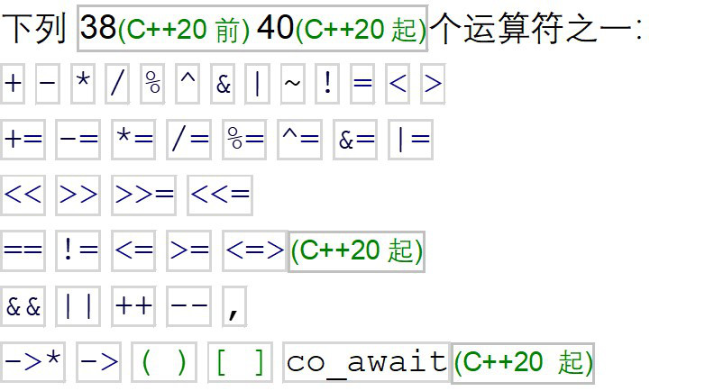

# C++ Operator Functions

C++ 运算符函数。

## Why operator overloading

为何要用运算符重载。

~~~C++
std::cout << "v1.compare(v2) is " << v1.compare(v2) << std::endl;
std::cout << "v1 < v2 is " << v1 < v2 << std::endl;
~~~

显然，第二种 v1<v2 要更直观。

## Operators: Which can be Overload

可重载的运算符

#### Overloadable

可重载。

1. 类似转换运算符：double，int，char......，也就是强制类型转换的运算符

2. new/delete，new []/delete[]

3. ""_suffix 用户自定义字面量运算符（自 C++11 起）

4. 一般运算符：

   

   
图1.一般运算符

#### not Overloadable

不可重载。

| Operator | Name           |
| -------- | -------------- |
| .        | 类属关系运算符 |
| .*       | 成员指针运算符 |
| ::       | 作用域运算符   |
| ?:       | 条件运算符     |
| #        | 编译预处理符号 |

#### Restrictions for operator overloading

运算符重载的限制。

- Precedence and Associativity are **unchangeable**.

  优先级和结合性不变。

- **Not** allowing to create new operator.

  不可创造新的运算符。

## Operator Functions

运算符函数。

#### 原型与调用

调用

~~~C++
//Call operators
std::cout << v1 < v2;
//等同于
std::cout << v1.operator<(v2);
~~~

定义

~~~C++
//Define function operators for Vec2D operators
bool Vec2D::operator<(Vec2d& seconde_Vec2D){
    return (this->compare(seconde_Vec2D) < 0);//这里的小于符号 < 就是常规的小于符号 < 了。
}
~~~

这里突然补充一下 this 指针相关：

1. 没有定义，不用定义。
2. 不能对其取地址 &this。
3. 不能赋值。
4. 能够指向对象。

## 确定运算符函数的调用形式

| 表达式  | 作为类的成员函数的原型 | 作为非成员函数的原型                                         |
| ------- | ---------------------- | ------------------------------------------------------------ |
| @a      | (a).operator@ ( )      | operator@ (a)                                                |
|         | 示例                   | !std::cin 调用 std::cin.operator!()                          |
| a@b     | (a).operator@ (b)      | operator@ (a, b)                                             |
|         |                        | std::cout << 42 调用 std::cout.operator<<(42)                |
| a=b     | (a).operator= (b)      | 不能是非成员函数                                             |
|         |                        | std::string s; s = "abc"; 调用 s.operator=("abc")            |
| a(b...) | (a).operator()(b...)   | 不能是非成员函数                                             |
|         |                        | std::random_device r; auto n = r(); 调用 r.operator()()      |
| a[b]    | (a).operator      | 不能是非成员函数                                             |
|         |                        | std::map<int, int> m; m[1] = 2; 调用 m.operator         |
| a->     | (a).operator-> ()      | 不能是非成员函数                                             |
|         |                        | auto p = std::make_unique<S>(); p->bar() 调用 p.operator->() |
| a@      | (a).operator@ (0)      | operator@ (a, 0)                                             |
|         |                        | std::vector<int>::iterator i = v.begin(); i++ 调用 i.operator++(0) |

此表中，@ 是表示所有匹配运算符的占位符：
@a 为所有前缀运算符；
a@b 为除 = 以外的所有其他运算符；
a@ 为除 -> 以外的所有后缀运算符。