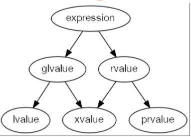

# C++11: Left Value, Pure Right Value and eXpiring Value

C++11: 左值，纯右值与将亡值。

以 lvalue，rvalue，xvalue 为简写。
为啥是 xvalue 不用 evalue，俺也不知道。

## C++03 lvalue and rvalue

C++03 的左值和右值

通俗理解：

- 能放在等号左边的是 lvalue。
- 只能放在等号右边的是 rvalue。
- lvalue 可以作为 rvalue 使用。

## C++ 11: Left Value

An **lvalue** designate a function or an object, which is an expression whose address can be taken.

左值指定了一个函数或者对象，它是一个可以取地址的表达式。

~~~C++
int lv1{ 42 }; // Object
int main() {
	int& lv2{ lv1 }; // Lvalue reference to Object
	int* lv3{ &lv1 }; // Pointer to Object
}
int& lv4() { return lv1; } // Function returning Lvalue Reference
~~~

显然 lv1,lv2,lv3 我们都可以对其取地址。

对于 lv4 虽然是函数，由于返回的是引用类型，仍然可以对其取地址，所以也是左值。如果不是引用类型，就为纯右值。

左值例子：以下都为左值，都可以对其取地址。

- 解引用表达式 *p
- 字符串字面量 "abc"，因为字符串字面量会放在全局/静态区
- 前置自增/自减表达式 ++i/--i，因为是先加再用，对其取地址也就是 i 的地址。
- 赋值或复合运算符表达式（x=y 或 m*=n 等）

都可对其取地址：&(*p)，&("abc")，&(++i)，&(--i)，&(x=y)，&(m\*=n)

## C++11: Pure Right Value

C++11：纯右值。

prvalue（Pure Right Value，纯右值）：是不和对象相关联的值，也就是字面量（下面例子第一个）；或者其求值结果是字面量；或者一个匿名的临时对象（比如 a+b; 返回的其实就是一个匿名的临时对象）。

纯右值例子：以下都为纯右值。

- 除字符串字面量以外的字面量，比如 32，'a'
- 返回非引用类型的函数调用 int f(){return 1;}
- 后置自增/自减表达式 i++/i--，因为是先取 i 再加，i++ 返回的是一个临时匿名对象
- 算术/逻辑/关系表达式（a+b，a&b，a<<b）（a&&b，a||b，~a）（a==b，a>=b，a<b）
- 取地址，&x

左值可以当作右值使用。

## C++11: eXpiring Value

C++11：将亡值。

xvalue（eXpiring Value，将亡值）：将亡值也指定了一个对象，是一个将纯右值转换为**右值引用**的表达式。

~~~C++
int lv1 = 1;
int& lv2 = lv1;
~~~

因为 lv1 是左值，所以 lv2 为左值引用。

~~~C++
int& lv3 {22};//非常量引用的初始值必须为左值
~~~

会报错，因为非常量左值引用不可以引用纯右值。

~~~C++
const int& lv4 = 3;
~~~

左值只有常量左值引用才可引用纯右值。

~~~C++
int&& prv1 {4};
~~~

右值引用可以引用纯右值。

~~~C++
int prv(int x) { return 6 * x; } // pure rvalue 
int& lv5 = prv(5);//非常量引用的初始值必须为左值
int&& prv2 = prv(5);//ok
~~~

函数 prv() 返回的不是引用类型，为纯右值。
同样，左值引用不能引用纯右值。
右值引用才可。

原本，纯右值是一个临时的变量，使用后就没有了。但经过右值引用后，延长了其生存周期，可以在之后通过右值引用 prv1，prv2 来继续使用其数据。

C++11 判定，任何一个表达式都是属于某一类值类型的。

expression 分为

- glvalue 泛左值（g = general）
  - lvalue 左值
  - xvalue 将亡值
- rvalue 右值
  - pvalue 纯右值
  - xvalue 将亡值