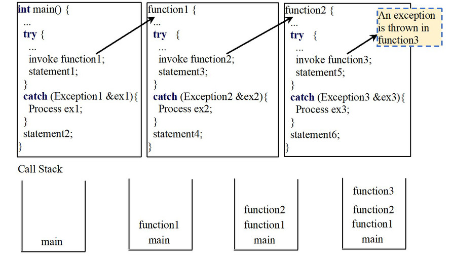

# Exception Propagation

异常传播。

## What is Exception Propagation?

什么是异常传播？

Nested Function Call：嵌套的函数调用：

- 每个函数中都有 try-catch 块。
- 内层函数抛出异常。

就会发生异常传播。

图1.异常传播

假定在 function2() 中的 invoke function3 抛出了一个异常。

如果该异常与 catch(Exception3 &ex3) 匹配，就进入这个 catch 处理；

否则，则随着函数返回到 function1（并不会执行 statement6），在 function1 中的 catch(Exception2 &ex2) 是否匹配，如匹配则由该 catch 处理；

否则，继续交由前一层的函数处理。

## The rules in Exception Propagation

异常传播中的规则。

1. try 块中的异常：跑一次的语句后面的块代码都被跳过，并开始寻址 exception handler 的代码。

2. 找 exception handler 的流程：沿函数调用的链反向寻找。

   按 catch 块的顺序对比，找到则执行 catch 块代码。
   找不到，则退出当前函数，将异常传给调用当前函数的函数。

