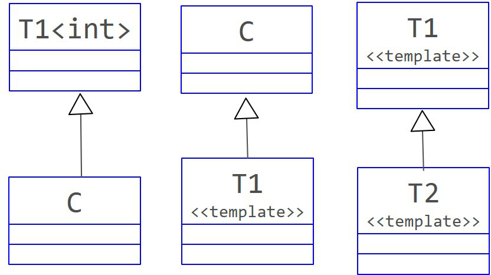

# Templates and Inheritance

模板和继承。

~~~C++
template<typename T> class T1;
template<typename T> class T2;
class C; 
~~~

图1.模板与继承

A non-template class can be derived from a class template specialization

非模板类可从类模板实例继承。

如上图，C 可继承模板 T1 的实例 T1\<int\>。

A class template can be derived from a non-template class.

模板可从非模板类继承。

如上图，模板 T1 可继承类 C。

A class template can be derived from a class template.

类模板可继承类模板。

如上图，模板 T2 可继承模板 T1。

总结，只有类继承模板（非实例）不可以。