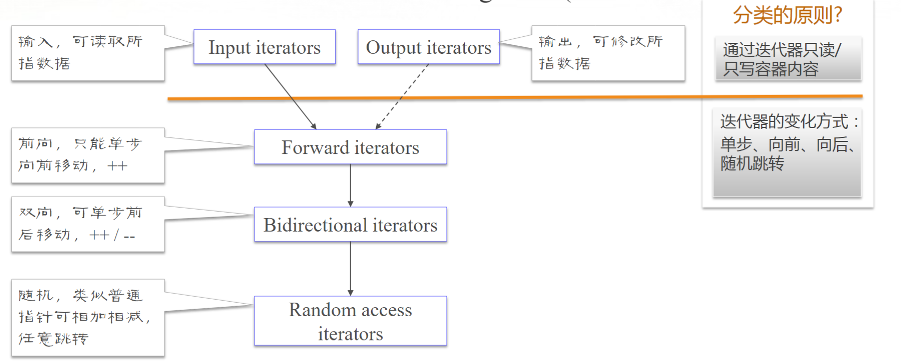
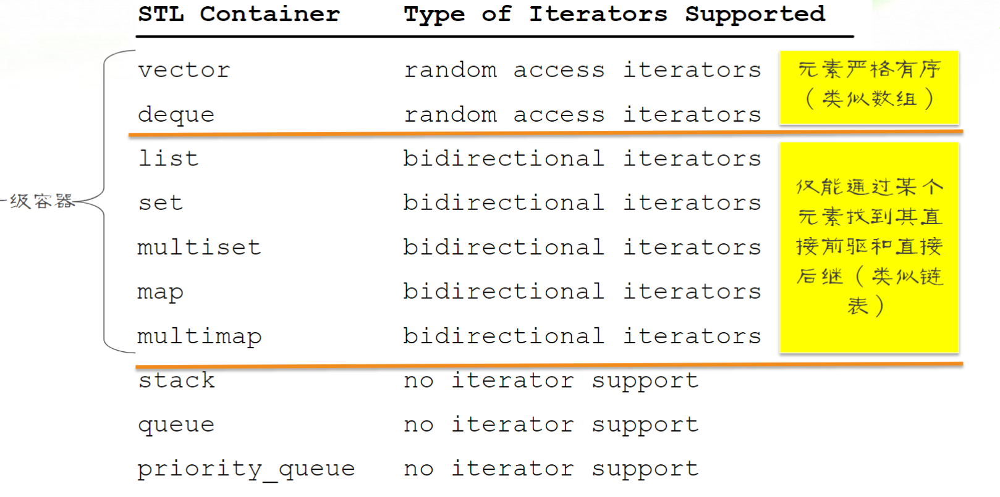
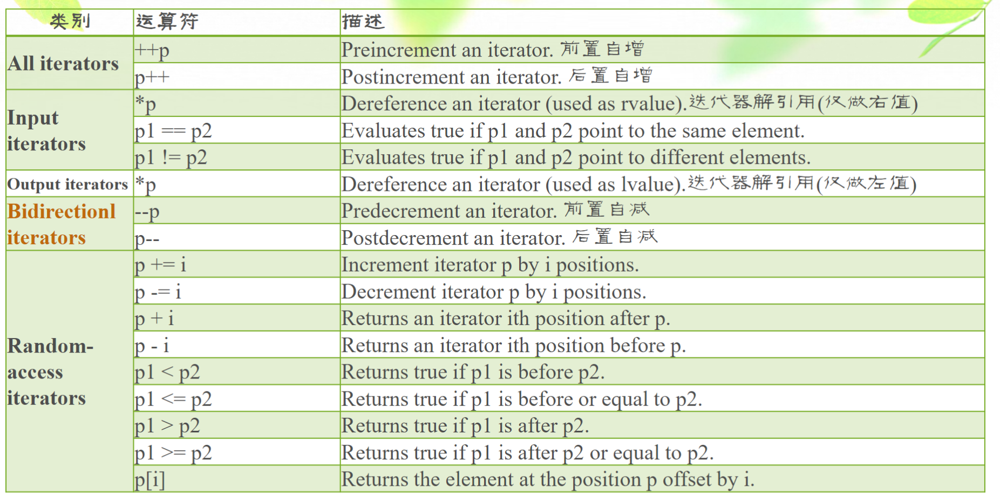

# STL Iterator

STL 迭代器。

Iterators are use extensively in the first-class containers for accessing and manipulating the elements.

迭代器用于访问和处理一级容器中的元素。

Sevaeral functions(e.g., begin() and end()) in the first-class containers are relatied to iterators.

一级容器中的某些函数也与迭代器有关。

## Type of Iterators

迭代器类型。

Each container has tis own iterator type.

各容器均有自己的迭代器类型。

Iterators can be classified into five categoried:

迭代器可分为 5 类：

图1.迭代器分类

Input iterators: 输入迭代器，可读取迭代器所指向的数据。

Output iterators: 输出迭代器，可修改迭代器所指向的数据。

Forward iterators: 前向迭代器，只能单步向前移动，即只支持 ++ 操作。

Bidirectional iterators: 双向迭代器，可单步前后移动，即只支持 ++/-- 操作。

Random access iterators: 随机迭代器，类似普通指针，可相加相减，任意跳转。

图中箭头表示，箭头指向的迭代器能够完成箭头起始的迭代器的功能，虚线是只能完成一部分。

## Iterator Types Supported by Containers

容器支持的迭代器类型。

图2.容器支持的迭代器类型

vector，deque：支持随机访问迭代器。

list，set，multiset，map，multimap：只支持双向迭代器。

stack，queue，priority_queue：不支持迭代器。

## Operators Supported by Iterators

迭代器支持的运算符。

图3.迭代器支持的运算符
