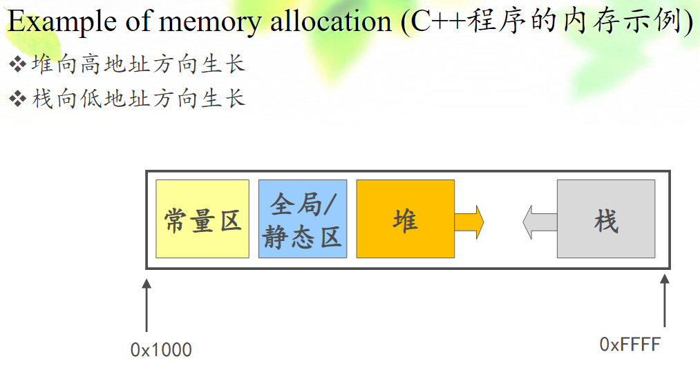

# 341 Simplified Memory Mode for C++

## Stack 栈

编译器自动分配释放。如，函数的局部变量就在栈区。

## Heap 堆

一般由程序员分配释放，若程序员不释放，程序结束时可能由 OS 回收。

## Global/Static 全局区/静态区

全局变量和静态变量的存储是放在一块的。

通常说我们写的一个程序，是从 main() 函数进入执行的。
但实际上，在执行 main() 函数之前，仍然有很多工作，其中就包括将全局变量和静态变量做初始化，放在全局区/静态区，这是早于 main() 函数的执行的。

可以简单认为：程序启动（若认为程序启动是指开始执行 main() 函数的话）之前，全局/静态变量就已经全局区/静态区存在了，它们的生命周期直到程序结束释放。

## Constant 常量区

可以简单理解为所有常量都放在一起，该区域内容不可修改，只读。

## Example of memory allocation C++ 程序的内存实例

图1.C++程序的内存示例

最外圈黑矩形表示我们程序所占用的内存，假定从 0x1000 到 0xFFFF。

堆区和栈区的相对位置一般是固定的。
堆向高地址方向增长，栈向低地址方向增长。
即，在堆中分配内存时，是从低向高推进的；在栈中分配内存时，是从高到低推进的。

堆、栈中间的内存，是可以共享的，增加了内存的利用效率。
这里的共享是指双方都能用，但不能同时用，你不用时我可以用，我不用时你可以用。

## Location of a variable 变量存放位置

例子：

~~~C++
int arr[3];
int func(){
    int a;
    char* p;
    char* str = "hello world";
}

//answer:
int arr[3];//arr 全局数组：全局/静态区
int func(){
    int a;//a 局部变量：栈
    char* p;//p 局部变量：栈
    char* str = "hello world";
    //str 局部变量：栈
    //"hello world" 常量：常量区
}
~~~

例子：

~~~C++
int func(int* pi){
    char* pc;
    pc = static_cast<char*> new char[8];
}

//answer
int func(int* pi){// pi 函数形参，相当于局部变量：栈
    char* pc;//pc 局部变量：栈
    pc = static_cast<char*> new char[8];//char[8] 由程序员分配的，new 出来的：堆区
}
~~~

