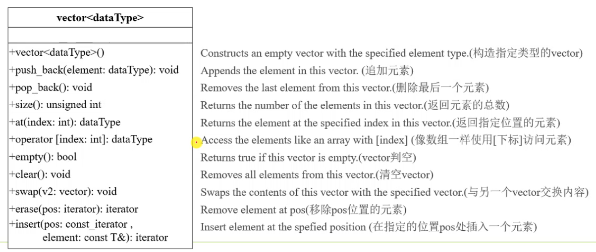

# The C++ vector class

C++ 的 vector 类。

Limitation of using array to store values: the array size is fixed in the class declaration.

使用数组存放数据的限制：数组大小在声明时就确定不可变。

The vector object can increase its size if needed.

vector 对象容量可按需增大。

图1.一些操作

