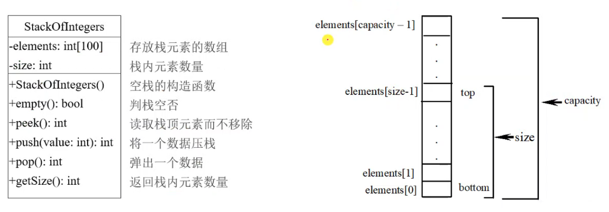

# Stack

栈。

看完了，原来这一节的意思是自己用数组实现一个 int 类型的栈，类名为 StackOfInteger。
我就偷懒不写啦。

## The StackOfInteger Class

A stack is a data structure that holds objects in a last-in first-out fashion.

栈是一种后进先出的数据结构。

Stack application：

- 函数调用时，主函数传给子函数的参数先进栈，进入子函数后，子函数的局部变量也按序在栈中建立。
- 子函数返回时，局部变量出栈、参数出栈。

## Members of Stack

stack 类的成员。

The StackOfIntegers class encapsulates the stack storage and provides the operations for manipulating the stack.

stack 类封装了栈的存储空间并提供了操作栈的函数。

图1.一些操作

