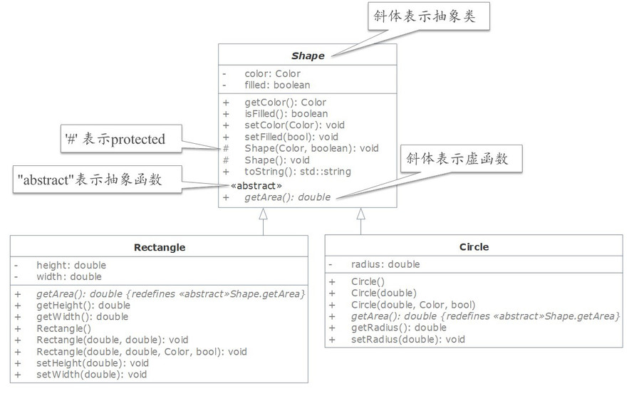

# Abstract Class and Pure Virtual Function

抽象类与虚函数。

## Abstract Class

抽象类。

classes become more specific & concrete with each new derived class.

派生类时，新类会越来越明确和具体。

move back up to the parent and ancestor, the classes become more general and less specific.

沿着派生类向父类移动，类会越来越一般化和抽象。

Sometimes a base class is so abstract that it cannot have any speific instances. Such a class is referred to as an **abstract class**.

当一个类太抽象以至于无法实例化，就叫作**抽象类**。

## Abstract Function / Pure Virtual Funtion

抽象函数 / 纯虚函数。

以之前的 Shape，Rectangle，Circle 为例。

思考，getArea() 函数放在哪个层次？
这里有两个选择，
选择一：放哪儿都行，Shape 类中或子类中定义 getArea()；
选择二：强制也有 Shape 子类必须实现 getArea()。

显然选择二的方式要好一些。

**抽象函数（abstract function）**：要求子类实现它。
抽象函数也被称为**纯虚函数（pure virtual function）**。

~~~C++
class Shape{
    //...
    virtual double getArea() = 0;//抽象函数/纯虚函数
    //加上 virtual 修饰，没有函数体，没有函数体的花括号，而是写上 = 0,最后要加上分号;
}
~~~

Shape 的子类 Rectangle，Circle 类必须实现了 getArea() 纯虚函数，才能够实例化。

毕竟要是继承了纯虚函数，但没实现，那么子类也是抽象类了，不能实例化。
子类中的 getArea() 函数也可以加上 override 修饰。

~~~C++
class Circle{
    //...
    //下面都行
    double getArea(){/*...*/}
    double getArea() override {/*...*/}
    virtual double getArea(){/*...*/}
    virtual double getArea() override {/*...*/}
}
~~~

**Abstract class**: the class which contains abstract functions.

包含抽象函数的类称为抽象类。

抽象类不能实例化（不能创建对象）。

图1. 图示

类名斜体，表示改类为抽象类。
函数前 # 号表示访问属性为 protected。
abstract 表示为抽象函数。
函数斜体，表示为虚函数。

