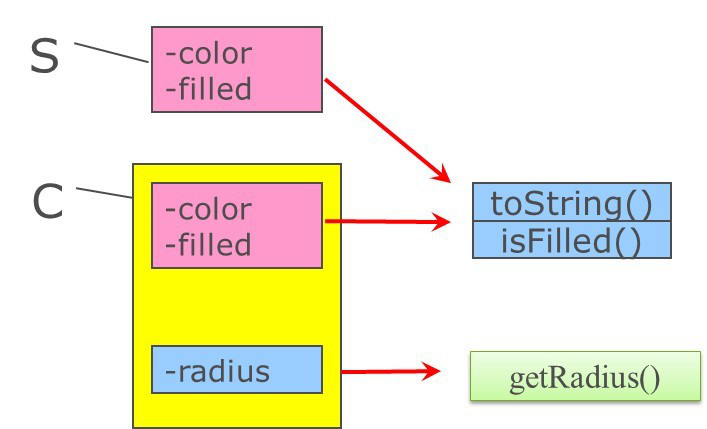

# 644 Upcasting and Downcasting

向上转换和向下转换。

**upcasting**: Assigning a pointer of a derived class type to a pointer of its base class type.

将派生类类型指针赋值给基类类型指针。

**downcasting**: Assigning a pointer of a base class type to a pointer of its derived class type.

将基类类型指针赋值给派生类类型指针。

Upcasting can be performed implicitly without using the dynamic_cast operator.

向上转换可以不使用 dynamic_cast 而隐式转换。

~~~C++
Circle* c = new Circle(2);
Shape* s = nullptr;
s = c;//ok,隐式向上转换。
~~~

Downcasting must be performed explicitly.

向下转换必须显式执行。

~~~C++
Shape* s = new Circle(1)
Circle* c = nullptr;
c = dynamic_cast<Circle*>(s);//必须显式向下转换
~~~

## 基类对象和派生类对象的互操作

对象内存布局

~~~C++
Shape s;//只是这里当作父类子类，用来举例。既然都实例化 Shape s 了，自然不是抽象类了。
Circle c;
~~~

内存布局：

图1.内存布局

可见，派生类比基类多出一些东西。

规则：

1. 可将派生类对象截断，只使用继承来的信息。
2. 不能将基类对象加长，无中生有变出派生类对象。

根据这个规则，可知：

~~~C++
Shape s;
Circle c;
s = c;//可以
//c = s;//报错
Shape &rs = c;//可以
//Circle &rc = s;//报错
~~~

