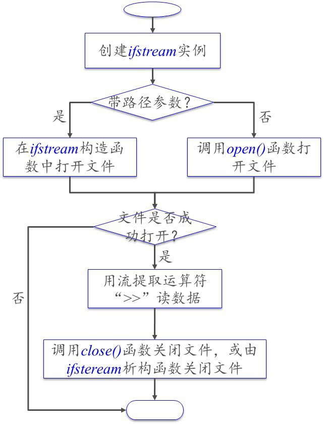

# Read Data from a File

从文件读数据。

ifstream class can be used to read data from a text file.

ifstream 可用于从文本文件中读数据。

图1.输入数据流程图

## Testing if the file is opened successfully.

检测文件是否成功打开。

Errors may occur:

可能出现的错误：

- the file does not exist when reading a file.

  读文件时文件不存在。

- the meida is ReadOnly when writing a file(e.g. write to a CD)

  写文件时，文件是只读的。

To detect if a file is successfully opened:

- invoke **fail()** immediately after **open()**.

  open() 之后马上调用 fail() 函数。

- If fail() returns ture, the file is not opend(does not exist).

  如果 fail() 返回 true，则文件未打开。

~~~C++
ofstream output("test.txt");
if(output.fail()){
    std::cout << R"(Can't open file "test.txt"!)";
}
~~~

## Knowing data format

了解数据格式。

To read data correctly, you need to know exactly how data is stored.

为了正确读数据，需要了解数据的存储格式。

例如：

对于 test.txt 文件

~~~C++
//test.txt
LiLei 90.5
HanMeimei 80

~~~

使用

~~~C++
input >> name >> double_score;
input >> name >> int_score;
~~~

是没有问题的。

而使用

~~~C++
input >> name >> int_score;//int 类型读取 90.5 就会与预期不一致
input >> name >> int_score;
~~~

## Testing End of File

检测是否已到文件末尾。

What if: 

若你

- Don't know how many lines are in the file.

  不知道文件有多少行。

- Want to read them all.

  想全读出来。

Use **eof()** function to detect the end of file.

用 eof() 函数检查是否是文件末尾。

~~~C++
ifstream in("test.txt");
while(in.eof() == false){
    std::cout << static_cast<char>(in.get());
}
~~~

## Example

test.text

~~~C++
LiLei 90.5
HanMeimei 80

~~~

~~~C++
#include <iostream>
#include <filesystem>
#include <fstream>

int main(){
    namespace fs = std::filesystem;
    fs::path p {"test.txt"};//创建路径
    std::ifstream input {p};//创建输入流
    if(input.fail()){//判断是否成功打开
        std::cout << "open fail" << std::endl;
        return -1;
    }
    
    std::string name {""};
    double score {0.0};

    input >> name >> score;
    std::cout << name << " " << score << std::endl;
    input >> name >> score;
    std::cout << name << " " << score << std::endl;
    
    input.close();//关闭文件输入流。
    return 0;
}
//output:
//LiLei 90.5
//HanMeimei 80
~~~

用一下 eof():

~~~C++
#include <iostream>
#include <filesystem>
#include <fstream>

int main(){
    namespace fs = std::filesystem;
    fs::path p {"test.txt"};//创建路径
    std::ifstream input {p};//创建输入流
    if(input.fail()){//判断是否成功打开
        std::cout << "open fail" << std::endl;
        return -1;
    }
    
    //这么写会有一问题，会多输出一个值。
    // while(!input.eof()){
    //    std::cout << static_cast<char>(input.get());
    // }
    //这样写的输出为：
    //LiLei 90.5
    //HanMeimei 80
    //

    //下面这这样写的输出为
    //LiLei 90.5
    //HanMeimei 80
    //
    char ch;
    while(!(input.get(ch)).eof()){
       std::cout << ch;
       //std::cout << static_cast<int>(ch) << " ";
    }
    
    input.close();//关闭文件输入流。
    //std::cin.get();
    return 0;
}
~~~

关于 eof()

> This function only reports the stream state as set by the most recent I/O operation;
> it does not examine the associated data source.
> For example, if the most recent I/O was a get() which returned the last byte of a file, eof() returns false.
> The next get() fails to read anything and sets the eofbit.
> Only then does eof() return true.

eof() 这个函数只返回该流被最近的 I/O 操作所设定的状态，
它并不检查相关的数据源。
例如，如果最近的 I/O 操作是 get()，并且此处 get() 获得了文件的最后一个字符，那么 eof() 会返回 false。
而下一次的 get() 将会读取失败，并且改变 eofbit 的值。
由于 eofbit 值改变，所以此后 eof() 才会返回 true。

