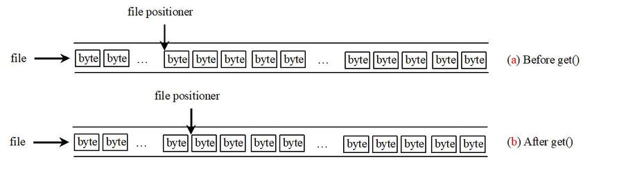

# File Positioner

文件位置指示器。

网上可能更常用的说法是文件指针，不过容易混淆，所以老师这里用的是文件位置指示器。

File Positioner（文件位置指示器）的其它说法

- File Pointer（文件指针）：易与 C 语言的 FILE* 混淆
- File Cursor（文件光标）：借用数据库中的 " 光标 " 概念

A file consists of a sequence of bytes.

文件由字节序列构成。

File positioner is a special marker that is positioned at one of these bytes.

一个特殊标记指向其中一个字节。也就是 fp(file positioner) 的作用

A read or write operation takes place at the location of the file positioner.

读写操作都是从文件位置指示器 fp 所标记的位置开始。

- When a file is opened, the fp is set at the beginning.

  打开文件时，fp 指向文件头。

- When you read or write data to the file, the file pointer moves forward to the next data item.

  读写操作后，文件位置指示器会自动向后移动到下一个数据项。

## Example of File Positioner

图1.进行 get() 操作前后 fp 的值

如图示，调用一个文件流的 get() 函数

~~~C++
aFileStream.get()
~~~

会使得

~~~C++
fp = fp + 1；
~~~

