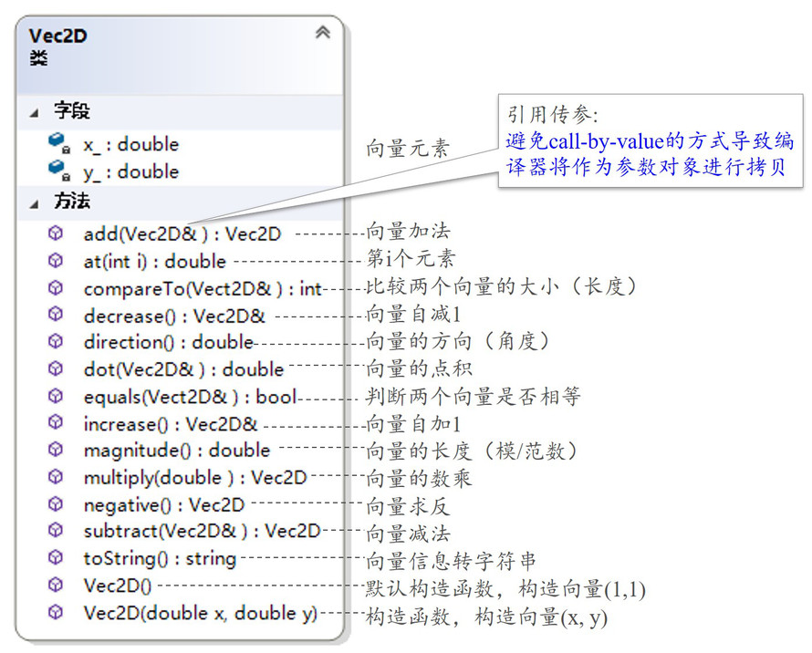

# 2D Vector Class

## How to describe 2D vector in C++

如何在 C++ 中描述平面向量。

- 向量数据成员
  - double x,double y 或者 std::array<double,2> v;
- 运算
  - +，-，数乘，点积。
  - 求长度（magnitude），方向（direction）
  - ==，!=
  - <，<=，>，>=
  - 类型转换：double（即求向量长度），string
  - 负值（Negative value）
  - 自加 1，自减 1

图1.要实现的Vec2D类

可注意到，大多数都是引用传参，这样可以避免大量的拷贝开销。

## The steps of creating Vec2D class

创建平面向量类的步骤。

#### Test-Driven Development（TDD）测试驱动开发

这里不是指软件测试方法，而是指开发设计方法。

Kent Beck《测试驱动开发》提出的这种思想。

#### Steps 步骤

- 先写测试代码，而不是功能代码
- 编译运行测试代码，发现不能通过
- 做一些小小的改动（编写功能代码），尽快地让测试程序可运行
- 重构代码，优化设计。

## Some Functions

一些要用到的函数。

~~~C++
#include <cmath>
double atan(double x);//返回 x 的 arctan 值，以弧度为单位。有其它类型重载
double sqrt(double x);//返回 x 的平方根。有其它类型重载
double pow(double b, double exp);//返回 b 的 exp 次方。有其它类型重载
~~~

## 实现

根据 Test-Driven Development（TDD）测试驱动开发的思想，我们先假装 Vec2D 类已经写好了，然后先写测试代码。

~~~C++
#include <iostream>

int main(){
    //创建向量对象
    Vec2D v1{3,5};
    Vec2D v2{4,6};
    //向量转为字符串
    std::cout << "v1 = " << v1.toString() << std::endl;
    std::cout << "v2 = " << v2.toString() << std::endl;
    //向量加法：向量+向量，向量+数
	//一般我们优先考虑函数的实现，然后再考虑运算符重载
    //Vec2D v3 = v1 + v2;
    //Vec2D v4 = v1 + 10.0;
    //所以没有写成这样，而是下面这样:
    Vec2D v3 = v1.add(v2);
	Vec2D v4 = v1.add(10.0);
    std::cout << "v3 = " << v3.toString() << std::endl;
    std::cout << "v4 = " << v4.toString() << std::endl;
    //向量减法，向量点积，向量数乘
    Vec2D v5 = v2.subtract(v1);
	double v6 = v2.dot(v1);
    Vec2D v7 = v3.multiply(2.1);
	std::cout << "v2 - v1 = " << v5.toString() << std::endl;
    std::cout << "v2 . v1 = " << v6 << endl;
	std::cout << "v3 * 2.1 = " << v7.toString() << std::endl;
    //向量求负值
    Vec2D v8 = v2.negative();
	std::cout << "-v2 = " << v8.toString() << std::endl;
    //向量自增/自减
    std::cout << "++v8 = " << v8.increase().toString() << std::endl;
	std::cout << "--v2 = " << v2.decrease().toString() << std::endl;
    //读取或者修改向量元素
    std::cout << "v1.x = " << v1.at(0) << std::endl;
    std::cout << "v1.y = " << v1.at(1) << std::endl;
    //向量长度 magnitude 和角度 direction
    std::cout << "v1.magnitude = " << v1.magnitude() << std::endl;
    std::cout << "v1.direction = " << v1.direction() << std::endl;
    //比较两个向量
    std::cout << "v1 compare v2 = " << v1.compare(v2) << std::endl;
    return 0;
}
~~~

然后写 Vec2D 类。

Vec2D.h

~~~C++
#pragma once
#include <string>

class Vec2D{
private:
    double x;
    double y;
public:
    Vec2D();
    Vec2D(double x, double y);
    ~Vec2D();

    //向量转为字符串
    std::string toString();
    //向量加法：向量+向量，向量+数
	Vec2D add(Vec2D second_Vec2D);
    Vec2D add(double numeral);
    //向量减法
    Vec2D subtract(Vec2D second_Vec2D);
    //向量点积
    double dot(Vec2D second_Vec2D);
    //向量数乘
    Vec2D multiply(double mutiplier);
    //向量求负值
    Vec2D negative();
    //向量自增1
    Vec2D& increase();
    //向量自减1
    Vec2D& decrease();
    //读取或者修改向量元素
    double& at(const int index);
    //求向量长度 magnitude
    double magnitude();
    //求向量角度 direction 与 x+ 轴的夹角
    double direction();
    //比较两个向量,如果 first_Vec2D 更小返回 -1; 更大返回 1；相等返回 0
    int compare(Vec2D second_Vec2D);
};
~~~

Vec2D.cpp

~~~C++
#include "Vec2D.h"
#include <exception>
#include <cmath>

Vec2D::Vec2D(){}
Vec2D::Vec2D(double x, double y) : x{x}, y{y} {}
Vec2D::~Vec2D(){}

//向量转为字符串
std::string Vec2D::toString(){
    return std::string("("+std::to_string(x)+","+std::to_string(y)+")");
}
//向量加法：向量+向量，向量+数
Vec2D Vec2D::add(Vec2D second_Vec2D){
    return Vec2D{x + second_Vec2D.x, y + second_Vec2D.y};
}
Vec2D Vec2D::add(double numeral){
    return Vec2D{x + numeral, y + numeral};
}
//向量减法
Vec2D Vec2D::subtract(Vec2D second_Vec2D){
    return Vec2D{x - second_Vec2D.x, y - second_Vec2D.y};
}
Vec2D Vec2D::subtract(double numeral){
    return Vec2D{x - numeral, y - numeral};
}
//向量点积
double Vec2D::dot(Vec2D second_Vec2D){
    return x * second_Vec2D.x + y * second_Vec2D.y;
}
//向量数乘
Vec2D Vec2D::multiply(double mutiplier){
    return Vec2D{x * mutiplier, y * mutiplier};
}
//向量求负值
Vec2D Vec2D::negative(){
    return Vec2D{-x, -y};
}
//向量自增1
Vec2D& Vec2D::increase(){
    x++; y++;
    return *this;
}
//向量自减1
Vec2D& Vec2D::decrease(){
    x--; y--;
    return *this;
}
//读取或者修改向量元素
double& Vec2D::at(const int index){
    if(index == 0) return x;
    else if(index == 1) return y;
    else std::__throw_out_of_range("at() only accept 0 or 1 as parameter.");
}
//求向量长度 magnitude
double Vec2D::magnitude(){
    return sqrt(x*x + y*y);
}
//求向量角度 direction 与 x+ 轴的夹角
double Vec2D::direction(){
    return atan(y/x);
}
//比较两个向量,如果 first_Vec2D 更小返回 -1; 更大返回 1；相等返回 0
int Vec2D::compare(Vec2D second_Vec2D){
    double m1 = this->magnitude();
    double m2 = second_Vec2D.magnitude();
    if(abs(m1-m2) < 1e-10) return 0;
    else return m1>m2 ? 1 : -1;
}
~~~

编译运行

~~~C++
//output:
//v1 = (3.000000,5.000000)
//v2 = (4.000000,6.000000)
//v3 = (7.000000,11.000000)
//v4 = (13.000000,15.000000)
//v2 - v1 = (1.000000,1.000000)
//v2 . v1 = 42
//v3 * 2.1 = (14.700000,23.100000)
//-v2 = (-4.000000,-6.000000)
//++v8 = (-3.000000,-5.000000)
//--v2 = (3.000000,5.000000)
//v1.x = 3
//v1.y = 5
//v1.magnitude = 5.83095
//v1.direction = 1.03038
//v1 compare v2 = 0
~~~

