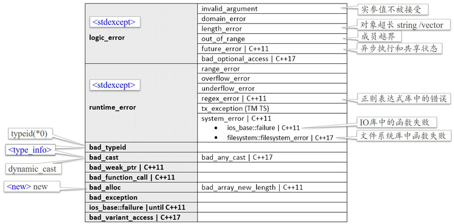

# Build-in Exception classes

内建异常类。

## Base Class of Exception in Standard Library

标准库中的异常基类。

~~~C++
#include <exception>
~~~

其中有 exception 类，exception 类是标准库中所有异常类的基类。

class exception：

- exception(); 构造函数

- virtual const char* what(); 返回解释性字符串

  what() 返回的指针指向拥有解释信息的空终止字符串（null-terminated string，即 '\0' 结尾的字符串）的指针。该指针保证在获取它的异常对象被销毁前，或在调用该异常对象的非静态成员函数前合法。

## Exception Classes in Standard Library

标准库中的异常类。

图1.标准库中的异常类

## Example

#### vector 抛出 out_of_range 异常

~~~c++
#include <iostream>
#include <vector>
#include <stdexcept>
int main() {
	std::vector<char> vec {'h','e','l','l','o'};
	try{
        for(int i = 0; i <= 5; i++)//故意越界
            std::cout << vec.at(i) << std::endl;
    }catch(std::out_of_range e){
        std::cout << e.what();
    }

	return 0;
}
//output:
//h
//e
//l
//l
//o
//vector::_M_range_check: __n (which is 5) >= this->size() (which is 5)
~~~

#### 内存分配失败抛出  bad_alloc 异常类

~~~C++
#include <iostream>
#include <exception>

int main() {
	try{
        for(int i = 0; i < 10000; i++){
            auto*p = new long long int [1000000];
            std::cout << i << std::endl;
        }
    }catch(std::bad_alloc& e){
        std::cout << e.what() << std::endl;
    }

	return 0;
}
//output:
//1
//2
//...
//7427
//7428
//std::bad_alloc
~~~

## 侧向转换失败抛出 bad_cast 异常类

~~~c++
#include <iostream>
#include <exception>

class Student{
    virtual void foo(){};
};

class Undergraduate : public Student{
};

class Graduate : public Student{
};

int main() {
	try{
        Undergraduate u;
        Graduate g;
        Student* s1 = &u;
        Student* s2 = &g;
        Undergraduate* p1 = dynamic_cast<Undergraduate*>(s1);//转换成功
        
        Graduate* p2 = dynamic_cast<Graduate*>(s1);//转换失败，p 为 nullptr
        if(p2 == nullptr) std::cout << "cast s1 to Graduate* fail" << std::endl;
        else std::cout << "cast s1 to Graduate* success" << std::endl;
        
        //dynamic_cast 只有在做引用类型转换时，转换失败才会抛出异常。
        Graduate& r1 = dynamic_cast<Graduate&>(u);
    }catch(std::bad_cast& e){
        std::cout << e.what() << std::endl;
    }

	return 0;
}
//output:
//cast s1 to Graduate* fail
//std::bad_cast
~~~

