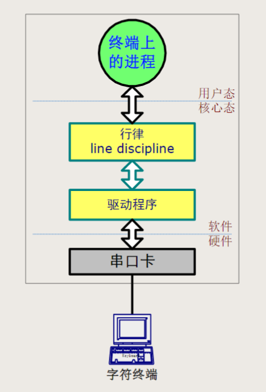
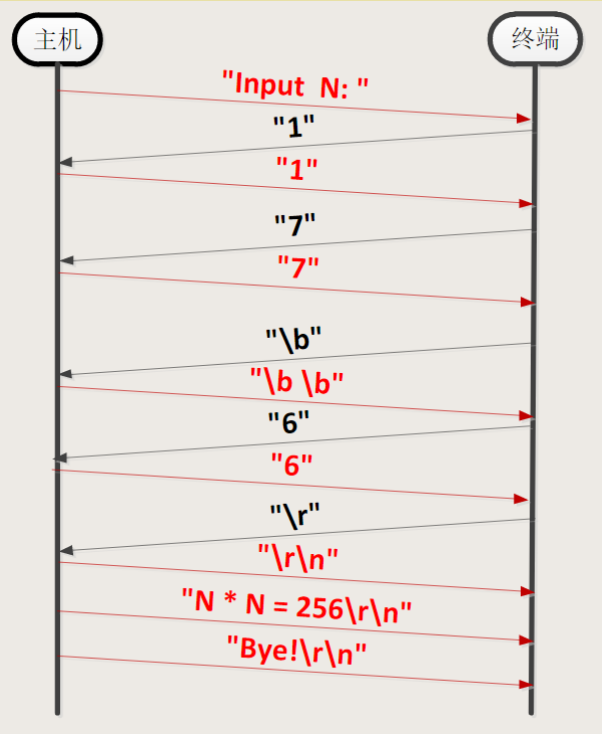
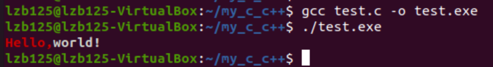
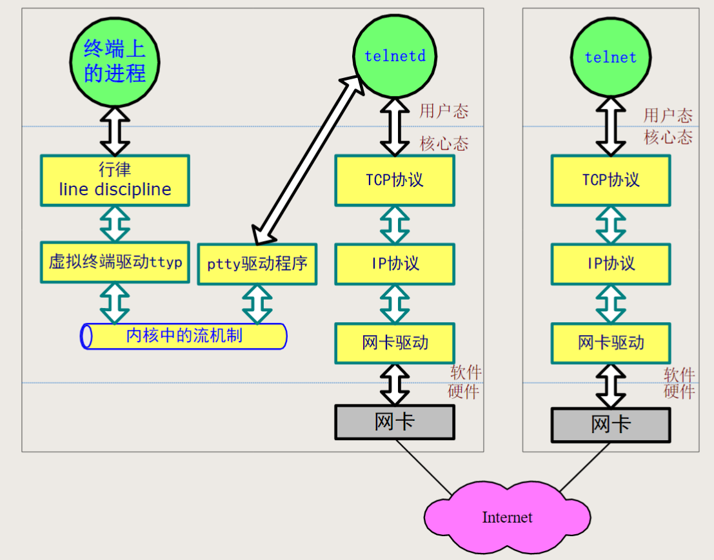

# Linux 字符终端

通过字符终端的方式使用 Linux 仍然是现在经常使用的一种方式。

虽然现在不使用物理设备上的终端了，但这种方式仍然在使用。

## 终端 Terminal

传统的 Unix/Linux 是多用户系统。其主机连接多台字符终端，字符终端作为交互式输入输出设备。

#### 终端的构成

终端由以下三部分构成：

- 键盘

- 显示器

- RS232 串行通信接口

  RS232 是一个通信标准。

#### 字符终端的历史

英文打字机

字符终端的历史，可以追溯到英文打字机（typewriter）。

其后是**电传打字机（teletypewriter，tty）**，电传打字机的缩写 tty 在如今 Linux 系统中仍然是终端的缩写名。

然后是字符终端，以屏幕代替卷纸打印机，仍然称作 tty 设备。

#### 主机和终端的连接

主机中需要有串口卡（硬件），引出多个 RS232 串口，每个 RS232 接口通过电缆连接一台终端。

RS232 电缆长度限制，早期要求小于十米，现在可达百米。

#### 终端与主机的功能分工

- 终端：主机的输入和输出设备。

  终端通过电缆把用户的按键信息送到主机，把主机发来的信息在屏幕上现实。

- 主机：程序和数据的存储及处理。

  数据及程序存放在主机的硬盘上，程序的运行也都由主机内的 CPU 占用主机内存来完成。

图1.终端与主机的功能分工

如图所示。

最下面是字符终端，它与主机相连。

上面的方框是主机，里面有硬件和软件。

此处画出硬件为串口卡。

硬件之上是驱动程序、行律。
这两个软件是在操作系统内核中的。

最上方是运行的用户编写的应用程序。

#### 行律与驱动程序

驱动程序：

- 不同的硬件需要不同的驱动程序。
- 此图中驱动程序的任务是将行律送下来的字节流，沿着通信线路发送出去，或者从远处收来的字节流，向行律输送。

行律的作用：

- 完成一行内字符的缓冲、回显与编辑，直到按下回车键。
- 完成数据加工功能，例如：将 \n 转化为 \r\n。
- 将 Ctrl+c 字符转化为中止进程运行的信号（signal）

#### 主机与终端之间的通信过程

假定主机运行程序：

~~~C
#include <stdio.h>
int main(void){
	int n;
    printf("Input N:");
    scanf("%d",&n);
    printf("N * N = %d\n", n*n);
    printf("Bye!\n");
    return 0;
}
~~~

终端的输入依次为：

~~~shell
17Backspace6Enter
~~~

则主机与终端之间的通信过程为：

图2. 主机与终端的通信过程

由此过程可见，行律起到了回显、数据加工的作用。
如将 "\b" 转换为 "\b \b"，"\r" 和 "\n" 转换为 \r\n"。

"\b \b" 的意思是，使得光标左移一个位置，以 " " 覆盖 "7"，然后再次左移一个位置，从而实现退格效果。

从字符终端接收到的 "\r"，和又用户程序发送下来的 "N * N = 256\n"，"Bey!\n"，行律对其中 "\r"（回车） 或 "\n"（换行） 转换为了 "\r\n"（回车换行），以实现回车换行的效果。

#### 行律功能的调整

行律具有数据加工的功能，但有时反而会导致不便。
比如：输入密码时，不希望回显；输入数据时，不希望缓冲而是直接尽快交付给应用程序。

可以通过两种方法来修改行律功能。

- 在程序中通过编程的方法。
- 使用相关命令 stty（set tty）

这里列举两个 stty 命令

~~~shell
stty erase ^H
~~~

有的终端可能不支持编辑功能，按 Backspace 键无作用，可通过此命令设置按下 Ctrl+h 键后擦掉一个字符，Ctrl+h 对于的 ASCII 码就是 8。

~~~shell
stty -a
~~~

该命令用于打印行律的所有控制信息状态。

#### 终端转义序列

终端忠实地显示从主机送来的信息，这些信息还有另外的表达方式，即转义。

**转义字符 Esc**，ASCII 码为 0x1B（十进制的 27）。

主机发往终端方向的数据中的转义序列具有的功能：

- 控制光标位置、字符颜色、字符大小等等
- 选择终端的字符集
- 控制终端上的打印机、刷卡机、磁条器、密码键盘

例如：

| 主机发送到终端的字节序列      | 功能            |
| ----------------------------- | --------------- |
| Esc[2J（0x1B 0x5B 0x32 0x4A） | 清除屏幕        |
| Esc[8A                        | 光标上移8行     |
| Esc[16;8H                     | 光标移到16行8列 |
| Esc[1;31m                     | 红色字符        |

例子：

~~~C
#include <stdio.h>

int main(){
	// \033 为 Esc 的 ASCII 码
    // 格式为 Esc[字背景颜色;字体颜色
	// 颜色用数字表示
    // \033[1:31m 表示修改输出字体颜色为红色
    // \033[1:37m 表示修改输出字体颜色为白色，也就是改回去
    printf("\033[1;31mHello,\033[1;37mworld!\n");
    return 0;
}
~~~

运行结果：

图3. 控制终端输出字体颜色

主机向终端发送转义序列有很多种方式，通过上述例子使用 C 语言编程 printf() 函数发送可行，其它方式也可行，只要从主机向终端发送的信息中有终端转义序列就行。

本质上就是主机和终端之间约定好了对终端转义序列的特殊处理，从而实现一些控制操作。

然而，不同厂商生成的终端设备，对终端转义序列的定义可能不一样，这就引入了终端类型的概念。

#### 终端类型

终端类型，定义了一组转义序列及其相对应的操作。
例如：ansi，vt100，vt200 等终端类型

主机根据终端类型，使用相应功能时，发送该终端类型中事先定义好的对应的控制码。

当终端类型设置不对，可能使一些全屏幕操作的软件运行失败。

#### 仿真终端和虚拟终端

- 仿真终端：

  PC 机上具有 RS232 接口，通过运行终端仿真软件来仿一个真正的终端设备的功能。

  例如: 早期 DOS 操作系统下的 CrossTalk； Windows 中的 "超级终端"

  仿真的内容包括实现终端的转义码序列功能。

- 虚拟终端 (利用网络)

  主机和终端之间的通信实际上就是一些字节流在两个方向上进行传输。有了网络以后，我们可以去掉 RS232 这条线，而是用网络的方式来进行字节传输。

  例如主机与 PC 通过网络相连，客户端运行 telnet，服务器端运行 telnetd，成位 Linux 的基于 TCP 通信的虚拟终端。

虚拟终端的字节流。

图4. 虚拟终端的字节流

如图所示，从该图左上角看起。

终端上的进程往下是行律，行律之下的驱动程序是一个虚拟终端驱动，它接收行律的数据，通过操作系统内核的一个设备，送到另一个应用进程 telnetd 中。

telnetd 通过 TCP/IP 的方法，送到远端服务器。

使用 telnet 的方式，是互连网早期的方式，由于不安全，所以现在经常使用的是安全终端，在 TCP 连接上进行了数据的加密和数据。
如 Windows 客户端软件 SecureCRT 或 putty。

