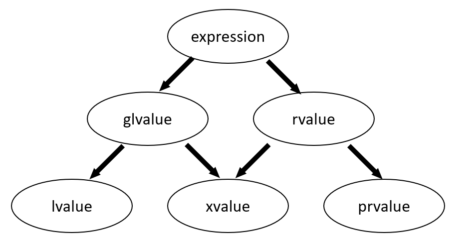

### 表达式

来自 cppreference 的 Expressions 页面：

https://en.cppreference.com/w/cpp/language/expressions

> An expression is a sequence of *operators* and their *operands*, that specifies a computation.
>
> Expression evaluation may produce a result (e.g., evaluation of 2 + 2 produces the result 4) and may generate side-effects (e.g. evaluation of [std::printf](http://en.cppreference.com/w/cpp/io/c/fprintf)("%d",4) prints the character '4' on the standard output).
>
> Each C++ expression is characterized by two independent properties: A type and a value category.

表达式是运算符和其操作数的数列，它指定了一个计算。

表达式求解可能生成一个结果（例如，2+2 的求解产生了结果 4）并且可能生成附带作用（例如，std::pringf("%d",4) 的求解在便准输出中打印了字符 ‘4’ ）。

每一个 C++ 表达式都具有两个独立的属性：一个**类型**和一个**值类别**。

### 值类别

根据微软的文档 Lvalues and Rvalues (C++)：

https://docs.microsoft.com/en-us/cpp/cpp/lvalues-and-rvalues-visual-cpp?view=msvc-170

> Every C++ expression has a type, and belongs to a *value category*. The value categories are the basis for rules that compilers must follow when creating, copying, and moving temporary objects during expression evaluation.

每一个 C++ 表达式有其**类型**和所属的**值类别**。值列表是编译器在表达式求解期间，创建、拷贝、移动临时对象时，必须遵守的基础规则。

> The C++17 standard defines expression value categories as follows:
>
> - A *glvalue* is an expression whose evaluation determines the identity of an object, bit-field, or function.
> - A *prvalue* is an expression whose evaluation initializes an object or a bit-field, or computes the value of the operand of an operator, as specified by the context in which it appears.
> - An *xvalue* is a glvalue that denotes an object or bit-field whose resources can be reused (usually because it is near the end of its lifetime). Example: Certain kinds of expressions involving rvalue references (8.3.2) yield xvalues, such as a call to a function whose return type is an rvalue reference or a cast to an rvalue reference type.
> - An *lvalue* is a glvalue that is not an xvalue.
> - An *rvalue* is a prvalue or an xvalue.

C++17 标准定义了下述值类别：

- glvalue(g = generalized)，泛左值是一个表达式，它的求解确定了对象/bit-field/函数的标识。
- prvalue(p = pure)，纯右值是一个表达式，它的求解初始化了一个对象/bit-field、或计算了运算符的操作数的值，这根据它出现的上下文决定。
- xvalue(x = expiring)，将亡值是一个泛左值，它表明一个资源可被重用的对象/bit-field（通常，这是由于它接近它生命周期的结束）。
  例如：某些涉及右值引用的表达式会产生将亡值 ，如调用一个返回类型为右值引用的函数，或一个转换为右值引用的的类型转换。
- lvalue，左值是一个将亡值之外的泛左值。
- rvalue，右值是一个纯右值或将亡值。

>An lvalue has an address that your program can access. Examples of lvalue expressions include variable names, including **`const`** variables, array elements, function calls that return an lvalue reference, bit-fields, unions, and class members.

一个左值拥有一个你的程序可访问的地址。
左值表达式的示例有：变量的名字（其包含 const 变量，数组元素，返回左值引用的函数调用，bit-fields，unions，类成员）。

> The following diagram illustrates the relationships between the categories:

下图说明了值类别之间的关系：

图1.值类别

>A prvalue expression has no address that is accessible by your program. Examples of prvalue expressions include literals, function calls that return a non-reference type, and temporary objects that are created during expression evaluation but accessible only by the compiler.

一个纯右值表达式不拥有你的程序可访问的地址。
右值表达式的例子有：字面量，返回非引用类型的函数调用，在表达式求解期间创建的仅可被编译器访问的临时对象。

>An xvalue expression has an address that no longer accessible by your program but can be used to initialize an rvalue reference, which provides access to the expression. Examples include function calls that return an rvalue reference, and the array subscript, member and pointer to member expressions where the array or object is an rvalue reference.

一个将亡值表达式拥有一个的程序在这之后不再可访问的地址，但该地址可用来初始化一个右值引用，该右值引用提供对该表达式的访问。
将亡值表达式的例子有：返回右值引用的函数调用，数组下标，为右值引用的数组或对象的成员或指针指向的成员。

### 辨析：

在 cppreference 的 Value categories 页面，由相关举例，这里不赘述（其实是懒得写）：

https://en.cppreference.com/w/cpp/language/value_category