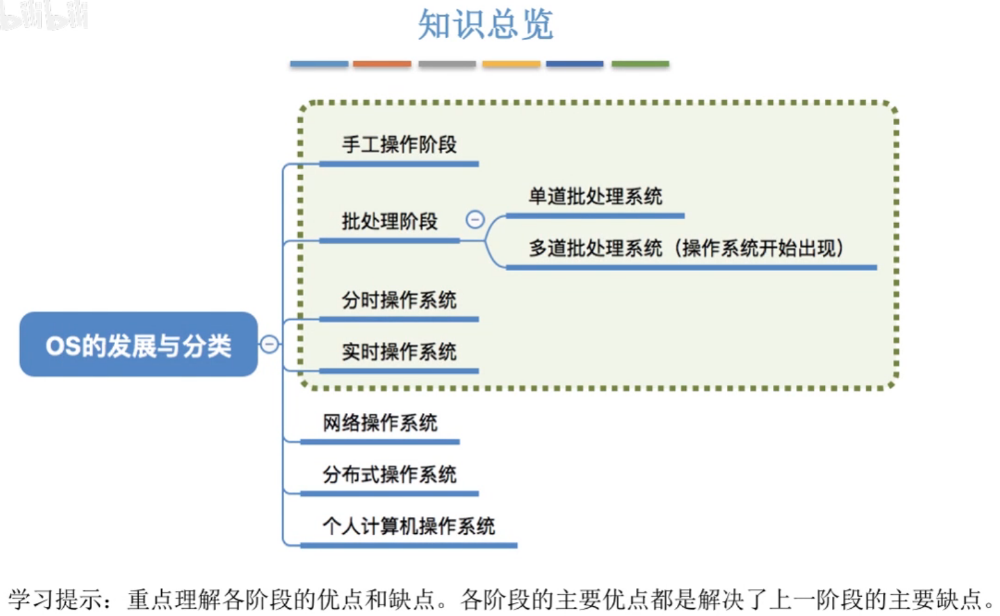

# 操作系统的发展与分类

本节总览。

## 一. 手工操作阶段

就是手工操作，通过纸带上打孔，输入计算机，比如写个打孔纸带，上面是计算的指令，然后又两个打孔纸带上面是输入的数据，再写个打孔纸带使得把计算后的结果输出......

缺点：

1. 用户独占全机，虽然不会出现被其他用户占用的而等待的现象，但资源利用率低。
2. CPU等待手工操作，对CPU的利用不充分。

## 二. 批处理阶段（操作系统开始出现）

为了解决手工操作阶段，人机矛盾及CPU和I/O设备速度不匹配的矛盾，出现了批处理系统。

又分为单道批处理系统、多道批处理系统。

### 2.1 单道批处理系统

通过外围机，将用户写在纸袋上的信息，读入到磁带中，
这样，计算机从磁带中读取至内存，
这样磁带上的一批作业能自动地逐个运行，
而且，磁带上有多个程序，计算机通过**监督程序（操作系统的雏形）**按磁带上的顺序，依次读入一个程序，执行完成后，再按顺序将下一个个程序读入内存运行。

优点：
缓解了一定程度的人机矛盾，资源利用率有所提升。

缺点：
内存中仅有一道程序运行，只有该程序运行结束之后，才能调入下一道程序。
CPU仍然发出输入/输出请求后，仍然只是在等待I/O完成，资源利用率还是很低。

### 2.2 多道批处理系统

于是在后来引入了**多道程序技术**。
多道程序设计技术，允许多个程序同时进入内存，并允许它们在CPU中交替地运行。

操作系统正式诞生。并引入了中断技术，由操作系统负责管理这些程序的运行，各程序并发执行。
（显然操作系统和多道程序技术是同时诞生的）

也就是原本从磁带一次读入一个程序，现在是读入多个程序并发执行了。

优点：
多道程序并发执行，共享计算机资源。资源利用率大幅提升，CPU和其他资源保持"忙碌"状态，系统吞吐量大。

缺点：
用户响应的时间长；
不提供人机交互能力，在程序运行期间，用户既不能了解自己的程序运行情况，又不能控制计算机。

## 三. 分时操作系统

分时技术，指把处理器的运行时间分成很短的时间片，以时间片为单位，轮流把处理器分配给各个作业服务。

分式操作系统，采用分时技术，并且多个用户可以通过终端同时共享一台主机，这些终端连接在主机上，用户可以同时与主机进行交互操作而互不干扰。

优点：
用户的请求可以被即时响应，解决了人机交互问题。

缺点：
不能优先处理一些紧急任务。
因为每个时间片是完全公平的分给各个用户/作业的，就算某个工作更紧急，但还是只能按照你一个时间片我一个时间片来。

## 四. 实时操作系统

为了能在某个时间限制内完成某个紧急任务而不需要时间片排队，诞生了实时操作系统。

实时操作系统又分为，硬实时操作系统、软实时操作系统。

1. 硬实时操作系统

   必须在绝对严格的规定时间内完成处理。

   比如导弹发射，那你必须限制时间内完成，不然在基地炸了咋办。

2. 软实时操作系统

   能偶尔违反时间规定。

   比如火车票订票系统，虽然应该定时更新还有多少张票，多少座位，但是偶尔更新慢了也可以接受。

实时操作系统的主要特点是及时性和可靠性。

## 五. 其他操作系统

上面的是考研常考的操作系统。

下面就是了解一下的操作系统。

### 5.1 网络操作系统

伴随着计算机网络的发展而诞生，能把网络中各个计算机有机地结合起来，实现数据传送等功能，实现网络中各种资源的共享和各台计算机之间的通信。

### 5.2 分布式操作系统

主要特点是分布性和并行性。

系统中的各台计算机地位相同，任何工作都可以分布在这些计算机上，它们并行、协同完成这些任务。

### 5.3 个人计算机操作系统

目前使用广泛的操作系统，比如Windows、Linux等，方便个人使用。

2020.09.28