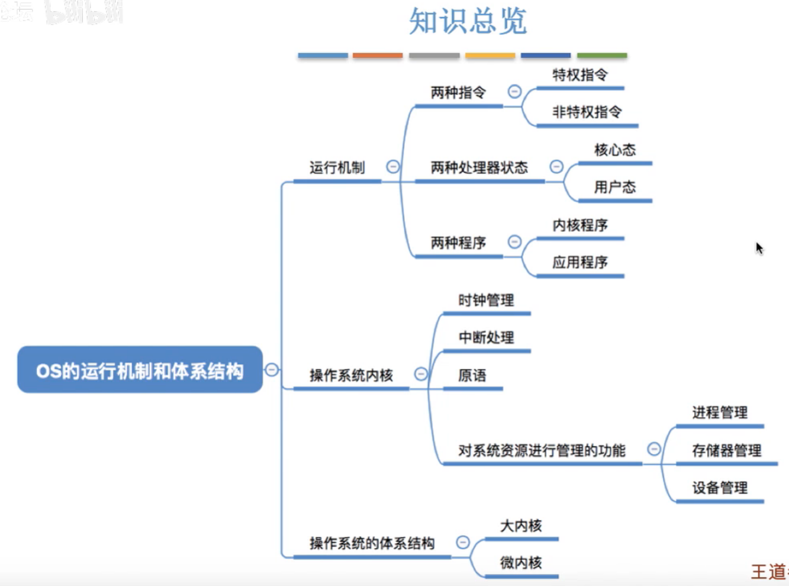
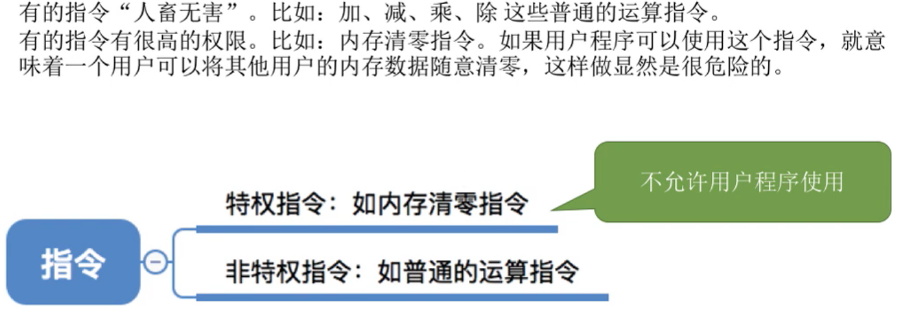
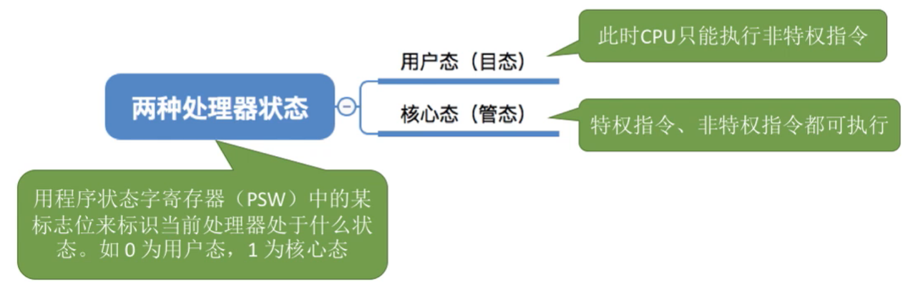
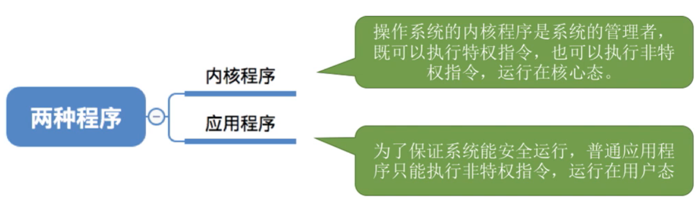
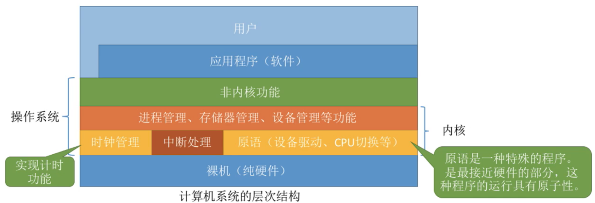
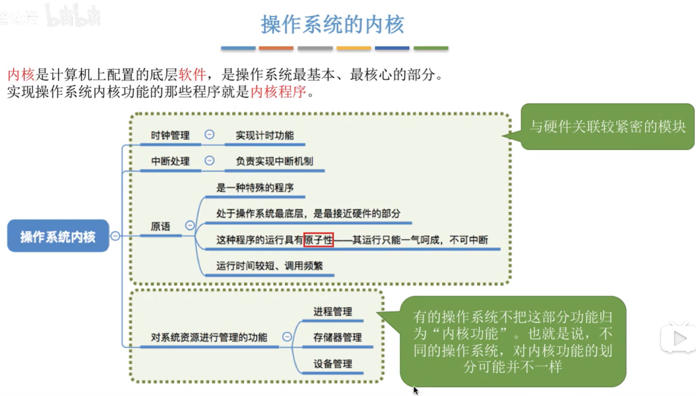
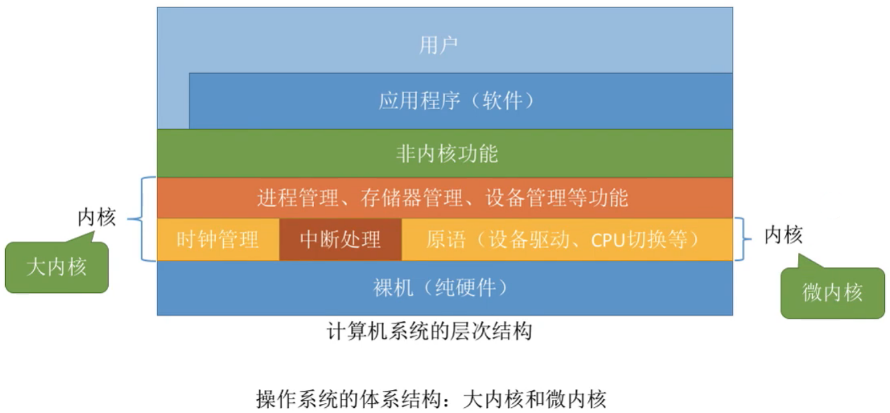
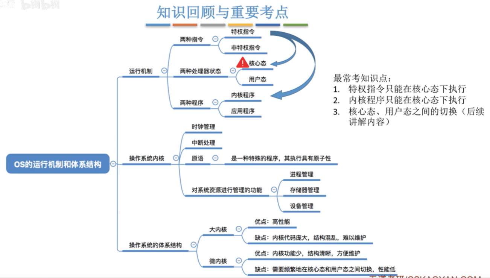

# 运行机制和体系结构

图1.本节总览

## 一. 运行机制

### 1.1 特权指令与非特权指令

图2.两种指令

由于某些指令具有很高的权限，造成的影响可能很大，所以指令分为：

1. 特权指令：不允许用户程序使用。
2. 非特权指令。

### 1.2 核心态与用户态

图3.两种处理器状态

通过程序状态字寄存器PSW中的某个标志位来标识当前处理器处于什么状态，从而判断当前状态能否执行特权指令，比如：
当该标志位为1时，为**核心态**（管态），此时特权指令，非特权指令都可以执行；
当该标志位为0时，为**用户态**（目态），此时只能够执行非特权指令。

### 1.3 内核程序与应用程序

图4.两种程序

操作系统的**内核程序**作为系统的管理者，既可以执行特权指令，也可以执行非特权指令，运行在核心态。

为了保证系统能安全运行，普通**应用程序**只能执行非特权指令，运行在用户态。

## 二. 操作系统内核

图5.操作系统的内核

操作系统的内核，是指计算机上配置的底层软件，是操作系统最基本、最核心的部分。

从图5可以看出，操作系统本身又可以细分为内核功能和非内核功能。

图6.操作系统内核

不同系统对内核的定义稍微有所区别，但大多数操作系统内核包括：

1. 时钟管理

   操作系统通过时钟管理，向用户提供标准的系统时间。

2. 中断机制

   中断机制中只有一小部分属于内核，这一部分是负责保护和恢复中断现场的信息，转移控制权到相关的处理程序

   这不就是<计组>中的中断隐指令+中断服务程序。所以，中断服务程序是属于操作系统的咯）
   顺带一提，有 2015 年真题可知，PC 的值由中断隐指令自动保存，而通用寄存器的内容由操作系统保存。

   > 处理外部中断时，应该由操作系统保存的是（B）
   >
   > A. 程序计数器（PC）的内容
   >
   > B. 通用寄存器的内容
   >
   > C. 快表（TLB）的内容
   >
   > D. Cache 中的内容

   可见，中断隐指令不算是操作系统，PC 也不算是操作系统保存的。

3. 原语

   处于操作系统最底层，是最接近硬件的部分。

   这些程序具有**原子性**，开始执行后直工作执行结束，其操作不可中断。

   这些程序的运行时间都较短，而且调用频繁。

4. 系统控制的数据结构及处理

   为了对系统资源进行有效的管理，这部分操作系统常见有：

   进程管理：进程状态管理、进程调度和分派、创建与撤销进程控制块等。

   存储器管理：存储器的空间分配和回收、内存信息保护程序、代码对换程序等。

   设备管理：缓冲区管理、设备分配和回收等。

前3个内核程序是与硬件关联绞紧密的模块。

## 三. 操作系统的体系结构

图7.大内核和微内核

**大内核**：将操作系统的主要功能模块都作为系统内核，运行在核心态。

**微内核**：只将最基本的功能保留在内核，运行在核心态，没那么必要的就运行在用户态。

图8.大内核、微内核对比

大内核：

优点：高性能。
缺点：内核代码庞大，结构混乱，难以维护。

微内核：

优点：内核功能少，结构清晰，方便维护。
缺点：需要频繁地在内核态和用户态之间切换，性能低。

## 四. 本节回顾

图9.本节回顾

2020.09.29