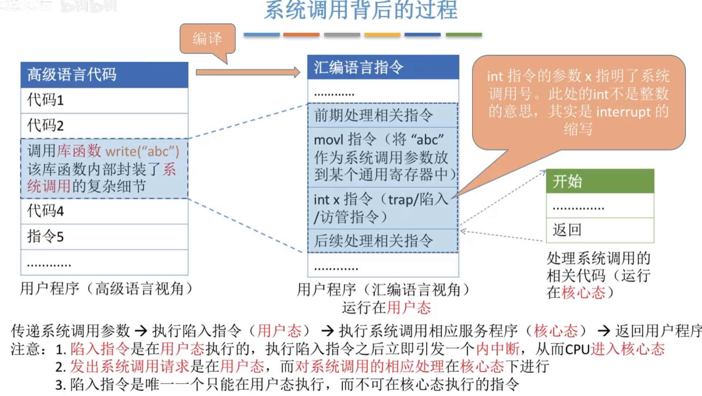

# 系统调用

图1.本节总览

## 一. 什么是系统调用，系统调用的作用

图2.回顾一下

用户接口分为命令接口和程序接口。

其中命令接口是用户可以直接使用的，而程序接口是用户通过程序间接使用的，是由一组系统调用组成。

图3.系统调用的作用及其分类

计算机系统中的各种共享资源都由操作系统统一掌管。

如果应用程序想要使用资源，比如存储分配、I/O操作、文件管理等，都必须通过系统调用的方式向操作系统提出服务请求，由操作系统代为完成。

系统调用，也就指用户在程序中调用操作系统提供的一些子功能。
应用程序发出系统调用请求，由操作系统代为执行（在内核态下），结束后返回用户态。

这样可以保证系统的稳定性和安全性，防止用户非法操作。

图3可以看出，系统调用都是一些影响非常大的操作，按功能分类，系统调用分为：设备管理、文件管理、进程控制、进程通信、内存管理。

## 二. 系统调用与库函数的区别

图4.系统调用与库函数的区别

应用程序，可以直接进行系统调用，也可以使用库函数。

库函数，本质就是封装好的函数嘛，
有些库函数并不设及到系统调用，有些库函数会设及到系统调用，
涉及到系统调用的库函数，就是把系统调用封装成一个函数，方便适用呗。

## 三. 系统调用背后的过程

图5.系统调用的过程

如图5，库函数write()中封装了系统调用，从汇编指令来看，执行到trap访管指令（陷入指令），从用户态切换成核心态，然后执行系统调用的响应服务程序，执行完毕后返回应用程序。

这里注意：

1. 陷入指令是在用户态执行的，执行陷入指令后立即引发一个内中断，CPU进入核心态。
2. 陷入指令是唯一一个只能在用户态执行，而不能在核心态执行的指令。
   因为核心态本是可以执行特权和非他特权指令的，但是就不能执行陷入指令。
3. 发出系统调用请求是在用户态，对系统调用的响应处理在核心态。

图6.系统调用号

陷入指令有一个参数，通过这个参数来告知操作系统需要适用的系统调用是什么。也就是执行什么中断服务程序。

（感觉这里就是计组那里选择中断服务程序，不过计组讲的是从向量地址找到中断向量从而找到中断服务程序。）

## 四. 本节回顾

图7.本节回顾

2020.09.29