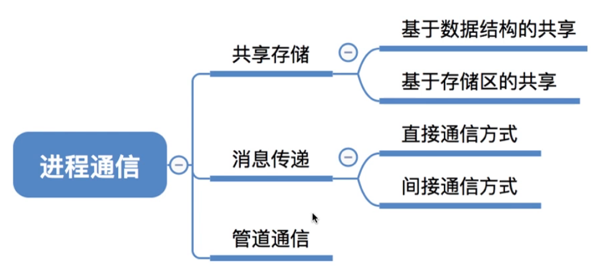
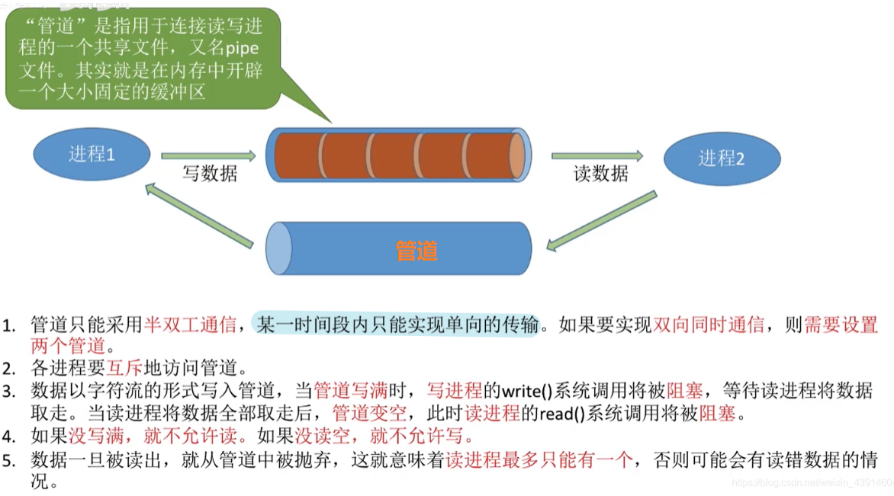
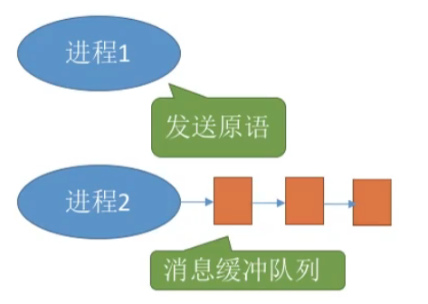
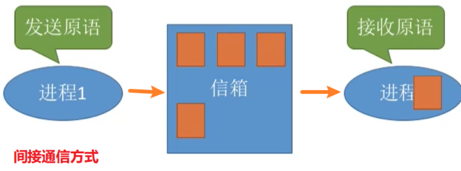
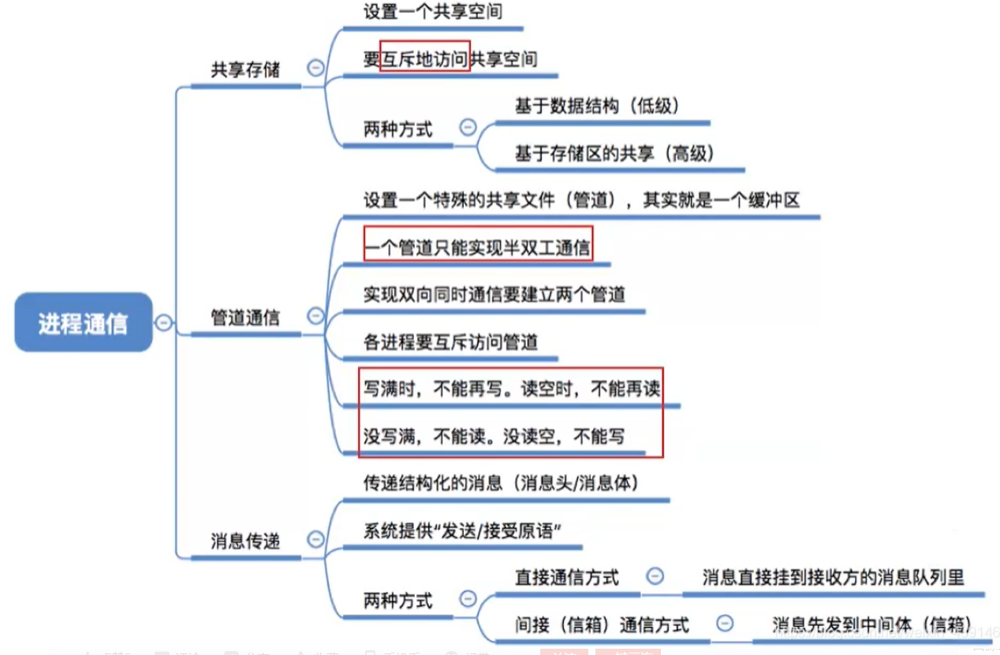

# 进程通信

图1.本节总览

## 一. 什么是进程通信

进程通信，是指进程之间的信息交换。

各个进程具有的内存地址空间相互独立。

为了保证安全，一个进程不能直接访问另一个进程的地址空间。

但有时进程之间的信息交换又是必须的。
于是为了保证进程之间的安全通信， 操作系统提供了一些方法：共享存储、消息传递、管道通信。

## 二. 共享存储

图2.共享存储

操作系统在内存中开辟一块共享空间，允许共享该空间进程对其进行**互斥访问**，即同一时刻只允许一个进程访问该共享空间。
互斥访问通过操作系统提供的工具实现。

共享存储方式，操作系统只负责提供共享空间和同步互斥空间，如P、V操作。

共享存储方式又有两种实现方式：基于数据结构的共享、基于存储区的共享。

### 2.1 基于数据结构的共享

基于数据结构的共享是一种**低级通信方式**。

共享空间只能有一种固定的数据结构

比如共享空间为只能放一个长度为10的数组。

这种共享方式速度慢，限制多（对数据格式有限制）。

### 2.2 基于存储区的共享

基于存储区的共享是一种**高级通信方式**。

操作系统只是提供一个共享空间，其数据的形式、存放的位置都有进程来控制，而非操作系统决定。

这种共享方式速度更快，数据形式更自由。

## 三. 管道通信

图3.管道通信

管道是指用于连接读写进程的一个共享文件，又名pipe文件。
本质是在内存中开辟一个大小固定的缓冲区。

管道只能采用**半双工通信**，即指虽然可以双向传输，但某一时间段内只能单向传输信息。
如果要实现双向同时通信，则需要设置两个管道。

为了协调双方通信，管道机制必须提供以下三方面的协调能力：

1. 互斥：
   各进程要**互斥**地访问管道。同一时间一个管道只能被一个进程访问。进程1在写入管道时，进程2无法读该管道。
2. **同步**：
   数据以字符流的形式写入管道，当管道写满时，写进程的write()系统调用被阻塞，等待读进程将数据全部取走，读进程的read()系统调用被阻塞。
3. 确定对方的存在：
   只有确定了对方已存在时才能进行通信。

如果没有写满，不允许进行读，如果没有读空，不允许写。
（我感觉不太对哦，如果数据本身就写不满一个管道呢？虽然大部分情况传输的数据应该是大于管道的容量的，这句话可能是指当传输数据大于管道容量的时候吧。）

数据一旦被读出，就从管道中抛弃。
这句话意思是，管道中的数据被进程读走后，就真取走了，这个数据不在管道中存在了。

## 四. 消息传递

消息传递，进程间的数据交换会以**格式化的消息**为单位。进程通过操作系统提供的"发送消息/接收消息"两个**原语**进行数据交换。

图4.格式化的消息

格式化的消息：

1. 消息头：包括发送进程的ID，接收进程的ID，消息类型，消息长度等格式化信息。
2. 消息体：发送的信息。

消息传递又分为两种方式：直接通信方式，间接通信方式。

### 3.1 直接通信方式

图5.直接通信方式

每个进程都拥有消息缓冲队列。

直接通信方式，发送消息的进程，将格式化的消息，通过发送消息原语，将该消息挂到接收进程的消息缓冲队列上。
接收消息的进程会通过接收消息原语，来依次接收消息缓冲队列上的消息。

### 3.2 间接通信方式

图6.间接通信方式

发送消息的进程，通过发送消息原语，把消息先发送到**中间实体（信箱）**，信箱中有着不同进程发送给不同进程的消息，接收消息的进程会有某种方法找到自己的消息（我感觉是根据消息头里的信息），通过接收消息的原语，从信箱中取走自己的消息。

间接通信方式，又称**信箱通信方式**。

## 四. 本节回顾

图7.本节回顾

2020.09.30

