# 现场概念、多线程模型

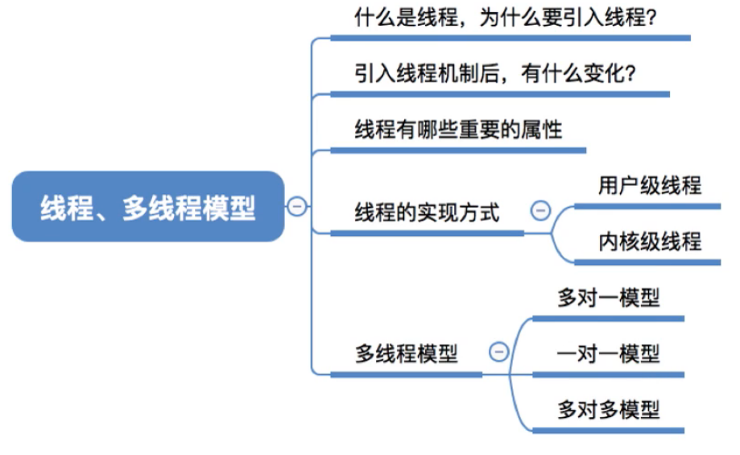

图1.本节总览

## 一. 什么是线程，为什么要引入线程？

进程是程序的一次执行。

我们可以采用多进程来提高CPU使用率。

其中进程的创建、切换、撤销是时空开销很大的阶段。
比如进程之间的切换，就需要保存现场，恢复现场等，
还有<计组>中讲到的虚拟存储器，因为进程是拥有各自独立的内存地址空间的，切换进程时，不同进程查实地址的表也要切换为各自的表。

如果说，我们把并不把进程看作最小单位，而是一样给进程分配资源，但是，把进程分为由多个线程组成，将线程的工作，拆分为每个线程负责一部分可以独立运行的工作，每个线程仅拥有很少的一部分自身运行必不可少的资源，但同一进程的线程可以共享该进程的资源。

这意味着，在同一进程中的不同线程切换时，并不需要保存/恢复进程的现场，而只用保存/恢复线程的少量的寄存器内容，而且也不用切换查实地址的表，切换代价远远低于进程。

当然，不同进程的线程进行切换，还是进程的切换。

于是，在引入了线程后，进程=资源+多个指令序列。
本质上是将资源与指令执行分开。

下面抄书：

>如果说，在OS中引入进程的目的是为了使多个程序能并发执行，以提高资源利用率和系统吞吐量，那么在操作系统中再引入线程，则是为了减少程序在并发执行时所付出的时空开销，使OS具有更好的并发性。
>
>进程的两个基本数据
>
>一. 首先回顾进程的两个基本属性：
>
>1. 进程是一个可拥有资源的独立单位，一个进程要能独立运行，它必须拥有一定的资源，包括用于存放程序正文、数据的磁盘和内存地址空间，以及它在运行时所需要的I/O设备、已打开文件、信号量等；
>2. 进程同时又是一个可独立调度和分派的基本单位，一个进程要能独立运行，它还必须是一个可独立调度和分配的基本单位。每个进程在系统中有位移的PCB，系统可根据PCB感知进程的存在，也可以根据其PCB中的信息，对进程进行调度，还可将断电信息保存在其PCB中。反之，再利用进程PCB中的信息来恢复进程运行的现场。
>
>正是由于进程有这两个基本属性，才使进程成为一个能独立运行的基本单位。从而也就构成了进程并发执行的基础。
>
>二. 程序鬓发执行所需付出的时空开销
>
>为使程序能并发执行，系统必须进行以下一系列操作：
>
>1. 创建进程，系统在创建一个进程时，必须为它分配其所必需的、除处理机以外的所有资源，如内存空间、I/O设备，以及建立相应的PCB；
>2. 撤销进程，系统在撤销进程时，又必须先对其所占有的资源执行回收操作，然后再撤销PCB；
>3. 进程切换，对进程进行上下文切换时，需要保留当前进程的CPU环境，设置新选中进程的CPU环境，隐藏须花费不少的处理机时间。
>
>据此可知，由于进程是一个资源的拥有者，因而在创建、撤销和切换中，系统必须为之付出较大的时空开销。这就限制了系统中所设置进程的数目，而且进程切换也不宜过于频繁，从而限制了并发成都的进一步提高。
>
>三. 线程——作为调度和分派的基本单位
>
>如何能使多个程序更好地并发执行，同时又尽量减少系统地开销。有不少研究操作系统的学者们想到，要设法将进程的上述两个基本属性分开，由OS分开处理，亦即并不把作为调度和分派的基本单位也同时作为拥有资源的单位，以做到"轻装上阵"；而对于拥有资源的基本单位，又不对之施以频繁的切换。正是在这种思想的指导下，形成了线程的概念。

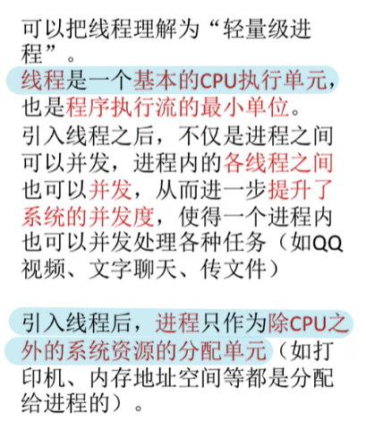

图2.线程

引入线程后：

线程是一个基本的CPU执行单元，也是程序执行流的最小单位。
（在之前都说进程切换，感觉是CPU在以进程为执行单位，但本质上，CPU是以线程为执行单位的。）

进程之间可以并发，进程内的各线程之间也可以并发。

进程只作为除了CPU之外的系统资源分配单元。

## 二. 引入线程机制后，有什么变化

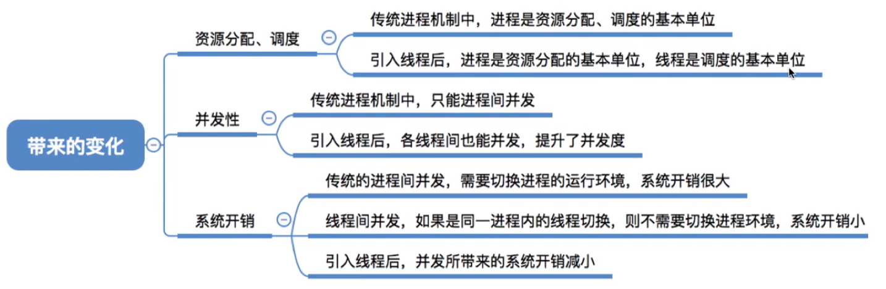

资源的分配、调度上：

传统进程机制中，进程是资源分配、调度的基本单位，
引入线程后、进程是资源分配的基本单位，线程是调度的基本单位。

并发性：

传统进程机制中，只能进程并发，
引入线程后，各线程间也能并发，提高了并发度。

系统开销：

传统进程机制中，需要切换进程的运行环境，系统开销大，
引入线程后，并发所带来的系统开销小，如果是同一进程内的线程切换，不需要切换进程环境。

## 三. 线程有哪些重要的属性

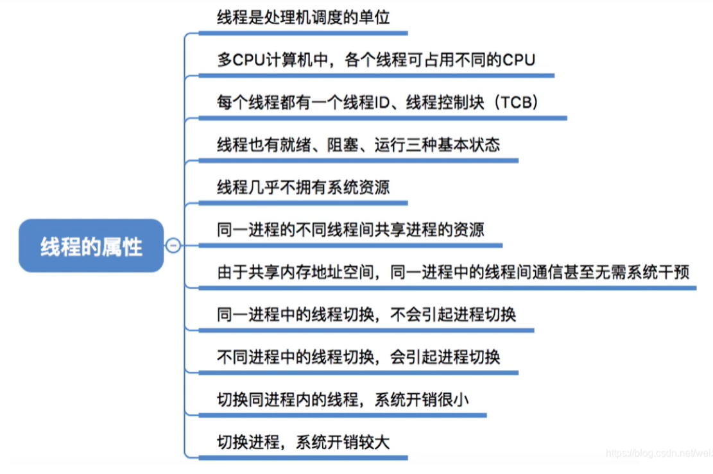

图4.线程的属性

线程是CPU调度的基本单位。
（进程已经不再是一个可执行的实体了，一个进程正在运行，实际上是指该进程的某线程正在执行。）

多CPU计算机中，各个线程可占用不同CPU。

**每个线程都有一个线程ID、线程控制块TCB。**

线程也有**就绪态、阻塞态、运行态**，三种基本状态。

线程**几乎不**拥有系统资源，几乎不，但还是有一点点。

同一进程的不同线程间共享进程的资源。

由于共享内存地址，同一进程中的线程间通信无需操作系统干预。

同一进程中的线程切换，不会引起进程切换。

不同进程中的线程切换，才会引起进程切换。

同一进程中的线程切换，系统开销小。

进程切换，系统开销大。

## 四. 线程的实现方式

线程的实现方式，有的计算机采用用户级线程来实现进程的多线程。有的计算机采用内核级线程来实现，还有二者组合方式的。

### 4.1 用户级线程

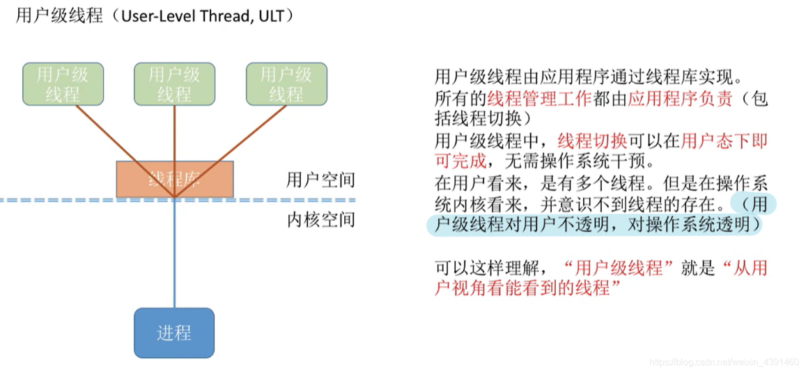

图5.用户级线程

用户级线程方式，

通过给用户提供线程相关的函数（这些函数在线程库中），比如创建线程、终止线程等等相关函数，由用户写程序时，调用这些函数，来实现自己写的程序的多线程运行。

所有线程的管理工作都由应用程序负责（本质上，其实就是用户控制）。

注意到线程库是在用户态实现的，所以线程切换就在在用户态完成了，不需要进入内核态，不需要操作系统干预。

（这里既然单讲用户级线程方式，那就是假设计算机只支持用户级线程方式，目前还没有内核级进程方式。所以操作系统内核仍然是以进程为基本单位来调度的。
但我下面还是写的一个单线程的进程= =，但其实这里对操作系统内核来说根本没有线程这个概念，哎呀好理解嘛。）

对于用户来说，我自己知道这个进程是有几个线程的，毕竟程序都是我自己写的。
但是对于操作系统来说，这个进程只是一个单线程的进程，虽然说代码执行起来确实是我们想要的线程并发。
但这实际上是我们程序设计好的，运行时所表现出来的现象，
对于操作系统来说，它只是在控制一个单线程的进程执行而已。

所以称为，用户级线程对用户不透明，对操作系统透明。

由于操作系统只是在控制单线程进程，所以这个应用程序，即便在多核CPU机器上，也只能在一个CPU上并发。

而且，同样是因为操作系统只是在控制单线程进程，如果一个线程（用户看来）被阻塞了，比如进行了一个系统调用，那么该进程的所有线程（用户看来）都被阻塞了，得等待这个系统调用结束。毕竟操作系统是以单线程进程来控制的。

### 4.2 内核级线程

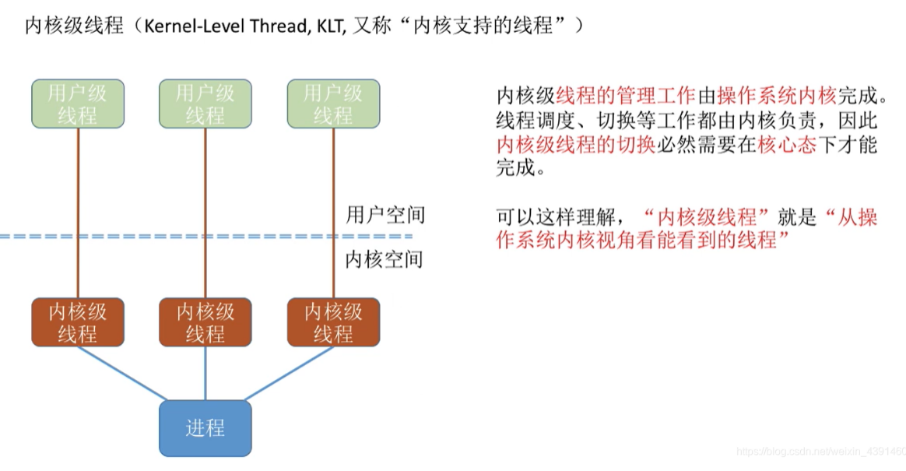

图6.内核级线程

内核级线程方式，

由操作系统内核来完成进程的管理工作。

这种方式也就是操作系统内核有了管理线程的功能。

现在，应用程序中是没有进行线程管理的代码的，而是通过系统调用，使操作系统内核来完成线程的创建、终止和切换。

显然的，内核级线程的切换必然需要在核心态下才能完成。

这样，内核级线程对操作系统不透明的，操作系统也就可以以内核级线程为基本单位来调度。（而非用户级线程，操作系统是以单线程进程来控制的）

多核CPU上，一个进程的内核级线程，是可以分配给多个CPU来并行的。

当然内核级线程方式，因为程序的运行是在用户态的，所以每次线程的切换，都需要从用户态切换到核心态来完成，开销比较大。

### 4.3 二者组合方式

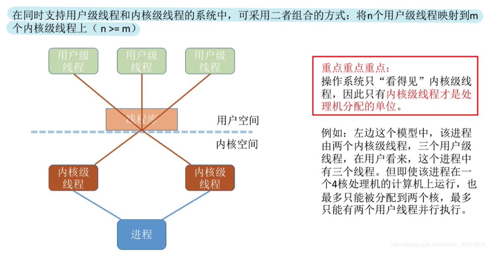

图7.二者组合的方式

在同时支持用户级线程和内核级线程的系统中，可采用二者组合的方式：将n个用户级线程映射到m个内核级线程上（ $m\leq n$ ）。

但注意，对操作系统来说，只看得见内核级线程，所以内核级线程才是处理机分配的单位。

## 五. 多线程模型

在同时支持用户级线程和内核级线程的系统中，用户级线程与内核级线程有不同的数量对应方式。

### 5.1 多对一模型

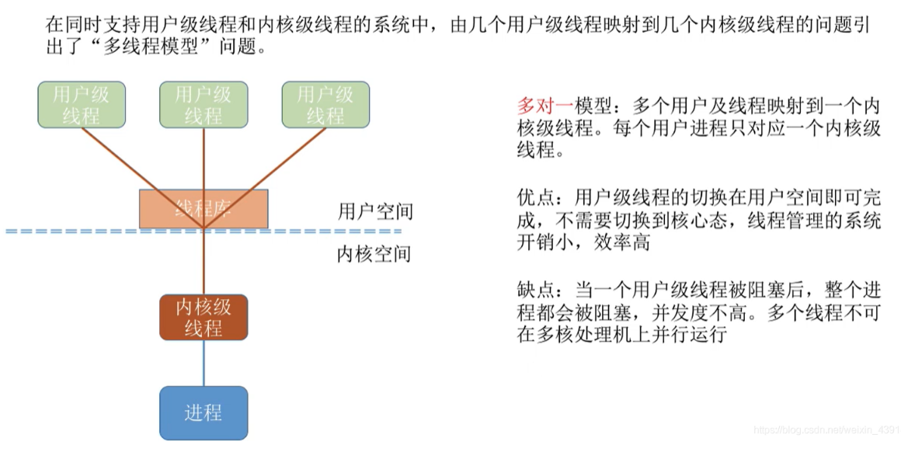

图8.多对一模型

多对一模型。

多个用户级线程对应一个内核级线程。
每个用户进程只对应一个内核级线程。

（其实就是在前面用户级线程那里我讲的一堆。）

优点：用户级线程的切换在用户空间即可完成，不需要切换到核心态，线程管理的系统开销小，效率高。

缺点：当一个用户级线程呗阻塞后，整个进程都会被阻塞，并发度不高。多个线程不可在多核处理机上并行运行。

### 5.2 一对一模型

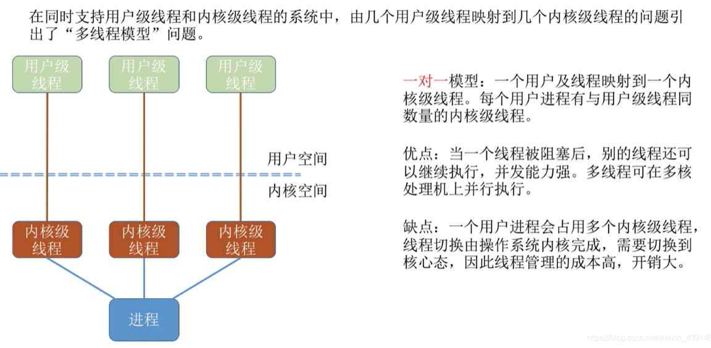

图9.一对一模型

一对一模型。

一个用户级线程对应一个内核级线程。
每个用户进程有与用户线程同数量的内核级线程。

优点：当一个线程被阻塞后，别的线程还可以继续执行，并发能力强。多线程可在多核处理机上并发执行。

缺点：一个用户进程会占用多个内核级线程，线程切换操作由操作系统内核完成，故需要由用户态切换为核心态，因此线程管理的成本高，开销大。

### 5.3 多对多模型

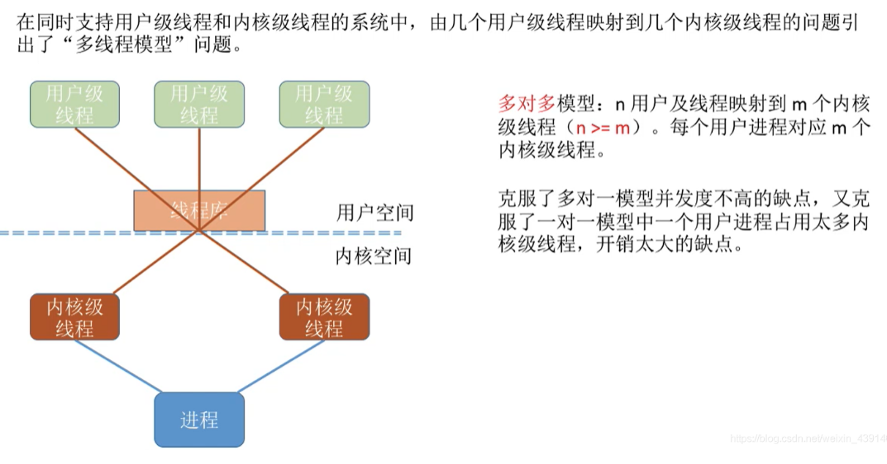

图10.多对多模型

多对多模型。

n个用户线程对应m个内核级线程。
每个用户进程对应m个内核级线程。

克服了多对一模型并发度不高的缺点，由克服了一对一模型一个用户进程占用太多内核级线程，开销太大的缺点。

## 六. 本节回顾

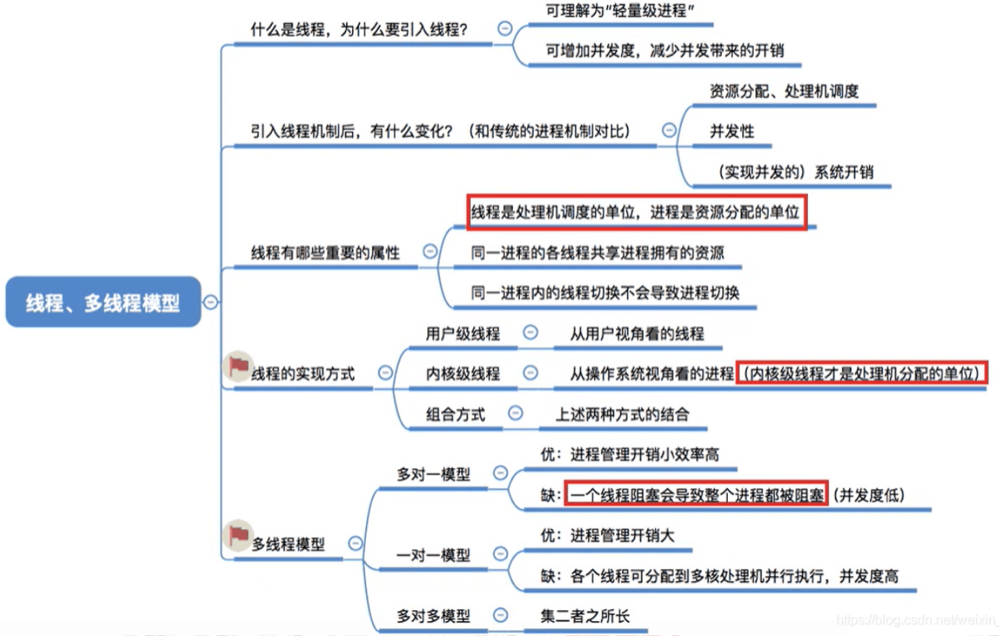

图11.本节回顾

这图11，一对一的优缺点写反了。

重复一下：**线程是处理机的调度单位，进程是资源分配的单位。**

2020.10.01