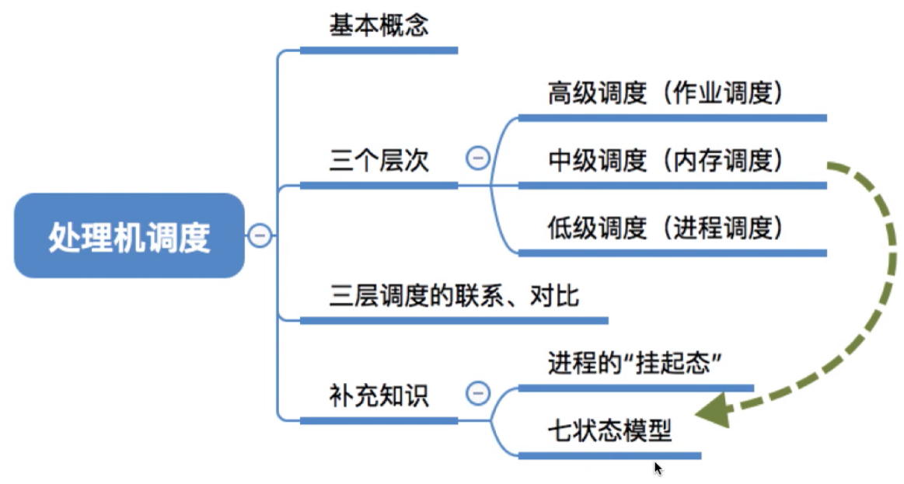
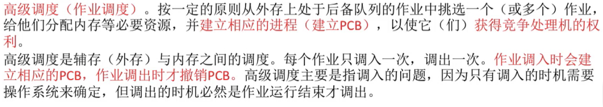
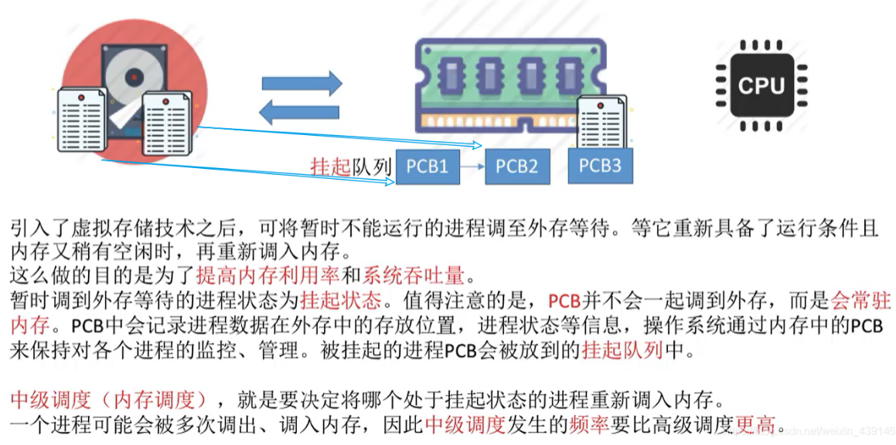
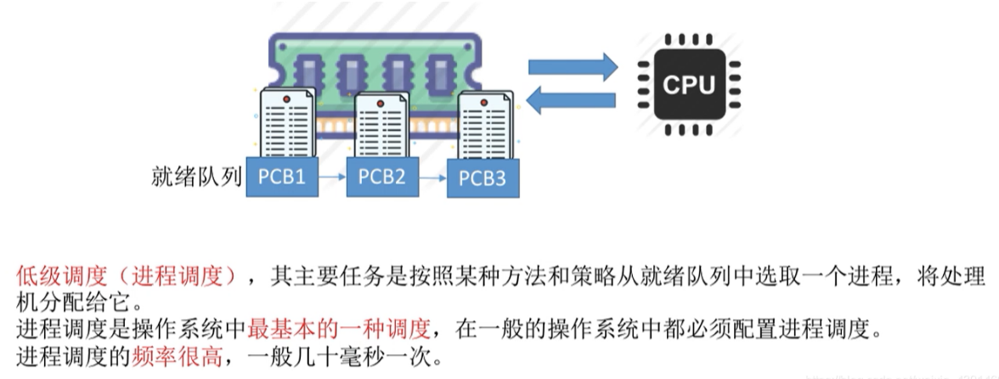
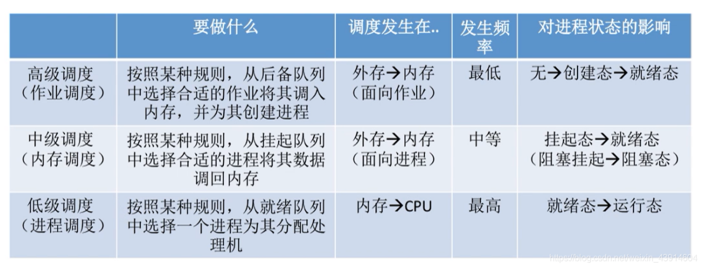
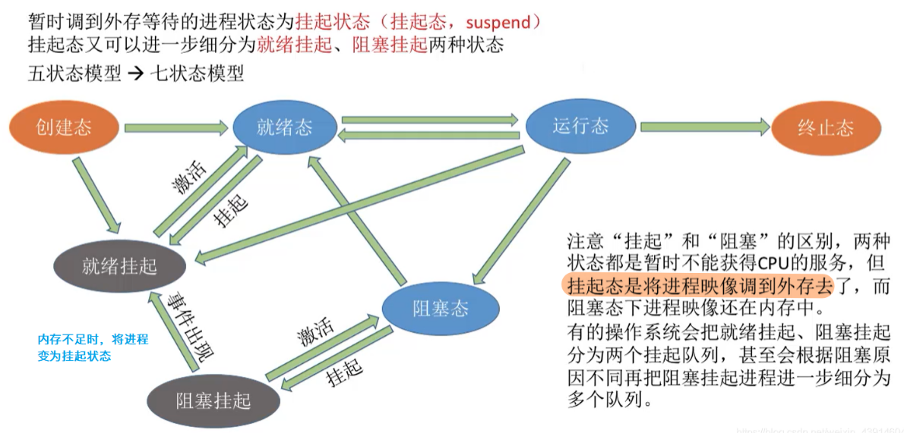
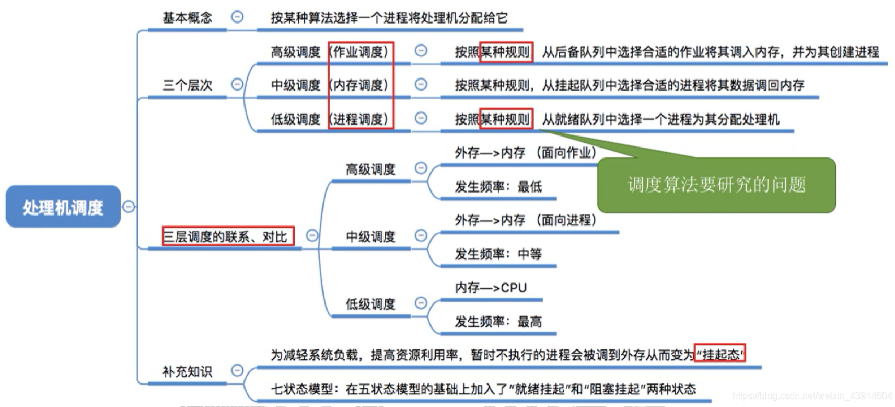

## 处理机调度的概念、层次

图1.本节总览

## 一. 基本概念

图2.调度的概念

处理机调度，指对就绪队列中按照一定的算法选中一个进程将处理机分配给它运行。

## 二. 三个层次

一个作业从提交开始知道完成，往往要经历以下三级调度。

### 2.1 高级调度（作业调度、长程调度）

图3.高级调度（作业调度、长程调度）

高级调度（作业调度、长程调度）。

按照一定原则从外存上处于后备队列的作业中选择一个（或多个）作业，给他们分配内存等必要资源，并建立相应的进程（建立PCB），以使它（们）获得竞争处理机的权力。

就是外存与内存之间的调度。

每个作业只调入一次，调出一次。
作业调入时建立PCB，调出时才撤销PCB。

高级调度主要用于多道批处理系统中，在其他系统中通常不设置高级调度。

### 2.2 中级调度（内存调度）

图4.中级调度（内存调度）

中级调度（内存调度），

是指由中级调度来决定把外存上的哪个（些）已经具备运行条件的就绪进程重新调入内存。

其作用是提高内存利用率和系统吞吐量。

把暂时不用，不运行的进程调到外存，具备了运行条件且内存又稍有空闲时在重新调入内存。
暂时调到外存的进程状态为**挂起状态**，当然PCB不会调到外存去，PCB是一直在内存的。毕竟操作系统是通过PCB来管理的，PCB里会记录进程在外存中的存放位置，进程状态等信息。被挂起的进程的PCB会被放入**挂起队列**中。

一个进程可能会被多次调出、调入内存。
发生频率：高级调度<中级调度。

### 2.3 低级调度（进程调度、短程调度）

图4.低级调度（进程调度、短程调度）

低级调度（进程调度、短程调度）。

调度的对象是进程（或内核级线程）。其主要功能是，根据某种算法，决定就绪队列中的哪个进程应获得处理机，并由分派程序将处理机分配给被选中的进程。

低级调度是最基本的一种调度，在多道批处理、分时和实时三种类型的操作系统中，都必须配置这级调度。

发生频率：低级调度<中级调度<高级调度。

## 三. 三层调度的联系、对比

图6.三层调度的联系对比

发生在：

高级调度：外存 $\rightarrow$ 内存，调入作业。
中级调度：外存 $\rightarrow$ 内存，调入挂起的进程。
进程调度：内存 $\rightarrow$ CPU。

对进程的影响：

高级调度：无 $\rightarrow$ 创建态 $\rightarrow$ 就绪态。
中级调度：挂起态 $\rightarrow$ 就绪态；阻塞挂起 $\rightarrow$ 阻塞态。
进程调度：就绪态 $\rightarrow$ 运行态。

## 四. 补充知识

图7.挂起态-七状态模型

阻塞态与挂起态的区别：

阻塞态：没有CPU资源、没有所需资源、有内存资源
挂起态：没有CPU资源、没有内存资源、没有所需资源
挂起态就是阻塞态，但是把进程实体（除了PCB）调到外存了。

挂起态又可细分为：

阻塞挂起：
没有CPU资源、没有内存资源、没有所需资源。

此时，被调回内存就是阻塞态；
资源分配到了，但没调入内存就是就绪挂起。

就绪挂起：
没有CPU资源、没有内存资源、有所需资源。

有所需资源了，但是内存空间不足，所以还是没法调入内存。

此时，调入内存了，就是就绪态；
就绪态暂时用不到，调到外存就是就绪挂起。

有的时候，
还可能从运行态，到就绪挂起；运行完就直接腾空间出来。
还可能从创建态，到就绪挂起。创建之后内存也不够，也腾空间出来。

## 五. 本节回顾

图8.本节回顾

2020.10.01

