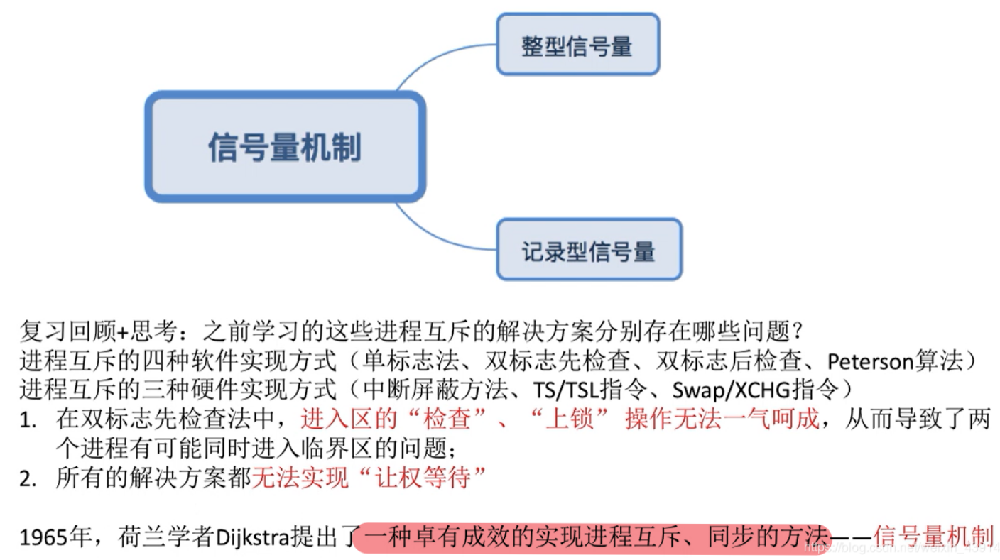
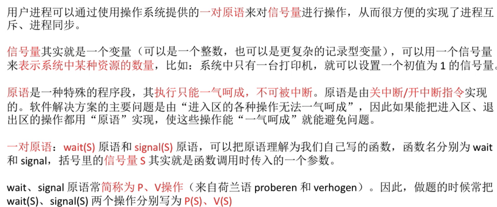
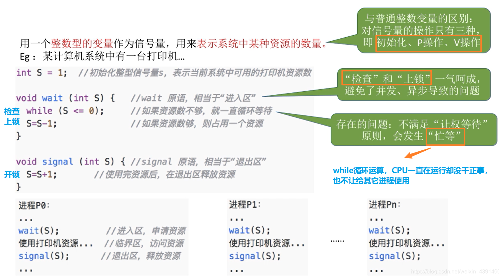
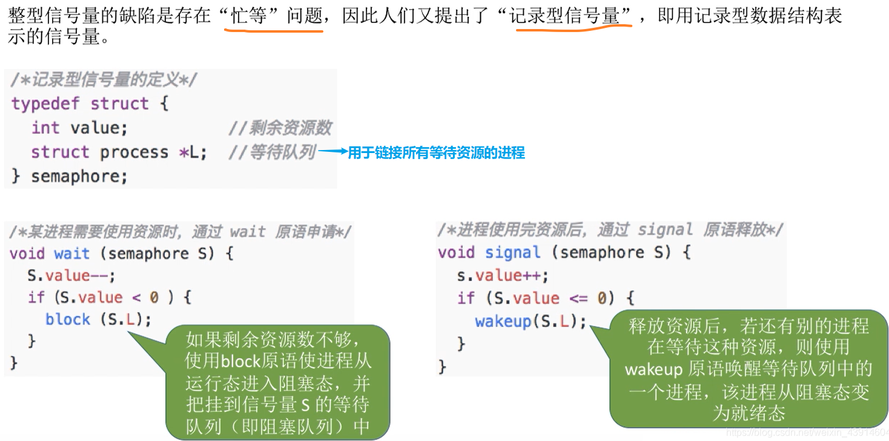
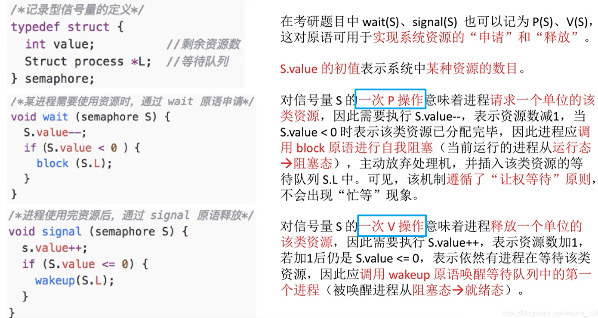
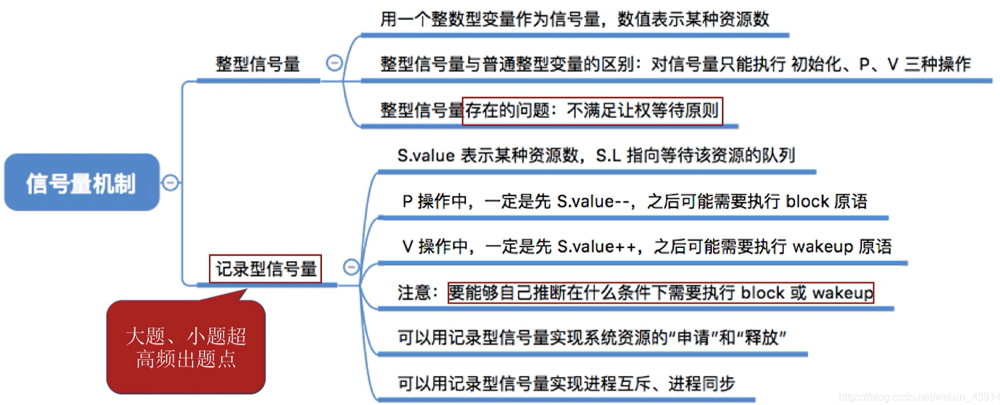

# 信号量机制

图1.本节总览

信号量机制，实现了进程同步与互斥，而且遵循了四个准则。（前面的四种软件、三种硬件方法都无法实现"让权等待"。）

## 一. 信号量机制

图2.信号量机制

用户可以通过使用操作系统提供的**一对原语**来对**信号量**进行操作，从而很方便地实现了进程同步与互斥。

**信号量**，本质就是一个变量，可以是一个整数，也可以是其他更复杂地记录型变量。
可以用一个信号量来表示系统中某种资源的数量。

**原语**，前面讲过了，本质就是关中断和开中断及其中间的一系列操作，原语不可中断，是连续完成的。

**操作系统提供的一对原语**，指wait和signal，通常又称为P操作，V操作。
可以用函数来理解，wait(S)，signal(S)，S就是传入这个操作的信号量。

## 二. 整型信号量

图3.整型信号量

使用整数型的变量作为信号量，来表示系统中某种资源的数量。

不同与一般的整型变量，对于整型信号量，只能进行初始化、P操作、V操作这三种操作。

整型信号量的P操作和V操作的实现，用C语言描述其逻辑：

~~~C
void wait(int S)//wait原语，相当于进入区
{
    while( S<=0 );//检查系统是否还有该资源，没有就循环检查等待。
    S=S-1;//系统有空闲该资源，该进程将占用该资源，把其信号量减1。
}
~~~

因为是原语，所以检查和上锁是连续完成的，避免了并发、异步导致的问题。

当然也会存在问题，当资源不足时，会出现忙等。

~~~C
void signal(int S)//singal原语，相当于退出区
{
    S=S+1;//进程使用资源完毕，推出，将信号量加1。
}
~~~

## 三. 记录型信号量

图4.记录型信号量

为了解决忙等问题，提出了记录型信号量。

该记录型信号量由结构体来定义：

~~~C
typedef struct
{
	int value;//剩余资源数量
	struct process * L;//等待队列，用于连接所有等待资源的进程
}semaphore;
~~~

记录型信号量的P、V操作，用C语言来描述逻辑：

~~~C
void wait(semaphore S)//wait原语，相当于进入区
{
    S.value--;//进程申请了该资源，S.value减1
    if(S.value<0)//S.value小于0，说明资源不够
    {
        block(S.L);//block原语，进程自我阻塞，放弃处理机进入该资源的阻塞队列中。也就是插入到信号量的链表S.L中。
    }
}
~~~

可以注意到记录型信号量当资源不够时，是会主动阻塞的，从而避免了忙等情况，遵循了"让权等待"准则。

~~~C
void signal(semaphore S)//singal原语，相当于退出区
{
    S.value++;//进程退出，释放资源，S.value加1
    if(S.value<=0)//S.value小于0，说明有进程在阻塞队列等待着使用该资源，S.L链表不为空NULL
    {
        weakup(S.L);//weakup原语，唤醒该资源的阻塞队列中的进程。也就是也就是信号量的链表S.L中第一个等待进程唤醒。阻塞态->就绪态
    }
}
~~~

图5.总结以下记录型信号量

## 四. 本节回顾

图6.本节回顾

2020.10.07