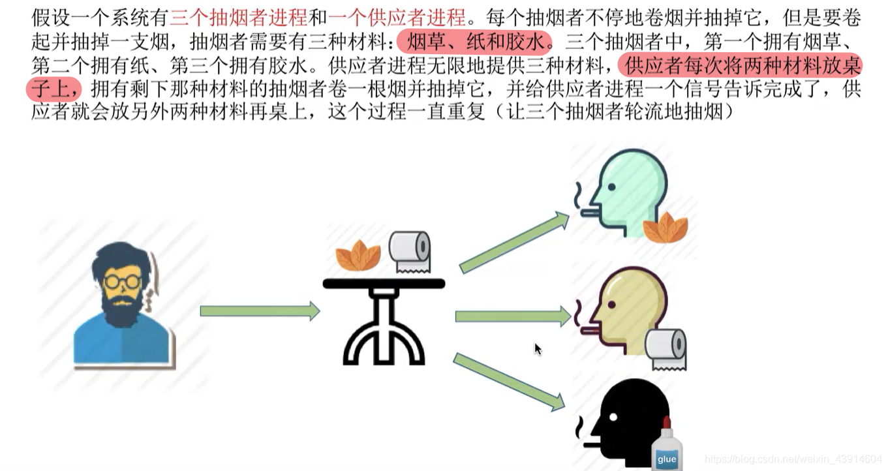
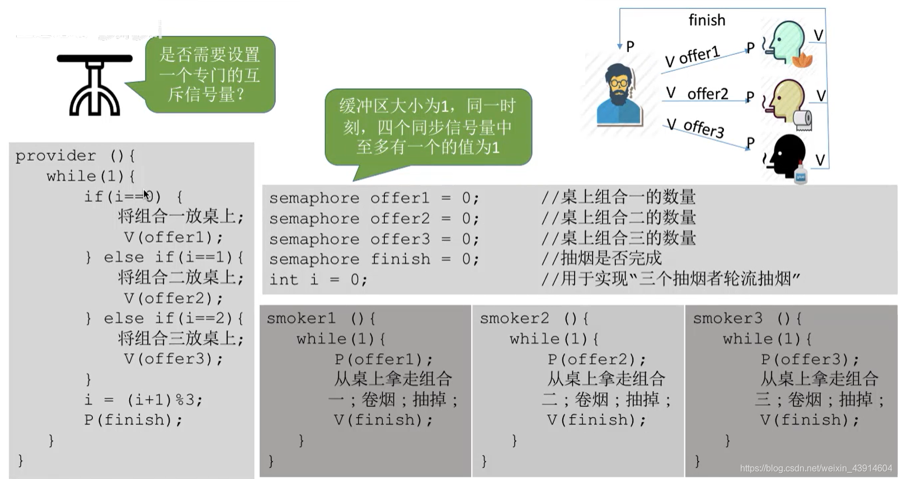

# 吸烟者问题

## 一. 问题描述

图1.问题描述

三个抽烟者各自拥有一种物品：烟草、纸、胶水（抽烟者自己的不会被消耗）。
一个供应者每次可以往缓冲区提供其中两种物品。
能凑齐三种不同物品的抽烟者，会拿走缓冲区中的两个物品，然后消耗掉（抽烟者自己的不会被消耗）。
抽烟者消耗完后，给供应者信号，供应者下次放入的是另外一组两种物品，也就是AB，BC，CA这样循环放入，要使得三个抽烟者轮流抽烟。

## 二. 分析问题

四个进程存在互斥访问。
抽烟者消耗完后，发出信号，供应者才能放入，同步。
缓冲区满后，抽烟者才能拿走，同步，但这里三个抽烟者拿走的条件不一样，所以需要一点点小改变。

~~~C
semaphore finish = 0;//抽烟者消耗完后的信号
semaphore offer_1 = 0;//缓冲区物品组合1
semaphore offer_2 = 0;//缓冲区物品组合2
semaphore offer_3 = 0;//缓冲区物品组合3
int i = 0;//用于供应者进程循环放入AB、BC、CA组合
~~~

但其实可以注意到semaphore mutex = 1;//互斥信号量，并不需要互斥信号量。

## 三. 实现

~~~C
provider(){
    while(1){
        if(i==0){
            放入BC组合;
            V(offer_1)
        }
        if(i==1){
            放入CA组合;
            V(offer_2)
        }
        if(i==2){
            放入AB组合;
            V(offer_3)
        }
        i=(i+1)%3;
        P(finish);
    }
}

smoker_1{
    while(1){
        P(offer_1)
        拿走BC组合;
        消耗掉;
        V(finish);
    }
}
smoker_2{
    while(1){
        P(offer_2)
        拿走CA组合;
        消耗掉;
        V(finish);
    }
}
smoker_3{
    while(1){
        P(offer_3)
        拿走AB组合;
        消耗掉;
        V(finish);
    }
}
~~~

图2.实现

## 四. 本节回顾

图3.本节回顾

利用变量i，来实现循环放入不同内容（进行不同的操作）。

2020.10.08