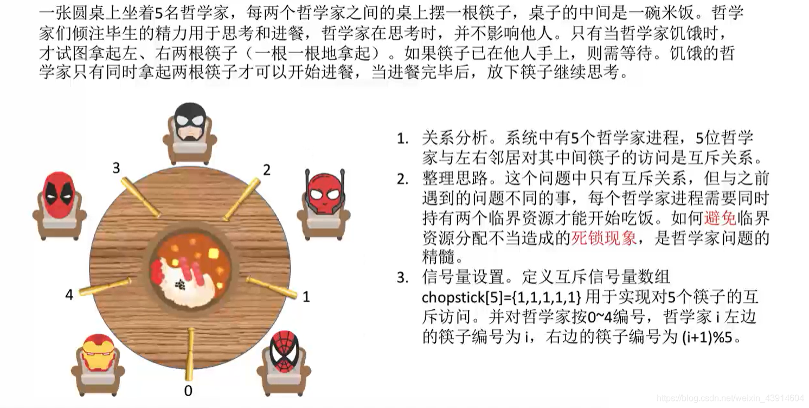
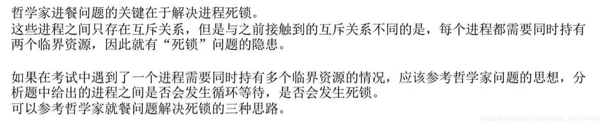

# 哲学家进餐问题

## 一. 问题描述

图1.问题描述

## 二. 分析问题

图1里有分析了。

五根筷子都是临界资源，每个哲学家需要两个临界资源。
因为哲学家是先后拿起两只筷子，所以拿起一只时，可能导致另一只被别人拿起，注意容易死锁。
所以，要确保哲学家拿筷子时，即便中途阻塞，也不会有其他哲学家拿筷子。

~~~C
semaphore chopstick[5] = {1,1,1,1,1};//五个筷子
semaphore mutex = 1//chopstick[]的互斥访问量，实现互斥的取筷子
~~~

## 三. 实现

方法一：限制同时只能有一个哲学家拿筷子，拿完左右筷子后才退出。

~~~C
Pi(){//编号为i的哲学家的进程
	while{
		P(mutex);//互斥访问筷子
		P(chopstick[i]);//拿左筷子
		P(chopstick[(i+1)%5]);//拿右筷子
		V(mutex);//释放筷子资源
		吃饭：
		V(chopstick[i]);//放回左筷子
		V(chopstick[(i+1)%5]);//放回右筷子
	}
}
~~~

方法二：限制同时最多只能有 n-1 个哲学家参与拿筷子，使得最少能有 1 个哲学家获得左、右筷子，完成后释放筷子，不会死锁。

~~~c
semaphore chopstick[5] = {1,1,1,1,1};//五个筷子
semaphore mutex = 4//chopstick[]的互斥访问量，实现互斥的取筷子

Pi(){//编号为i的哲学家的进程
	while{
		P(mutex);//限制拿筷子人数，人数减 1
		P(chopstick[i]);//拿左筷子
		P(chopstick[(i+1)%5]);//拿右筷子
		吃饭：
		V(chopstick[i]);//放回左筷子
		V(chopstick[(i+1)%5]);//放回右筷子
        V(mutex);//退出，使人数加 1。
	}
}
~~~

## 四. 本节回顾

图2.本节回顾

遇到进程同时需要多个临界资源时，考虑哲学家进餐问题模型。

2020.10.08