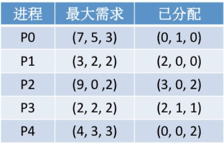
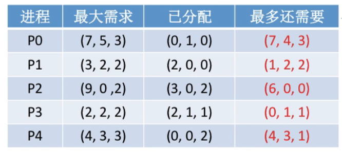
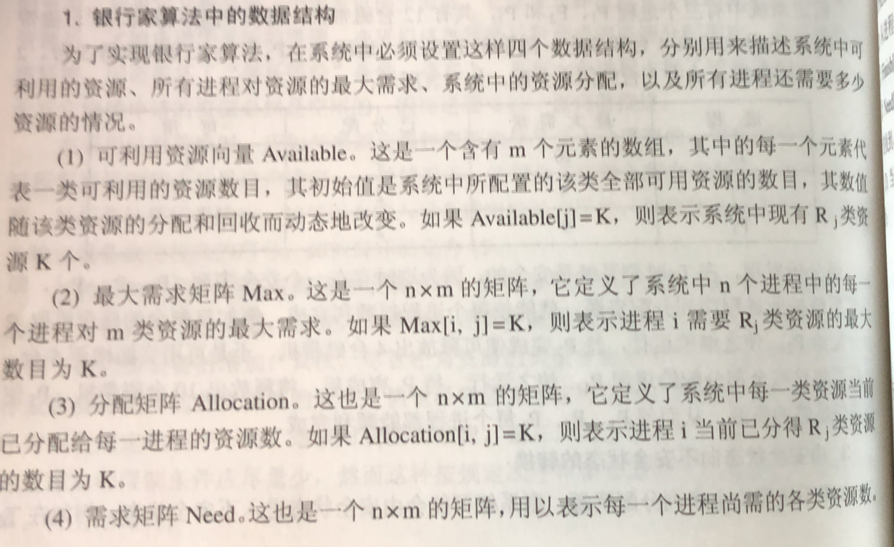
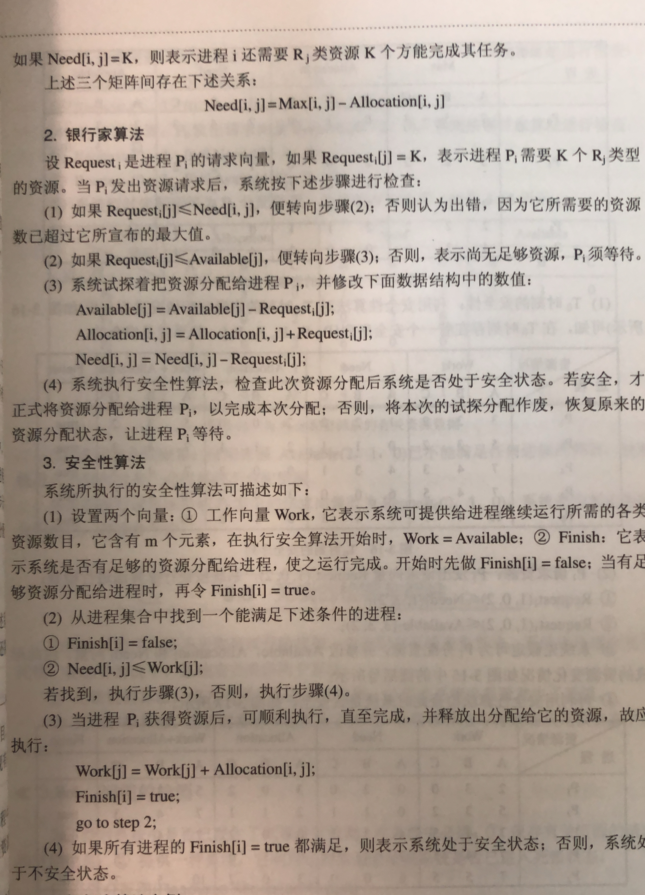
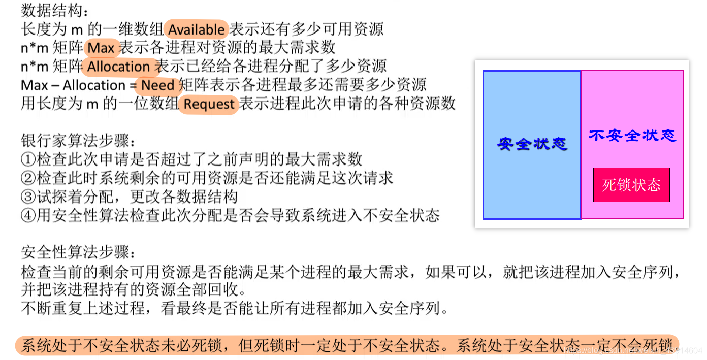

# 死锁的处理策略-避免死锁

图1.本节总览

避免死锁，用某种方法防止系统进入不安全状态，从而避免死锁。

## 一. 安全序列

简单地说，系统有资源，进程A、B、C申请资源，进程ABC拥有资源后，是可能整个进程结束后才会释放资源的。

当进程申请资源时，系统需要考虑，我把这个资源给某个进程后，该进程是否能够完成任务，顺利结束，从而系统能够回收到该进程运行期间占有的资源，由此，资源回收后又可以给其他进程使用，其他进程使用完后，再释放资源......从而使得整个系统能够顺利的运行下去。

比如进程A、B、C都需要资源1、2、3来完成任务，那么系统应该将资源1、2、3都分配给某进程先使用，这样该进程能顺利完成任务，释放资源，然后资源再都给另一个进程使用，这样整个系统可以顺利的进行。于是 $A\rightarrow B \rightarrow C$ 就是一个安全序列（当然这里安全序列不唯一）。

而如果将资源1给进程A，资源2给进程B，资源3给进程C，但进程A、B、C仍然需要申请另外两个资源来完成任务，才会释放资源，这就进入了互相等待，死锁的状态。

图2.安全序列

**安全序列**就是指，如果系统按照这种序列分配资源，则每个进程都能顺利完成。

## 二. 安全/不安全状态，与死锁关系

只要能找出一个安全序列，系统就是**安全状态**。当然安全序列可能是多个的。

如果分配了资源后，系统找不出任何一个安全序列，系统就进入了**不安全状态**，意味着之后可能所有进程都无法顺利执行。
当然，如果有进程提前释放资源，那也可能回到安全状态。
不过在分配资源前，应该考虑最坏状态。

如果系统处于安全状态，则一定不会发生死锁。如果系统进入不安全状态，则可能发生死锁。
发生了死锁，一定处于不安全状态；安全状态，不一定发生死锁。

在资源分配前考虑这次分配是否会导致系统进入不安全状态，由此决定是否答应资源分配的请求，这也就是银行家算法。

## 三. 银行家算法+安全性算法

图3.银行家算法

以下开始为**银行家算法**。

以向量来表示进程的最大需求与已分配资源数。

图4.进程的最大需求与已分配

图4表示有3种资源，忘了假设系统中这三种资源共有 $(10,5,7)$ 。

将最大需求减去已分配。

图5.计算出最多还需要

计算出最多还需要的资源。

将系统总资源 $(10,5,7)$ 减去已分配资源，得到系统剩余可用资源为 $(3,3,2)$ 。

然后依次判断系统剩余可用资源能否满足该进程的请求，注意这里是进程的请求，不一定是最多还需要。

1. 如果进程请求数>最多还需要，则认为出错了，毕竟本来不需要那么多资源，你还申请多了。
   反之，那就正常，进入下一个。
2. 如果进程请求数>系统剩余可用资源，那该进程等待，系统没那么多资源。
   反之，那就进入下一步。
3. 系统尝试将资源分配给该进程，并修改系统剩余可用资源、进程已有资源、进程最多还需要资源**的值**，但并不马上分配给它。

4. 然后执行安全性算法，检查这样分配后系统是否处于安全性状态。
   若安全，则才将资源正式分配给该进程；否则本次尝试作废，将刚才修改的值恢复，让该进程等待，进行下个满足条件进程的尝试分配。

以下开始为**安全性算法**：

变量Work=系统剩余可用资源，布尔数组finish[]表示系统是否有足够资源分配给对应进程完成。

1. 从除了尝试分配的进程外的其他进程中找到满足：
   finish[]=false，
   其最大还需要资源数小于Work，的进程

   说明系统剩余资源可以满足其需要，使其完成运行。
   如果能找到则进入下一步。
   如果找不到了，最后一步。

2. 于是更新Work=Work+该进程已分配资源，并且修改该进程Finish[]=true。
   回到上一步。
3. 如果所有进程的Finish[]=true，则系统处于安全状态；否则系统处于不安全状态。

如果所有进程都加入安全序列（Finish[]都为true），说明本次尝试分配，系统处于安全状态，暂不可能发生死锁。可以分配。

但如果，有一个或以上进程无法加入安全序列（Finish[]有false），说明本次尝试分配，系统处于不安全状态，则有可能发生死锁（是有可能）。不进行分配。

## 四. 代码实现思路

图6.代码实现思路

图7.代码实现思路

其实我前面讲的也是这个逻辑，只不过用的文字来说明的比较多。

## 五. 本节回顾

图8.本节回顾

2020.10.09

