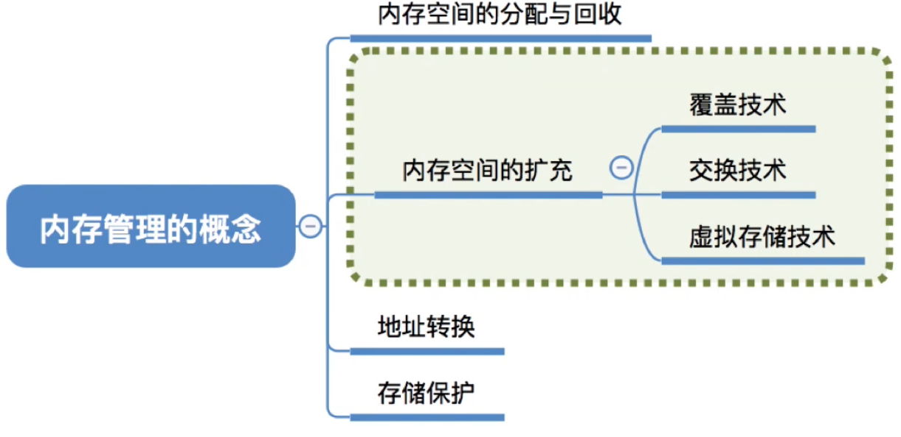

# 覆盖与交换

图1.本节总览

今年考研考纲已经把这里删除了。不过我转考北邮807了，北邮自主命题，还是学吧。反正多学也不吃亏。

这一节，因为地址转换前两节讲过了，存储保护上一节也讲了。

剩下内存空间的分配和回收，内存空间的扩充。

这一节讲内存空间的扩充中的覆盖技术，交换技术。

虚拟存储技术在后面再详细讲解。

## 一. 覆盖技术

图2.覆盖技术

图2讲的很清楚了。

将程序分为多个段，
常用的段，常驻内存，放在固定区，
不常用的段，在需要时调入内存，放在覆盖区。

图3.例子

比如A段，会调用B段或C段，B段会调用D段，C段会调用E段或F段。

于是这个程序可以分为，A放在8k大的固定区，B、C共享10K大的覆盖区，D、E、F放在12K大的覆盖区。

因为A同时只能调用B或C吗，又不可能同时调用B和C，自然B和C共用一个覆盖段就行了，调用B或C时，覆盖上去。
D、E、F同理。

缺点是，必须由程序员来声明覆盖结构，操作系统来完成自动覆盖。增加了用户编程的负担。用于早期的操作系统中。

覆盖技术是早期在单一连续存储管理中使用的扩大存储容量的一种技术，它同样可用于固定分区分配的存储管理。

## 二. 交换技术

图4.交换技术

交换（对换）技术。

内存空间紧张时，系统将内存中某些进程暂时换出外存，把外存中某些已具备运行条件的进程换入内存。

在处理机调度中的中级调度（内存调度），就是存储器的对换功能。

图4是以解答提出3个问题来讲述的：

1. 在具有对换功能的操作系统中，通常把磁盘空间分为**文件区**和**对换区**。

   文件区主要用于存放文件，主要**追求存储空间的利用率**，因此对文件区空间的管理采用**离散分配方式**。

   对换区空间只占磁盘空间的小部分，被换出进程的数据就存放在对换区。
   由于对换速度直接影响到系统的整体速度，因此对换区空间的管理主要**追求换出速度**，因此通常对换区采用**连续分配方式**。

   对换区的I/O速度比文件区更快。

2. 交换通常在许多程序运行且内存吃紧时进行，而系统负荷降低就暂停。

   比如，在发现许多进程运行时缺页，则说明内存紧张，此时可以换出一些进程，如果缺页率下降，就可以暂停换出。

   （毕竟如果内存够大，放你在内存里阻塞也无所谓）

3. 可优先换出阻塞进程；可换出优先级低的进程；为了防止优先级低的进程在被调入内存后很快又被换出，有的系统还会考虑进程在内存的驻留时间。

   当然PCB还是常驻内存的，不会调出。

## 三. 本节回顾

图5.本节回顾

2020.10.10