# 连续分配管理方式

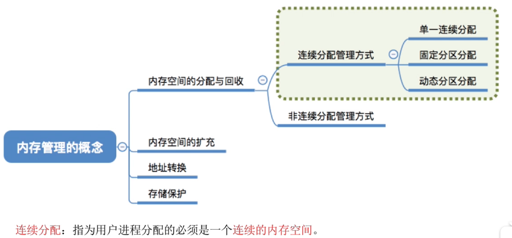

图1.本节总览

连续分配：指为用户进程分配的必须是一个连续的内存空间。

非连续就是不是连续的。

## 一. 单一连续分配

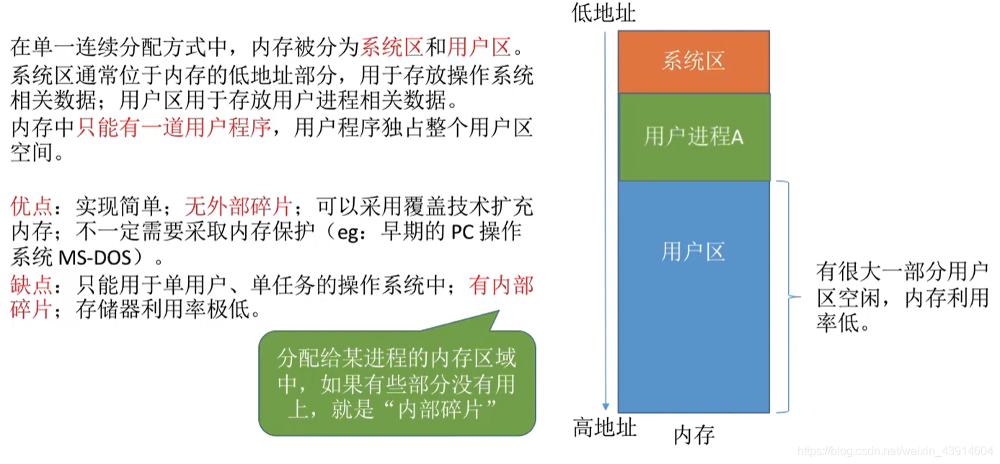

图2.单一连续分配

单一连续分配。

内存分为**系统区**和**用户区**。

系统区通常位于内存的低地址部分，用于存放操作系统相关数据；
用户区用于存放用户进程相关数据。**内存中只能由一道用户程序，用户程序独占整个用户区空间**。

优点：实现简单；**无外部碎片**；可采用覆盖技术扩容内存；不一定需要内存保护。
缺点：只能用于单用户、单任务的操作系统；**有内部碎片**；存储器利用率极低。

外部碎片，就是因为已分配的分区，中间的未分配的分区过小导致无法分配给其他程序，无法利用。
内部碎片，指分配给某进程的内存空间，有没有利用的部分，就是内部碎片。
这里整个用户区都是该进程的空间，都是内部碎片啊。

## 二. 固定分区分配

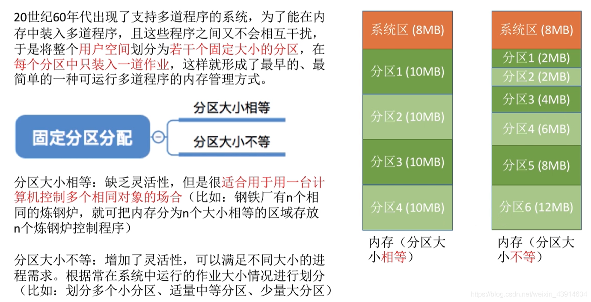

图3.固定分区分配

固定分区分配。

将用户区分为若干固定大小的分区，每个分区中只装入一道作业。

可以分区大小相等，或分区大小不等来划分。

分区大小相等：缺乏灵活性，但适用于一台计算机控制多个相同对象的场合。

分区大小不等：增加了灵活性，可满足不同大小的进程需求。根据常在系统中运行的作业大小情况进行划分。

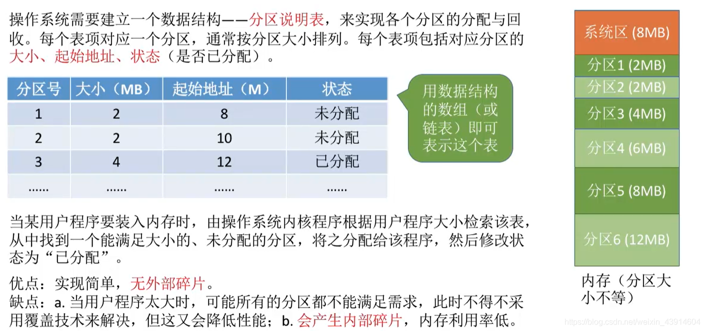

图4.分区说明表

操作系统需要建立一个数据结构——**分区说明表**，来实现对各个分区的分配与回收。

表中记录了包括每个分区的分区号、大小、起始地址、状态等信息。

当装入用户程序时，由操作系统根据用户程序大小检索该表，从中找到一个能满足大小的、未分配的分区，将其分配给该程序，然后修改该分区状态为已分配。

优点：实现简单，**无外部碎片**。
缺点：当用户程序太大时，可能所有分区都不能满足需求，不得不采用覆盖技术，会降低性能；**会产生内部碎片**。内存利用率低。

## 三. 动态分区分配

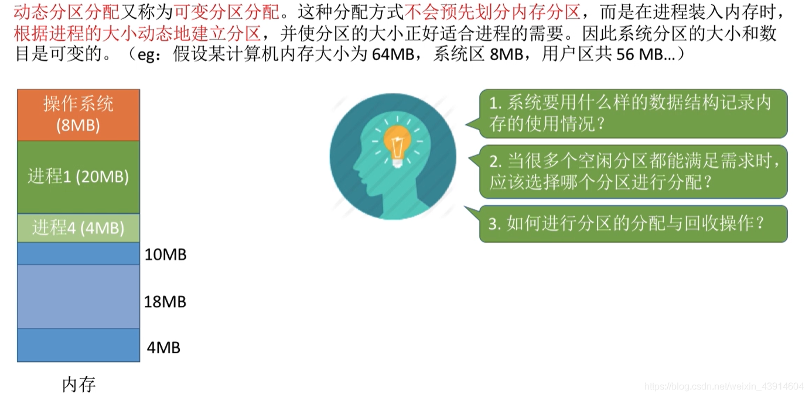

图5.动态分区分配

动态分区分配，又称**可变分区分配**。

不会预先划分内存分区，而是在程序装入内存时，根据进程的大小动态的建立分区，并使分区大小刚好适合进程的需要。因此系统分区的大小和数目是可变的。

图5提出了这种方式的3个问题。

### 3.1 使用什么数据结构

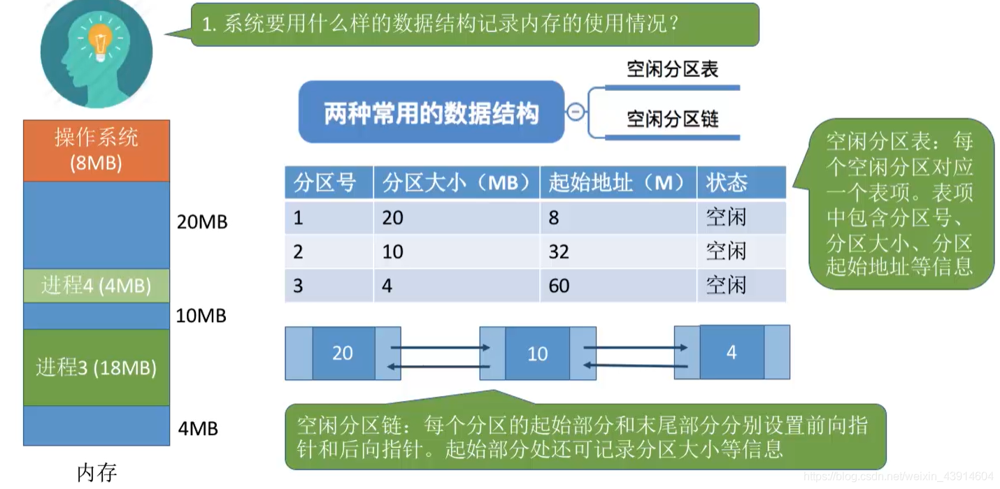

图6.动态分区分配的数据结构

可有两种数据结构：

1. 空闲分区表：

   用表的方式，记录每一个空闲分区，其分区号、分区大小、起始地址、状态等信息。

2. 空闲分区链：

   就是链表嘛，每个分区起始部分和末尾部分分别设置前向指针和后向指针。起始部分处还可记录分区大小等信息。

### 3.2 当有多个空闲分区时，如何分配

图7.如何分配

当有多个空闲分区时，应该分配哪个空间给该程序？

当程序装入内存时，按照一定的动态分区分配算法，从空闲分区表（链）中选出一个分区分配给改作业。

下一节介绍四种动态分区分配算法。

### 3.3 如何分配与回收

#### 3.3.1 分配

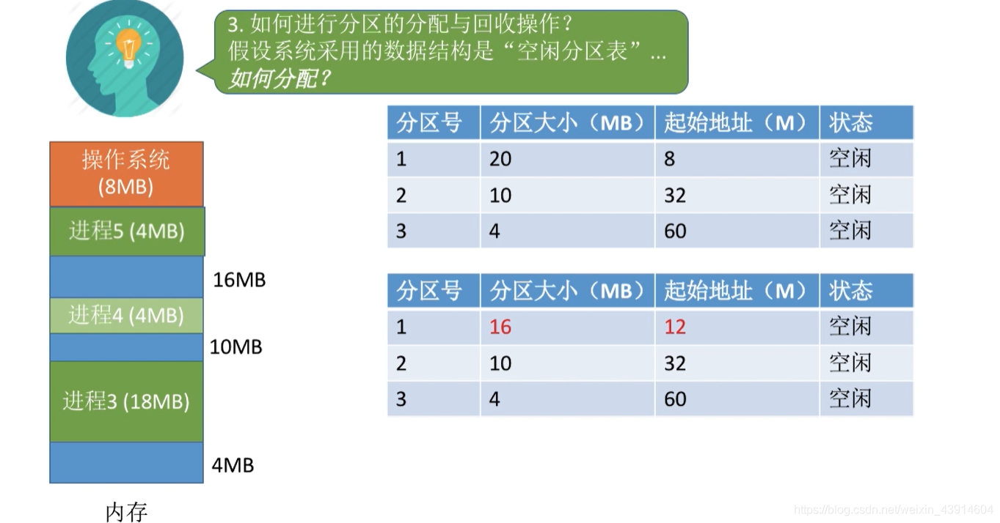

图8.分配

假设采取了某种动态分区分配，将进程5放入分区1中。

以空闲分区表为了，修改分区1的分区大小，和起始地址。

如果是将进程5分配到分区3，刚好用完，则从空闲分区表中删除分区3。

#### 3.3.2 回收

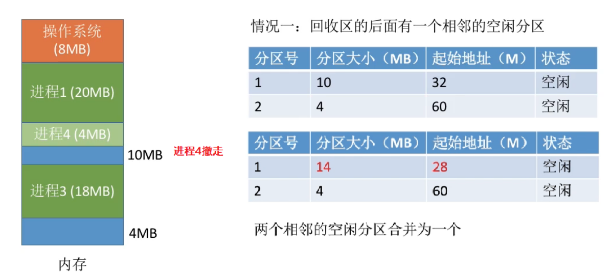

图9.回收

假设要将进程4撤走，图9中进程4有相邻空闲分区，则撤走后将进程4的空间与相邻空闲分区合并，修改空闲分区表的内容。

只有前面有和只有后面有都类似的。

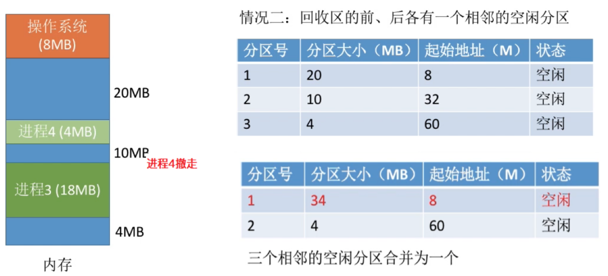

图10.前后都有相邻空闲分区

当前后都有相邻空闲分区，那合并就少了一个分区，删除掉。

还有一种情况，前后都没有相邻分区，那就是空闲分区表新增一个分区。

虽然前面空闲分区表都是按照地址递增顺序来排列的，为了方便讲解嘛，但实际上根据动态分区分配算法来排列，并不一定是就按地址递增来排列。

动态分区**没有内部碎片，有外部碎片**。

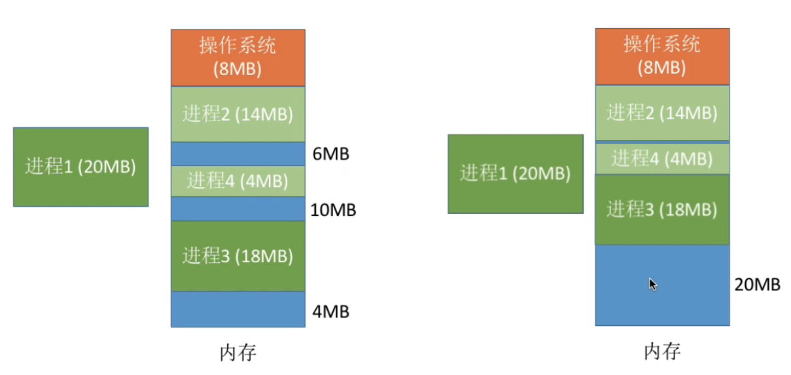

图11.紧凑技术

图11所示，内存中有足够空间可以放下进程1，但是多个零散的空闲分区，导致无法装入进程1，于是通过**紧凑（拼凑）技术**，移动其他进程，腾出一个连续的内存空间，就可以放入进程1了。

## 四. 本节回顾

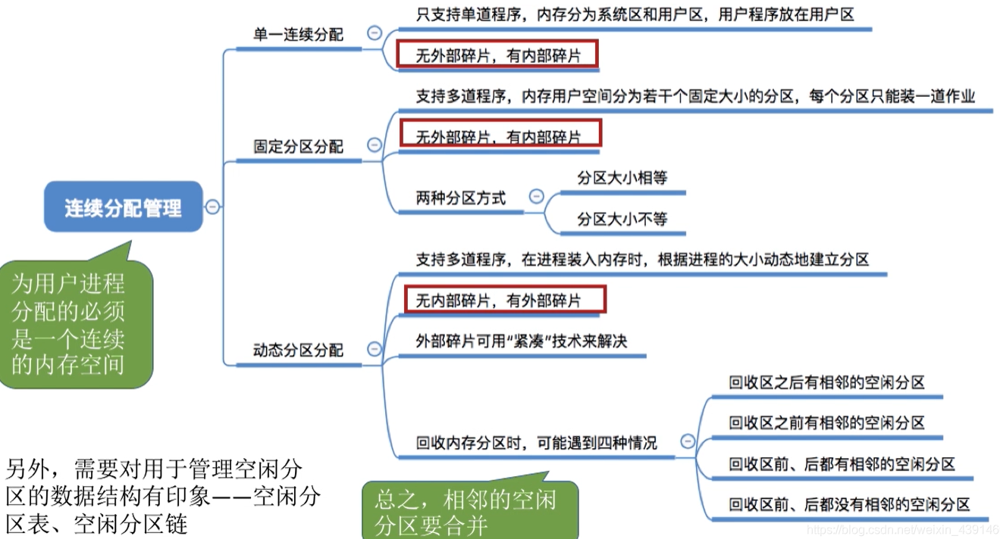

图12.本节回顾

2020.10.10

