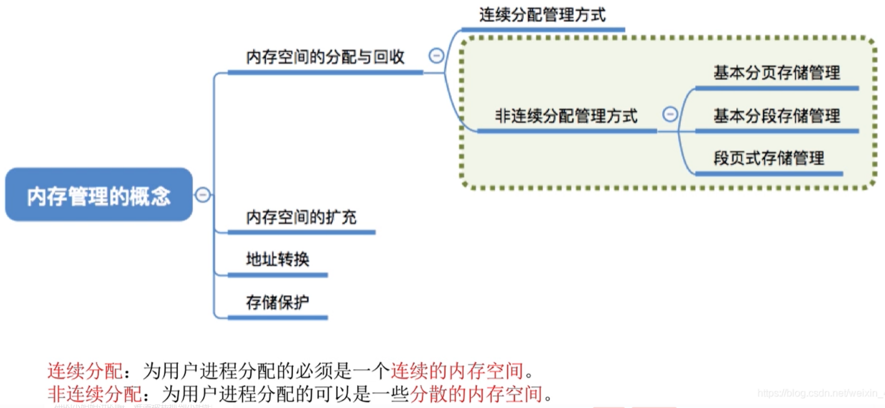

# 非连续分配管理方式

图1.非连续分配管理方式

前面两节讲的连续分配管理方式，为用户进程分配的必须是一个连续的内存空间。

所以会出现小的，难以利用的空闲分区。

如果说可以将程序不连续存放，而是能拆开成几部分存放，那么不就可以避免这种情况，或可以将其利用来了嘛。

非连续分配：为用户进程分配的可以是一些分散的内存空间。

分为：

1. 基本分页存储管理。
2. 基本分段存储管理。
3. 段页式存储管理。

2020.10.10

