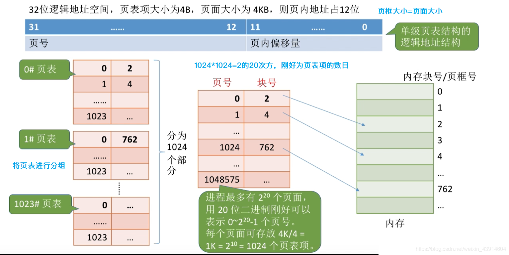
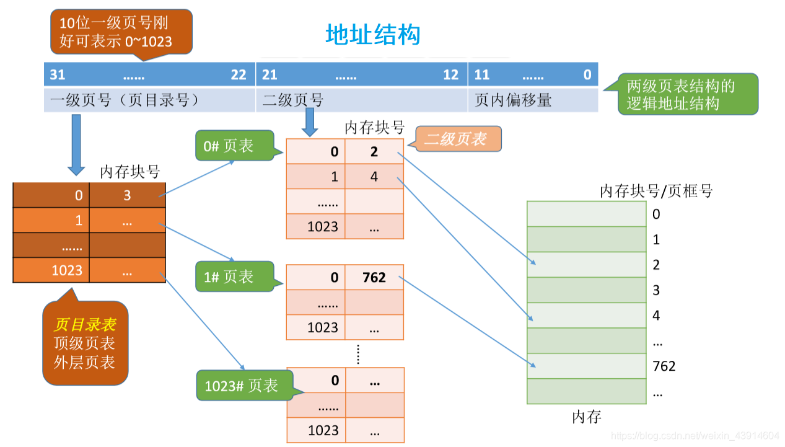
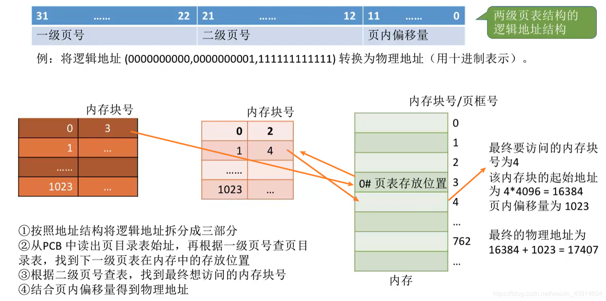
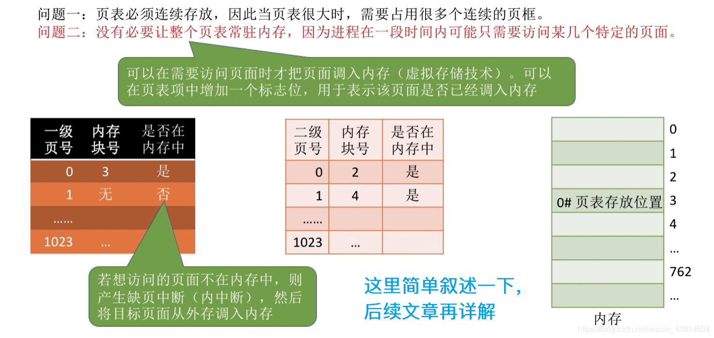
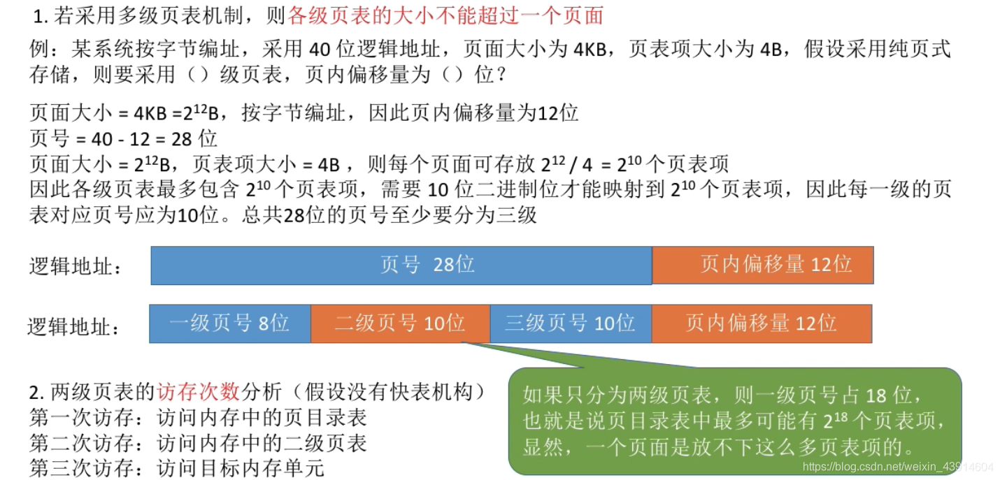
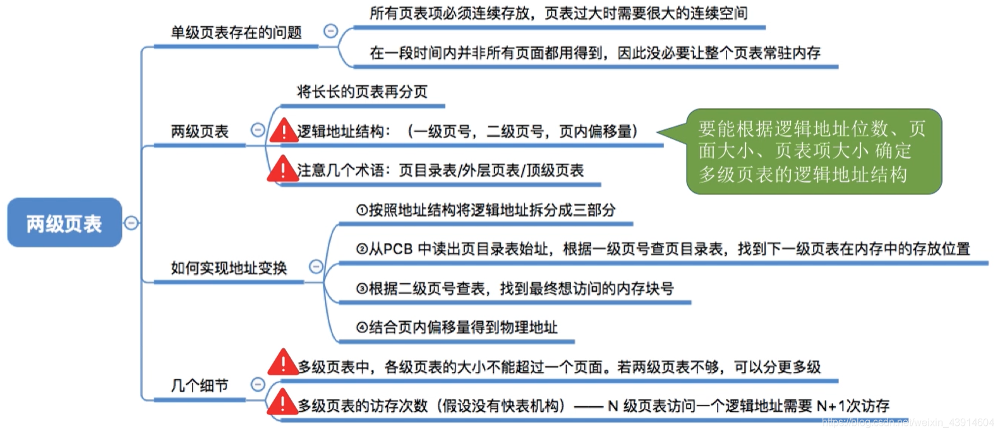

# 两级页表

图1.本节总览

## 一. 单级页表的问题

页表需要在内存中连续存储。
本身我们使用分页式存储管理方式，就是为了不连续存储，从而减少碎片。

根据局部性原理，很多时候，进程在一段时间内只需要访问某几个页面。所以没必要让整个页表完整地常驻内存。

图2.两级页表的思路

先解决第一个问题：

那就是给页表再建立页表，哈哈哈。

对页表进行分组，每个内存块刚好可以放入一个分组，每组可以离散的存储在内存。
记录每组信息的页表，称为**页目录表**，或称外层页表，顶层页表。

## 二. 两级页表的原理、逻辑地址结构

图3.单级页表

图3，简单看看单级页表。

对单级页表进行分组，每组大小为一个内存块大小，可以离散的存储。

图4.两级页表

对其分组建立一个页表，为**页目录表**。

现在，页目录表是连续存储的，但页表是离散存储的了。

采用两级页表，逻辑地址的结构也变为：一级页号（页目录号）+二级页号+页内偏移量。

## 三. 地址变换过程

图5.地址变换

图 5 最后的页内偏移量算错了，不是 1023，而是 $2^{12}-1=4095$ 。

地址变换过程：

1. 按照地址结构将逻辑地址拆分为3部分。
2. 从PCB中读出页目录表起始地址，由一级页号和页目录表起始地址，找到对应的页表的一组所在的内存块号。
3. 根据改组页表所在内存块号和二级页号，找到欲访问的地址所在内存块号。
4. 根据欲访问的内存块号和页内偏移量，得到物理地址。
5. 根据物理地址，访问存储单元。

## 四. 局部性

下面再解决第二个问题：

图6.第二个问题

页目录表中，增加一个标志位记录该分组是否已在内存中。

访问时，如果在，那就是正常的流程。
如果要访问的页面的分组不在内存中，则产生**缺页中断（内中断）**，然后调入内存，修改标志位。

## 五. 小细节

图7.小细节

小细节：

1. 如果采用多级页表机制，则**各级页表的大小不能超过一个页面**。

   这句话感觉王道说的不准确，准确的应该是使用多级页表，则**每一个**页表都只能占一个页面，而不能连续占用两个及以上的页面。

   如图7例题。

   页面大小4KB，推出页内偏移量为12位；
   页表项大小为4B，一个页面最多存1K个页表项，所以每一级页号最多 10 位。

   所以是三级页表。

2. 两级页表的访存次数（假设没有快表）

   第一次访存：访问页目录表；
   第二次访存：访问二级页表；
   第三次访存：访问存储单元。

## 六. 本节回顾

图8.本节回顾

2020.10.11

