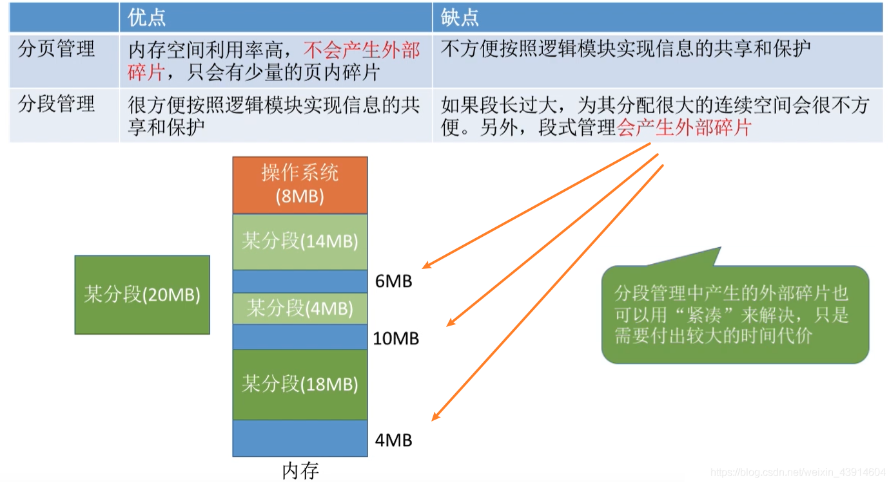
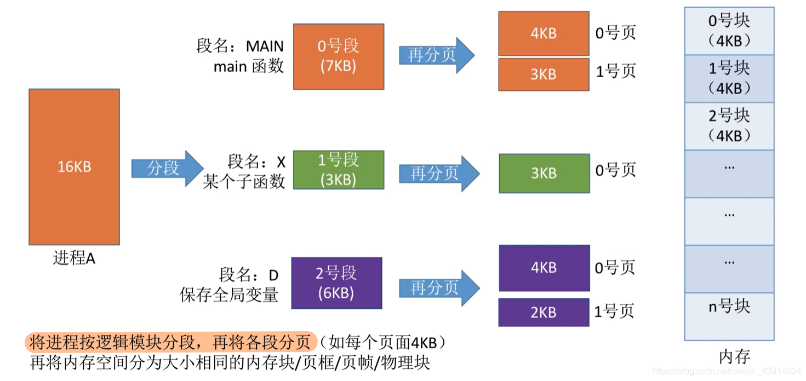
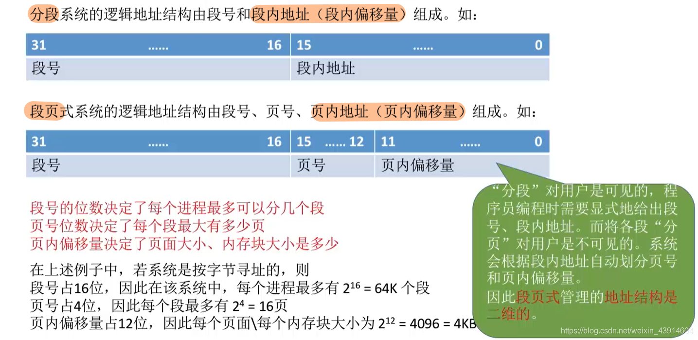
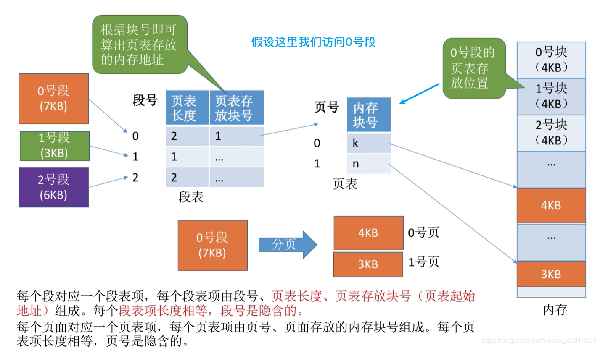
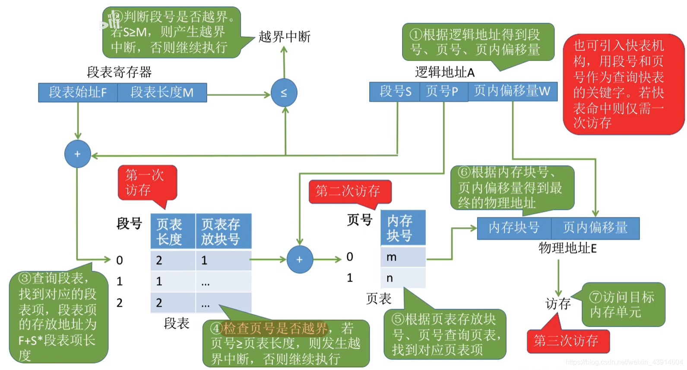
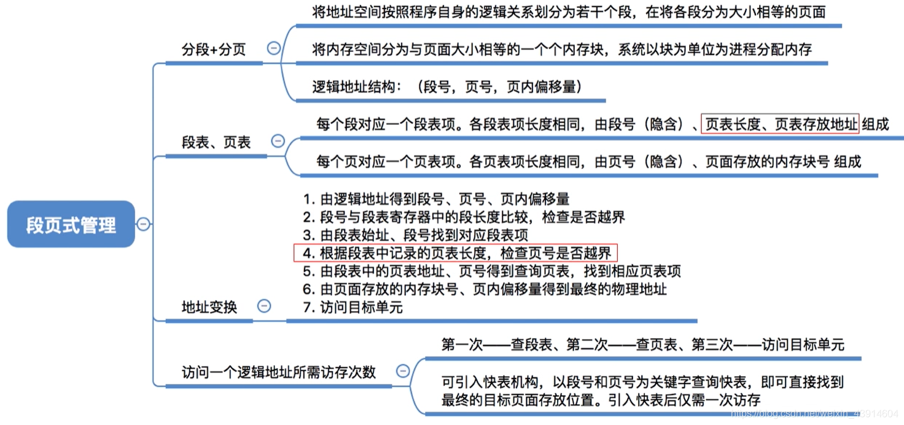

# 段页式管理方式

图1.本节总览

段页式管理方式，也就是段式、页式两种方式的结合。

## 一. 分析分段、分页的优缺点

图2.分段、分页的优缺点

## 二. 分段+分页：段页式管理方式

图3.段页式管理方式

分段+分页。

进程，先按照逻辑模块分段，再将每段进行分页。

图4.逻辑地址结构

段页式系统的逻辑地址结构为：段号+页号+页内偏移量。

段号的位数，决定每个进程最多分为几个段。
页号的位数，决定每段最多几个页。
页内偏移量的位数，决定页面大小。

在段页式管理方式中，仍然是分段对用户可见，分页对用户不可见。
所以仍然是二维的，用户只需要按照段式来使用，后面都是系统来完成根据段内地址自动划分页号和页内偏移量。

## 三. 段页式的段表、页表

图5.段表、页表

每个进程创建一个段表，段表项的内容为：页表长度（这段分为多少页了）、页表存放块号（页表起始地址）。
每个段表项长度相等。段号不用存储，隐含。

一个段表项可以对应多个页面。

## 四. 地址转换

图6.地址转换

地址转换过程：

1. 逻辑地址分为：段号、页号、页内偏移量
2. 段号与段表寄存器中的段表长度对比，判断是否越界。越界，发出越界中断（内中断）；不越界，进入下一步。
3. 根据段表起始地址、段号，访问段表中对应的存储单元，获得页表长度、页表存放块号。**第一次访存**。
4. 页表与页表长度对比，判断是否越界。越界，发出越界中断（内中断）；不越界，进入下一步。
5. 根据内存块号和页内偏移量，访问页表中对应存储单元，得到物理地址。**第二次访存**。
6. 由物理地址，访问目标内存单元。**第三次访存**。

当然，也能用快表。

## 五. 本节回顾

图7.本节回顾

2020.10.11