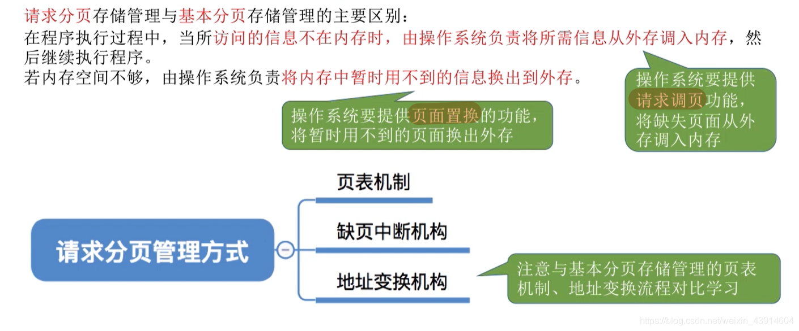
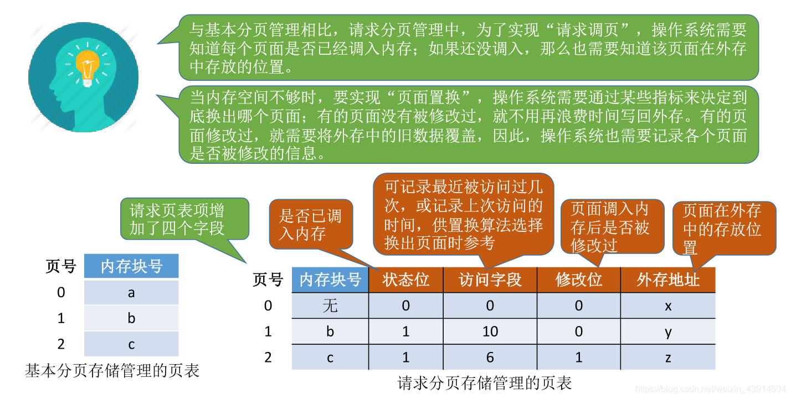
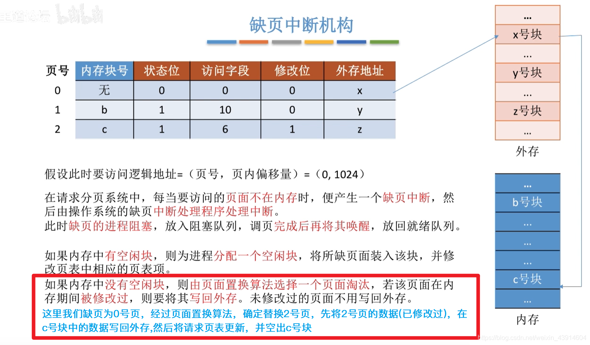
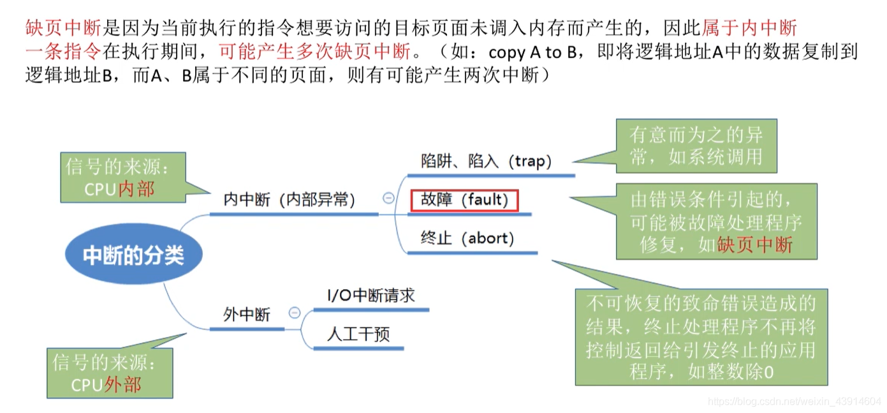
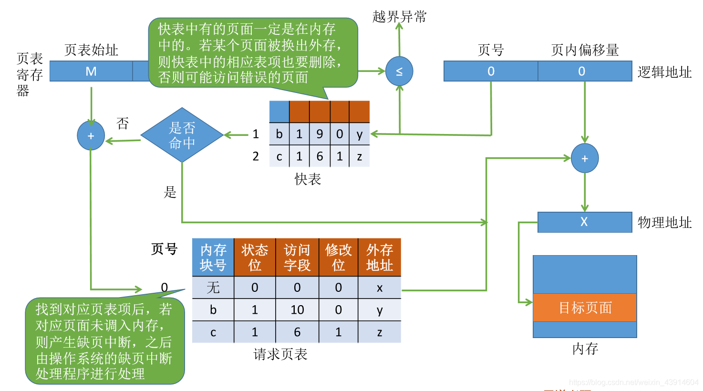
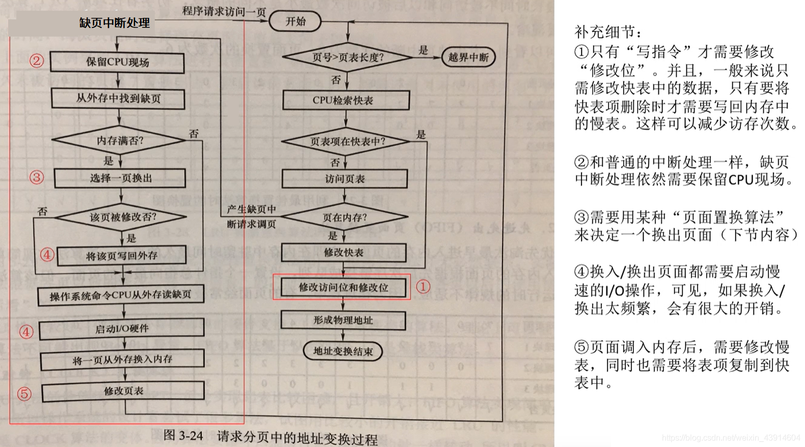
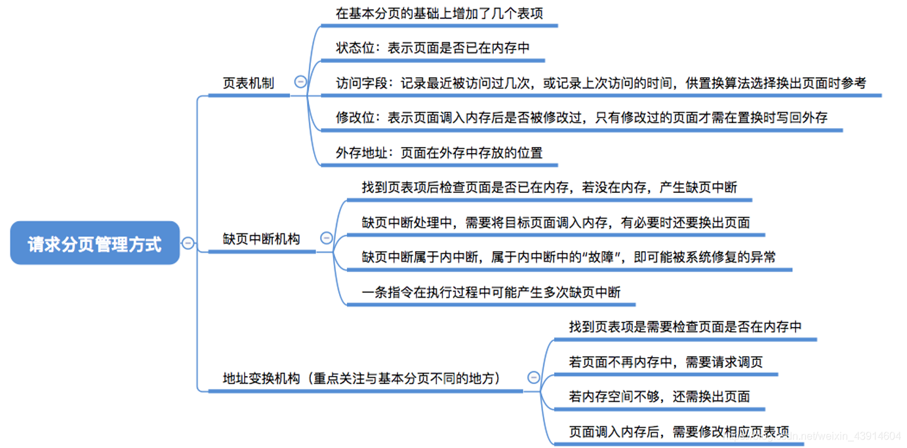

#  请求分页管理方式

图1.本节总览

请求分页与基本分页的主要区别：

1. 请求分页，当程序执行过程中，访问的信息不在内存时，由操作系统将其从外存调入内存，然后继续执行。（操作系统提供请求调页功能）
2. 请求分页，若内存空间不够时，由操作系统复制将暂时用不到的信息换出到外存。（操作系统提供页面置换功能）

## 一. 请求分页的页表

图2.页表

请求分页的页表，除了记录**内存块号**，还需要记录：

**状态位**：该页面是否调入内存。

**访问字段**：可记录该页面最近被访问过几次，或上次访问的时间，供置换算法选择换出页面时参考

**修改位**：记录该页面调入内存后是否被修改过。没有修改过，不用时可以直接覆盖，不用再写入外存。

**外存地址**：页面在外存中的位置。

## 二. 缺页中断机构

图3.缺页中断机构

缺页中断机构工作流程：

当进程要**访问页面不在内存**时，产生**缺页中断**，然后由操作系统的缺页**中断处理程序**来处理中断。
此时缺页的进程**阻塞**，进入阻塞队列，**调页**完成后再将其**唤醒**，放回就绪队列。

如果内存中有空闲块，则为进程分配一个空闲块，将所缺页面装入该块，并修改页表中相应的页表项。
如果内存中没有空闲块，则根据**页面置换算法**选择一个页面淘汰，若该页面在内存期间被修改过，则要将其写回外存。未修改过，不用写回外存，可以直接覆盖。

图4.缺页中断

缺页中断，属于内中断，是因为指令执行时访问的目标页面为调入内存而产生的。

一条指令，可能产生**多次**缺页中断，如copy A to B，而A、B不属于同一页面且都不在内存，就是两次缺页中断。

## 三. 地址变换机构

图5.地址变换流程

地址变换流程：（有快表）

1. 给出逻辑地址，将逻辑地址分为页号和页内偏移量。
2. 检查页号是否越界，若越界，则越界中断；若未越界，则下一步。
3. 判断快表是否命中，若命中，则获得欲访问页面在内存的起始地址，与页内偏移量相加，得到物理地址，根据物理地址访存。
4. 若快表未命中，根据页表起始地址与页号，算出慢表中页表项的地址，访问该页表项。
5. 若该页表项记录，该页面不在内存中，则产生缺页中断，之后由操作系统的缺页中断处理程序进行处理。
6. 若页表项记录，该页面已在内存中，则获得欲访问页面在内存的起始地址，与页内偏移量相加，得到物理地址，根据物理地址访存。

图6.课本中的流程图

课本中的流程图。

1. 只有**写指令**才需要修改"修改位"。

   毕竟写指令修改的是Cache或内存的数据，而不是直接修改外存的数据。

   一般来说都是修改Cache中的数据，所以只用修改快表的修改位，当快表项删除时才写回内存，修改慢表，这样可以减少访存次数。

2. 与普通的中断处理一样，缺页中断也需要保留CPU现场。

3. 是根据某种页面置换算法来决定换出哪一个页面的。

4. 换入/换出需要启动I/O操作，如果频繁换入/换出，会有很大开销。

5. 页面调入内存后，需要修改慢表，同时也需要将表项复制到快表中。

如果缺页的流程（具有快表）：

查快表（未命中）——查慢表（未命中）——调页——查快表（命中）——访问目标单元。
毕竟根据局部性原理，当然刚访问的页面就应该放入快表。

## 四. 本节回顾

图7.本节回顾

2020.10.12