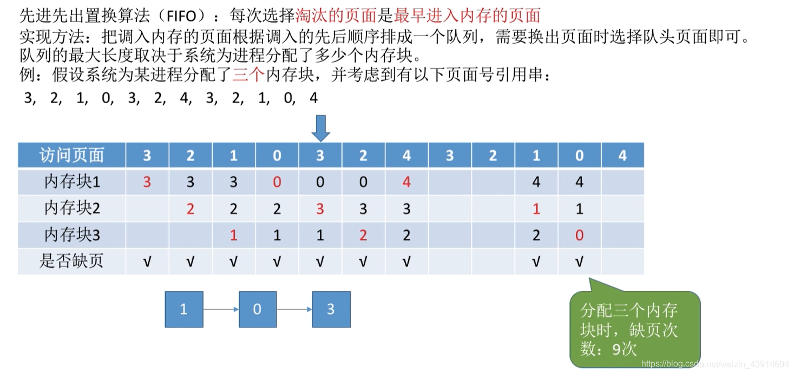

# 页面置换算法

显然，页面置换算法应该使得换入/换出的频率尽量低，减少I/O的开销。

在<计算机组成原理>—7高速缓冲存储器—702地址映射方式，有相关内容。

## 一. 最佳置换算法（OPT）

图2.最佳置换算法

最佳置换算法：

每次淘汰以后永不使用，或未来长时间内不在被访问的页面，以此可以保证最低的缺页率。

图2，第四次访问页面2，往后看，出现先后0、1、7，说明7是在未来最长时间不会访问的，所以淘汰7换为2。
同样的，后面也是淘汰未来最长时间不会访问的页面。

缺页中断9次，页面置换6次。
缺页中断未必发生页面置换，因为有可能有可用的空闲内存块。

缺页率=9/20=45%

然而，现实中，实际上是无法预知访问页面的顺序的，虽然图2是给出了访问页面顺序，但现实中，只有运行到了一条指令，才知道当前要访问的页面，而无法预知。
所以这个最佳置换算法在现实中是**无法实现**的。

## 二. 先进先出置换算法（FIFO）

图3.先进先出置换算法（FIFO）

先进先出置换算法：

每次淘汰最早进入内存的页面。

实现方法：
调入内存的页面根据调入先后顺序排成一个队列。队列长度为分配到的内存块数。

图4.FIFO分配四个内存块

注意到同样的访问顺序，FIFO图3中为3个内存块，缺页9次，而图4为4个内存块，缺页10次。

分配的内存块增多了，但缺页次数反而增加，称为**Belady异常**。

**只有FIFO算法会产生Belady异常**。

FIFO算法实现简单，但算法性能差，算法逻辑与实际运行时的规律不适应。

## 三. 最久未使用置换算法（LRU）

图5.最久未使用置换算法

最久未使用置换算法LRU：

每次淘汰最近最久未使用的页面。

实现方式：
每个页面对应页表项中，记录自上次被访问一来经历的时间t。

该算法需要专门的**硬件支持**，算法性能好，但实现困难，开销大。

如图5，访问页面3时，往前数7、2、1、8，说明7是最近最久没使用的页面，于是淘汰7。

## 四. 时钟置换算法（CLOCK）

图6.时钟置换算法

时钟置换算法CLOCK：

是一种性能和开销较均衡的算法，又称CLOCK算法、最近未使用算法。
分为简单的CLOCK算法、改进型的CLOCK算法，这里先讲简单的CLOCK算法。

简单的CLOCK算法：
将调入内存的页面链接成循环队列，一个页面被调入/调出后，指针指向下一位置的页面。
每个页面对应的页表项，设置一个访问位，初始为0，如果该页面被访问了，则修改为1。
当需要淘汰一个页面时，从指针所指页面开始，依次检查访问位，若遇到访问为1的，则修改为0；若遇到访问位为0的，则淘汰。
显然，如果检查一圈后访问位全为1，但扫描过程中都修改为0了，所以第二圈扫描时必然会有访问位为0的页面。
所以进行替换**最多**会经过**两轮扫描**的。

图6中，分配了5个内存块，先放入了1、3、4、2、5，现在调入6，指针指向页面1，页面1访问位为0，替换；指针指向页面3。
后面调入7时，扫过3、4，访问位为1，修改访问位为0；遇到2访问位为1，替换为7。

## 五. 改进型的时钟置换算法

图6.改进型的时钟置换算法

简单的CLOCK算法只考虑了最近是否使用过，而没有考虑当未修改过的页面是不需要替换，而是可以直接进行覆盖的，而减少内存到外存的I/O操作开销。

改进型的时钟置换算法：

为每个页面的页表项，设置访问位，修改位，初始为0，访问过后则修改访问位为1，修改过则修改修改位为1。
同样也是作为循环队列。
当内存块满，且需要从外出调入页面时：

第一轮扫描：
查找（访问位，修改位）=（0，0）的页面，如有，则进行覆盖；如没有，进行第二轮扫描。
不修改任何标志位。

第二轮扫描：
查找（访问位，修改位）=（0，1）的页面，如有，则进行替换；如没有，进行第三轮扫描。
第二轮扫描，**会修改**扫描过的页面都访问位改为0。

第三轮扫描：
查找（访问位，修改位）=（0，0）的页面，如有，则进行覆盖；如没有，进行第四轮扫描。
不修改任何标志位。

第四轮扫描：查找（访问位，修改位）=（0，1）的页面，如有，则进行替换。不会没有啦。
不修改任何标志位。

所以进行页面调入**最多**会经过**四轮扫描**的。

其实每轮找到页面其实原本是(0,0)，(0,1)，(1,0)，(1,1)，
优先级：最近没被访问，没修改过 $\rightarrow$ 没被访问，修改过 $\rightarrow$ 被访问，没修改过  $\rightarrow$ 被访问，修改过。

## 六. 本节回顾

图7.本节回顾

2020.10.13