#  文件存储的空间管理

上一节讲了，操作系统对磁盘的管理主要工作为，对非空闲磁盘块的管理，对空闲磁盘块的管理。

上节讲了对非空闲磁盘块的管理。

这节讲对空闲磁盘块的管理。

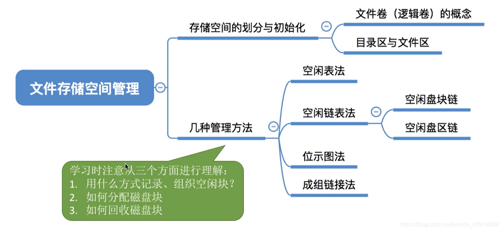

图1.本节总览

## 一. 存储空间的划分与初始化

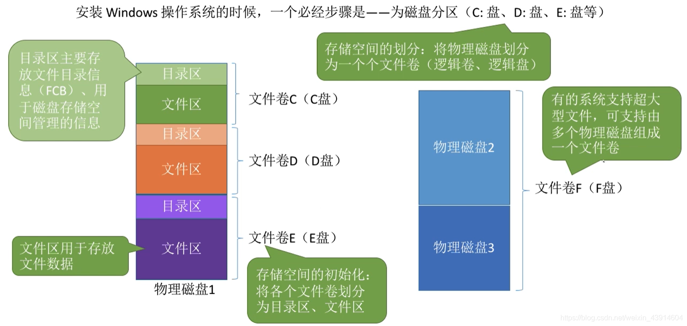

图2.文件卷

将物理磁盘划分为若干文件卷（逻辑卷、逻辑盘），每个文件卷又分为目录区和文件区。

目录区主要粗放文件目录信息（FCB）、用于磁盘存储空间管理的信息。
文件区用于存放文件数据。

有的系统支持超大型文件，可支持由多个物理磁盘组成一个文件卷。

## 二. 空闲表法

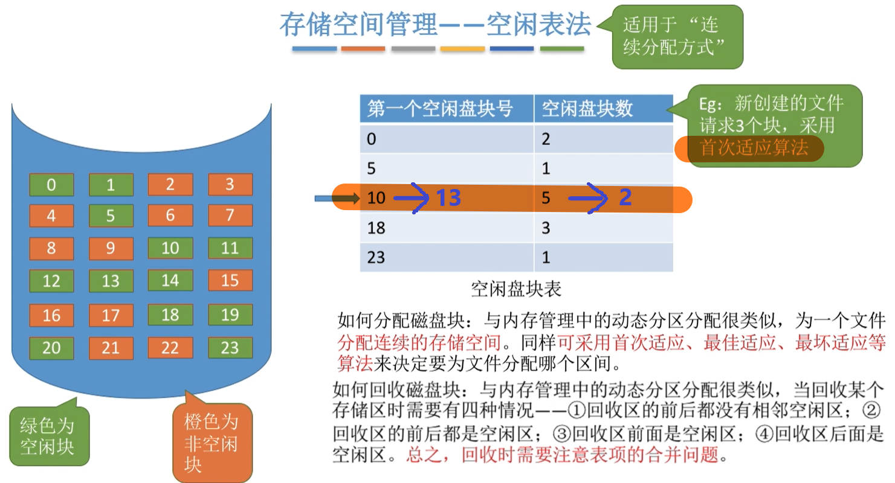

图3.空闲表法

对空闲磁盘块建表，表中按顺序记录连续的空闲盘的第一个空闲盘块号和空闲盘块数。

通常适用于**连续分配方式**。

分配：

以使用空闲表法，并采用**首次适应算法**，分配磁盘块为例
如图3，为新创建文件分配3个磁盘块，按顺序找到第一个足够的空间，为其分配，并修改空闲表的内容，如图3，修改10为13，5为2。

当然如果该空闲表项刚好用完，就删除。
当然也可以采用其他分配算法。

回收：

回收同样是要修改空闲表，注意合并可合并的空闲表项。

## 三. 空闲链表法

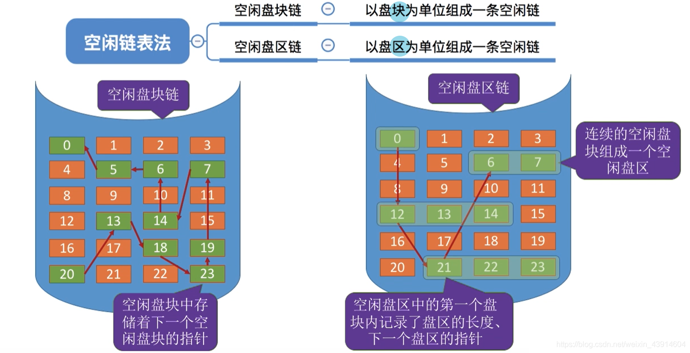

图4.空闲链表法

空闲链表法，通过指针来形成一条空闲链。

又分为：

空闲盘块链：以盘块为单位组成一条空闲链。
空闲盘区链：以盘区（一段连续的空闲磁盘块）为单位组成一条空闲链。

### 3.1 空闲盘块链

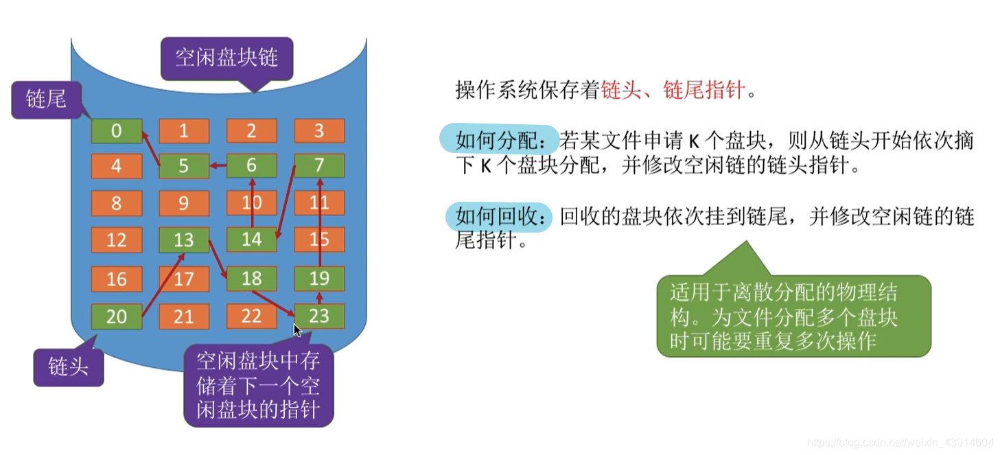

图5.空闲链表法

操作系统保存的是链头、链尾的指针。
每个空闲磁盘块有指向下一个空闲磁盘块的指针。

分配：

若为文件申请K的磁盘块，则从链头开始分配给文件K个空闲磁盘块，并修改链头指针。

回收：

回收的磁盘块依次挂到链尾，并修改链尾指针。

空闲盘块链，显然适用于离散分配的物理结构。
由于以单个磁盘块为单位，所以分配磁盘块时可能会重复很很多次操作。

### 3.2 空闲盘区链

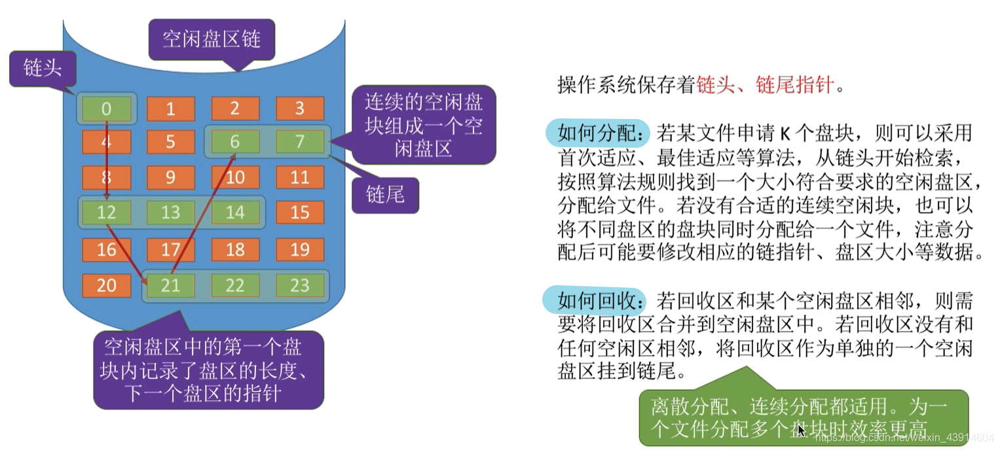

图6.空闲链表法

分配：

操作系统保存的是盘区的链头、盘区的链尾的指针。
每段盘区（连续空闲磁盘块）的**第一个磁盘块**记录了盘区的长度、指向下一个空闲磁盘块的指针。

并不是最后一个空闲磁盘块记录指向下一个空闲磁盘区的指针，而是第一个磁盘块记录。

分配：

可以使用不同的分配算法，若文件申请K的磁盘块，则从链头开始检索，

可以是分配给文件K个**连续的**空闲磁盘块（一个盘区），并修改相应指针。
如果没有的话，也可以是分配给文件K个**离散的**空闲磁盘块（不同盘区），并修改相应指针。

回收：

若回收的区域没有与任何空闲盘区相邻，则挂到链尾，并修改相应的指针。
若回收的区域与某个空闲盘区相邻，则合并，并修改相应的指针。

空闲盘区链，显然顺序分配、离散分配都适用。
由于以磁盘区为单位，所以分配磁盘块时效率更高。

## 四. 位示图法

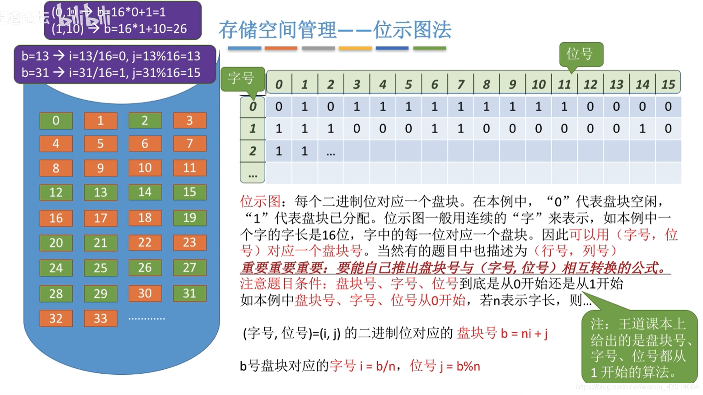

图7.位示图法

位示图法。

采用一个二进制位来表示该磁盘块是否空闲，按序每位二进制位对应一个磁盘块。

显然因为二进制位也是需要存储，自然和字长有关，所以位示图通常采用（字号、位号）来表示，或者（行号，列号），列数就为字长。

**注意**，磁盘块号、字号、位号从0开始还是从1开始！

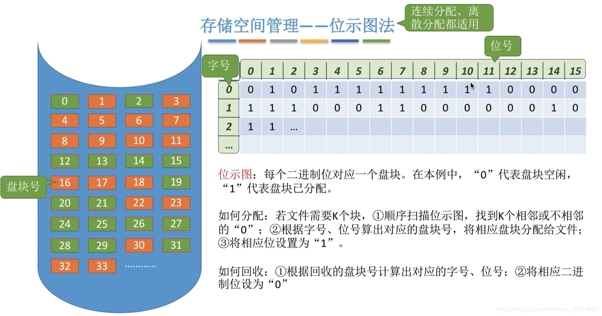

图8.位示图法的分配与回收

分配：

若文件需要K个磁盘块，找到K个连续或有间断的0，根据（字号、位号）计算出对应磁盘号，将相应的磁盘块分配给文件，修改这些磁盘块对应位为1。

回收：

根据回收的磁盘块号计算出对应（字号、位号），将相应的值改为0。

## 五. 成组链接法

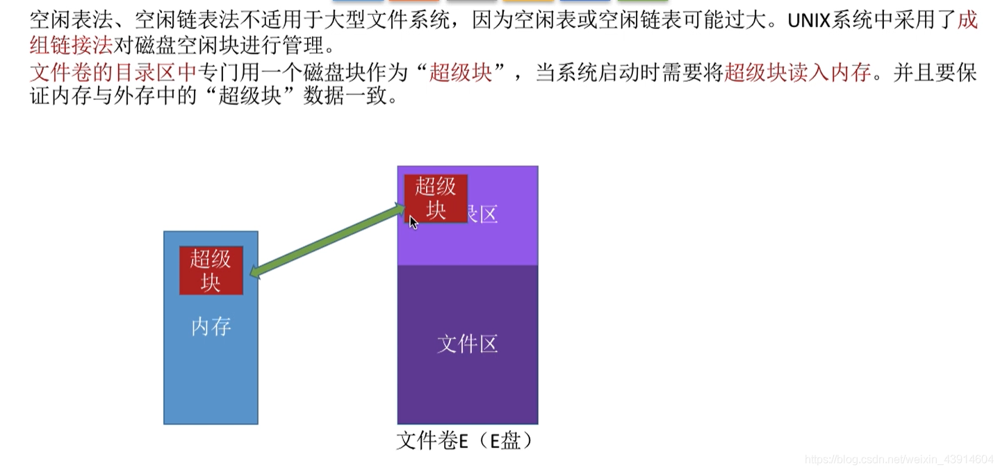

图9.成组链接法

当文件很大，巨大，非常大时，即便光是目录就很大，UNIX系统中采用了成组链接法来对磁盘空闲块进行管理。

（我盲猜又是多层结构）

文件卷的目录区中，专门用一个磁盘块作为**超级块**，当系统启动时需要将超级块读入内存，并且要**保证内存与外存的超级块数据一致**。

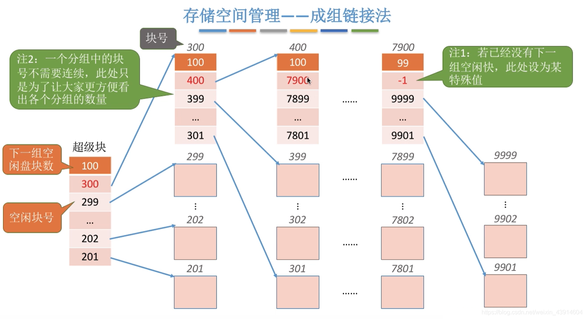

图10.成组链接法-图示

这里王道讲得是真的不好，抄书：

>空闲表法和空闲链表法都不适用于大型文件系统，因为这会使空闲表或空闲链表太长。在 UNIX 系统中采用的是成组链接法，这是将上述两种方法相结合而形成的一种空闲盘块管理方法，它兼备了上述两种方法的优点而克服了两种方法均有的表太长的缺点。
>
>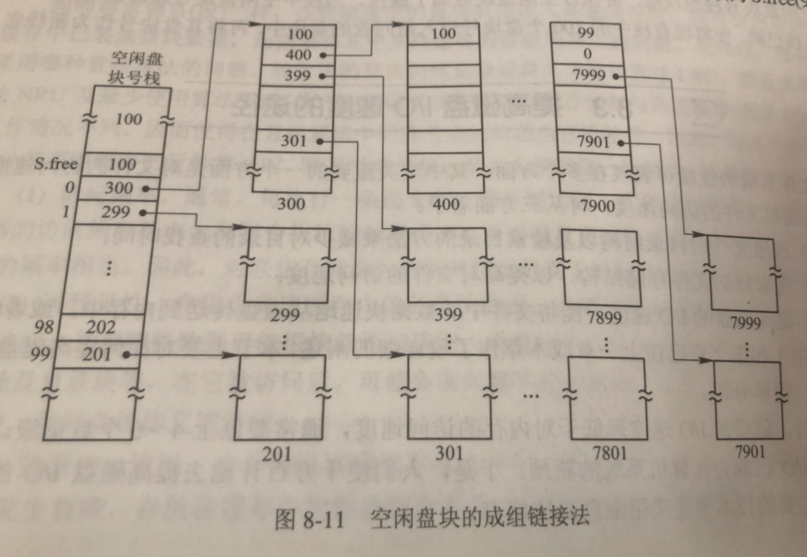
>
>
图11.空闲盘块的成组链接法

>
>1. 空闲盘块的组织
>
>   （1）空闲盘块号栈，用来存放当前可用的一组空闲盘块的盘块号（最多含 100 个号），以及栈中尚有的空闲盘块（号）数 N。顺便指出，N 还兼作栈顶指针用。例如，当 N=100 时，它指向 S.free(99)。由于栈是临界资源，每次只允许一个进程去访问，故系统为栈设置了一把锁。图 8-11 左部示出了空闲盘块号栈的结构。其中 S.free(0) 是栈底，栈满时的栈顶为 S.free(99)。
>
>   （2）文件区中的所有空闲盘块被分为若干个组，比如，将每 100 个盘块作为一组。假定盘上共有 10000 个盘块，每块大小为 1KB，其中第 201~7999 号盘块用于存放文件，即作文件区，这样，该区的最末一组盘块号应为 7901~7999；次末组为 7801~7900，...，倒数第二组的盘块号为 301~400；第一组的盘块号为 201~300，如图 8-11 所示。
>
>   （3）将每一组含有的盘块总数 N 和改组所有的盘块号记入其前一组的第一个盘块的 S.free(0)~S.free(99) 中。这样，由各组的第一个盘块可链成一条链。
>
>   （4）将第一组的盘块总数和所有盘块号计入空闲盘块号栈中，作为当前可供分配的空闲盘块号。
>
>   （5）最末一组只有 99 个可用盘块，其盘块号分别记入其前一组的 S.free(1)~S.free(99) 中，而在 S.free(0) 中则存放 " 0 "，作为空闲盘块链的结束标志。（注：最后一组的盘块数仍为 100，但实际可供使用的空闲盘块数却是 99，对应的编号应为（1~99），0 号中放空闲盘块链的结尾标志，而不再是空闲盘块号。）
>
>2. 空闲盘块的分配与回收
>
>   当系统要为空户分配文件所需的盘块时，须调用盘块分配过程来完成。该过程首先检查空闲盘块栈是否上锁，如未上锁，便从栈顶取出一空闲盘块号，将与之对应的盘块分配给用户，然后将栈顶指针往下移一格。
>   若该盘块号已是栈底，即 S.free(0)，这是当前栈中最后一个可分配的盘块号。由于在该盘块号所对应的盘块中记有下一组可用的盘块号，因此，须调用磁盘读过程将栈底盘块号所对应的内容读入栈中，作为新的盘块号栈内的内容，并把原栈底对应的磁盘块分配出去（其中的有用数据已经读入栈中）。然后，在分配一相应的缓冲区（作为该盘块的缓冲区）。最后，把栈中的空闲盘块数减 1 并返回。
>
>   在系统回收空闲盘块时，须调用盘块回收过程进行回收。它是将回收盘块的盘块号记入空闲盘块号栈的顶部，并执行空闲盘块数加 1 操作。
>   当栈中空闲盘块号数据已达 100 时，表示栈已满，便将现有栈中的 100 个盘块号记入新回收的盘块中，再将其盘块号作为新栈底。

那么我在补充详细说明：

**只有栈底，即 S.free(0) 指向的磁盘块，才是记录着空闲盘块号栈的磁盘块。**
**其余 S.free(1)~S.free(99)，指向的都是没有信息的空闲磁盘块。**

---

所以，在空闲磁盘的分配中，对于 S.free(1)~S.free(99) 的分配，都是直接分配后，栈顶指针下移动一格就行。
但对于 S.free(0)，假定为原本的空闲磁盘块号栈 A 中的 S.free(0)，由于其指向的磁盘块中有空闲盘块号栈 B，所以需要先将其空闲盘块号栈 B 读入内存，才能将 B 所在的磁盘块分配出去，然后因为 A 指向的空闲磁盘块已经分配完了，于是把读入的空闲盘块号栈 B 作为新的空闲盘块号栈，也就是下一次分配按照 B 的信息来分配。

可以注意到，系统中只存在着一个空闲盘块号栈，我这里自己假定称其为 S。
最开始，是从特定的一个磁盘块，即超级块中，调入最开始的空闲盘块号栈 1，即 S = 1。
当空闲盘块号栈 1 要把最后一个栈底 S.free(0) 指向的记录有空闲盘块号栈，假定为空闲盘块号栈 2，的空闲磁盘块分配出去时。先将空闲盘块号栈 2 调入内存，再将空闲盘块号栈 2 所在磁盘块号分配出去。然后空闲盘块号栈 2 作为新的空闲盘块号栈，即 S = 2。

而前面说过，系统会**保证内存与外存的超级块数据一致**。
所以新的空闲盘块号栈，也会同步到超级块中。

---

在回收时，若栈已满，则是将当前的系统的空闲盘块号栈 S，存出到该回收的磁盘块，然后形成新的系统的空闲盘块号栈 S，其中内容是将该回收的磁盘块号入新的系统的空闲盘块号栈 S ，即 S.free(0) 指向该回收的磁盘块，N 加 1。

---

这也是为什么 1.（5）中说："（注：最后一组的盘块数仍为 100，但实际可供使用的空闲盘块数却是 99，对应的编号应为（1~99）"，因为最后一组已经不再指向下一个有空闲盘块号栈的空闲磁盘块了，而 N 又充当着栈顶指针的作用。

当然，如果本身最后一组的空闲盘块数小于 99，那 N 自然也是小于 100 啦。为 98，那 N = 99。
**只是少一个，少的会是记录空闲盘块号栈的那个**。

---

补充，虽然图 10，图 11 中的空闲盘块号栈指向的空闲磁盘块号都是连续的，但只是方便理解，实际上可以是离散的。

图 11 是因为书上例子说明了这些盘都是空的，所以当然一开始是连续的。
图 10 估摸着是王道照着图 11 画的。

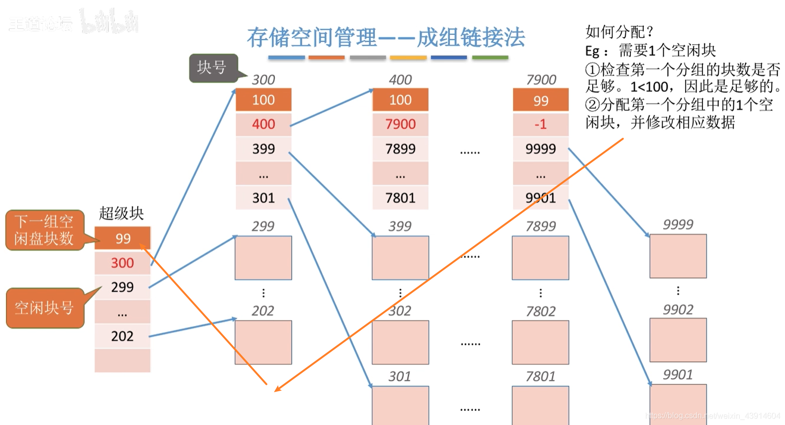

图12.成组链接法-分配

分配：

需要1个空闲块，判断是否上锁，检查第一个分组是否足够（判断总块数），
1<100足够的，分配给该文件1个空闲块，此时不是栈底，栈顶指针下移一格，N 减少 1，修改相应数据。

如图12，将第一组的第一个空闲块201分配给了该文件，超级块中的总块数变为99，空闲块号删除了201。

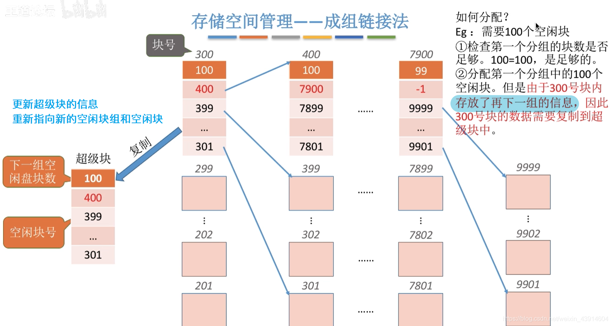

图13.成组链接法-分配

分配：

需要100个空闲块，检查第一个分组是否足够（判断总块数），
100=100足够的，分配给该文件100个空闲块（整个第一组），修改相应数据。

因为是刚好100=100，而栈底 S.free(0) 指向的最后一个空闲磁盘块中记录空闲盘块号栈 1，所以需要将空闲盘块号栈 1 复制到系统的空闲盘块号栈 S，S = 1。

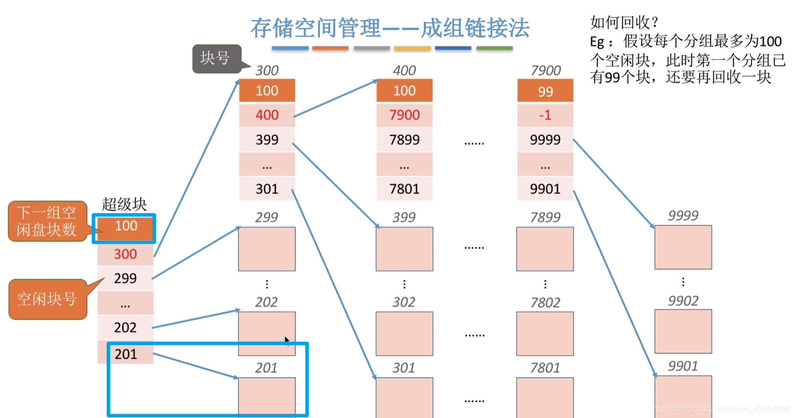

图14.成组链接法-回收

回收：

每组最多100个空闲磁盘块，第一个分组现有99个，现在回收1个。

很简单嘛，修改超级块中的下一组总块数99变为100，空闲块号增加201。

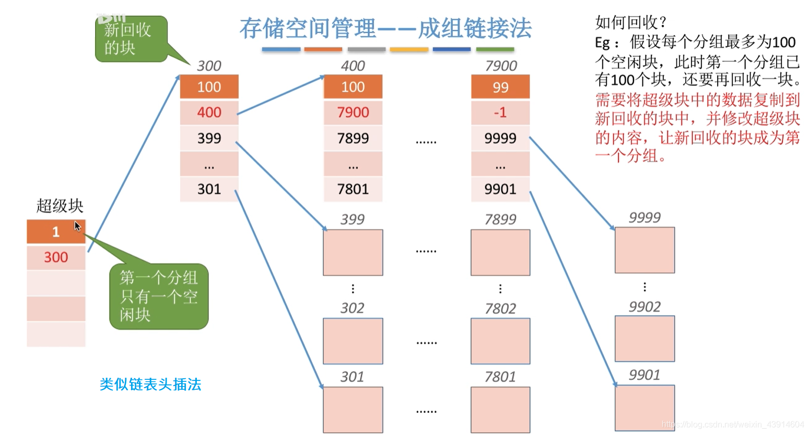

图15.成组链接法-回收

回收：

每组最多100个空闲磁盘块，第一个分组已有100个，现在回收1个。

将空闲盘块号栈 S 的内容复制到回收的空闲块中。再形成新的空闲盘块号栈 S ，其中的内容其中内容是将该回收的磁盘块号入新的系统的空闲盘块号栈 S ，即 S.free(0) 指向该回收的磁盘块，N 加 1。

图 15 可以看到，原本的空闲盘块号栈 S 为 N = 100，400~301，然后回收磁盘块 300，于是最终变成了回收的磁盘块 300 中有着原本的空闲盘块号栈 S ，则新的空闲盘块号栈 S.free(0) 指向 300。

## 六. 本节回顾

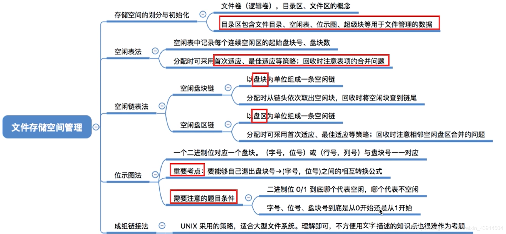

图16.本节回顾

2020.10.15

