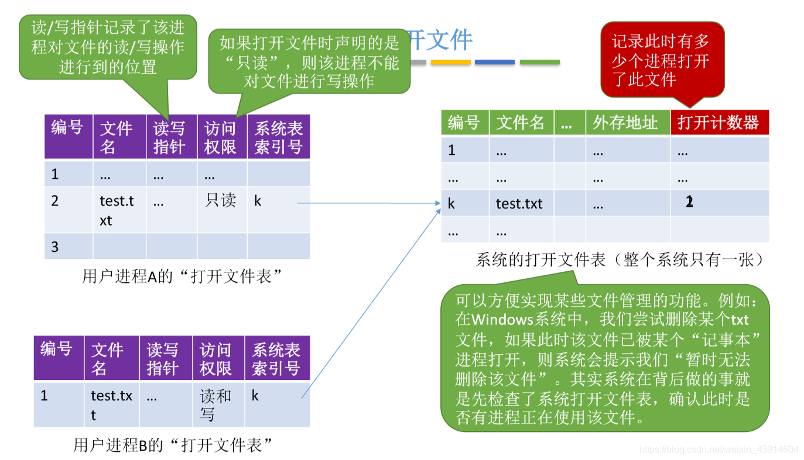

# 文件的基本操作

图1.本节总览

## 一. 创建文件（create系统调用）

图2.创建文件

进行Create系统调用时，需要提供的几个主要参数：

1. 所需的外存空闲大小。
2. 文件存放路径。
3. 文件名。

操作系统处理Create系统调用时，主要做了：

1. 在外存中找到所需的空间。
2. 根据文件存放路径的信息找到该目录对应的目录文件，在目录中创建该文件对应的目录项。目录项中包含了文件名、文件在外存中的存放位置等信息。

如图2，在Windows操作系统中，使用图形化交互，新建文本文档，本质就是Create系统调用。

## 二. 删除文件（delete系统调用）

图3.删除文件

进行Delete系统调用时，需要提供的几个主要参数：

1. 文件存放路径。
2. 文件名。

操作系统处理Delete系统调用时，主要做了：

1. 根据文件存放路径的信息找到该目录对应的目录文件，在目录中找到该文件对应的目录项。
2. 根据目录项中的信息，如外存位置，文件大小等，回收文件占用的磁盘块。
3. 从目录表中删除文件对应的目录项。

## 三. 打开文件（open系统调用）

图4.打开文件

使用文件前，需要先打开文件。

进行Open系统调用时，需要提供的几个主要参数：

1. 文件存放路径。
2. 文件名。
3. 要对文件进行的操作类型。如只读、只写、读写等。

操作系统处理Open系统调用时，主要做了：

1. 根据文件存放路径的信息找到该目录对应的目录文件，在目录中找到该文件对应的目录项，并检查用户是否有指定的操作权限。
2. 将目录项复制到内存中的**打开文件表**中，并将对应表目的编号返回给用户。之后用户使用打开文件的编号来指明要操作的文件。

这样对于已经打开的文件就不需要每次操作都再访问目录了，加快了文件的访问速度。

图5.两种打开文件表

有两种打开文件表：**系统的**打开文件表和**用户的**打开文件表。

系统的打开文件表，整个系统只有一张。
其中记录所有的正在进程使用的文件信息，编号、文件名、外存地址等，另外**打开计数器**还记录了每个文件此时被多少个进程打开。

每个进程有一张自己的用户的打开文件表。
其中记录自己这个进程此时已经打开的文件的信息，编号、文件名、读写指针、访问权限等，其中还记录有**系统表索引号**。
使用某个文件时，通过进程表找到系统表索引号，再去系统表中查，查到该文件的外存地址。

## 四. 关闭文件（close系统调用）

图6.关闭文件

使用完文件后，需要关闭文件。

操作系统处理Close系统调用时，主要做了：

1. 将进程的打开文件表相应表项删除。
2. 回收分配给该文件的内存空间资源。
3. 系统打开文件表的打开计数器count减1，若count=0，则删除对于表项。

## 五. 读文件（read系统调用）

图7.读文件

进程使用Read系统调用完成读操作（图7里面打错字了）。

需要指明：

1. 哪个文件，也就是指明在打开文件表中的索引号。
2. 需要读多少数据。
3. 读入的数据放在内存中的什么位置。

操作系统处理Read系统调用时，会从读指针指向的外存中，将用户指定大小的数据读入用户指定的内存区域。

如图7，双击打开记事本时，就会发生从外存读入记事本中的数据到内存，然后显示出来。

## 六. 写文件（write系统调用）

图8.写文件

进程使用Write系统调用完成读操作。

需要指明：

1. 哪个文件，也就是指明在打开文件表中的索引号。
2. 需要写回多少数据。
3. 要写回的数据在内存中的什么位置。

操作系统处理Write系统调用时，会从用户指定的内存区域中，将用户指定大小的数据写入写指针指向的外存。

## 七. 本节回顾

图9.本节回顾

2020.10.17