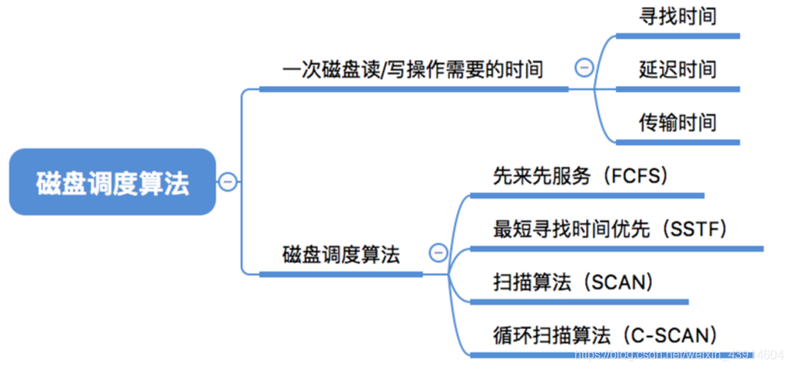
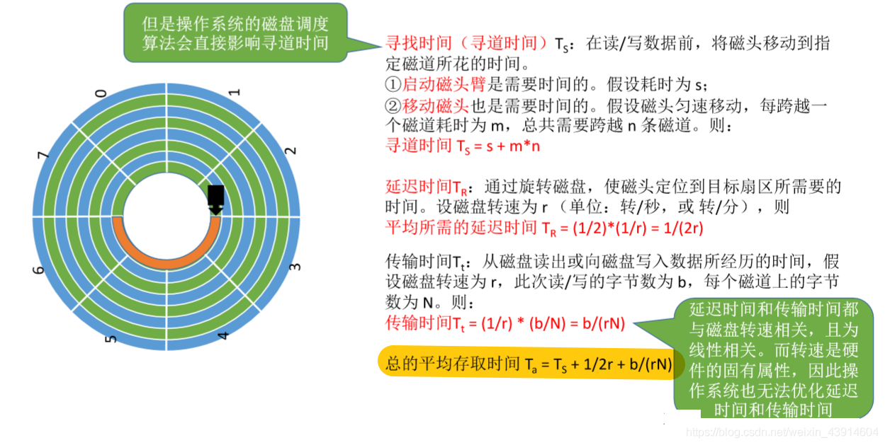
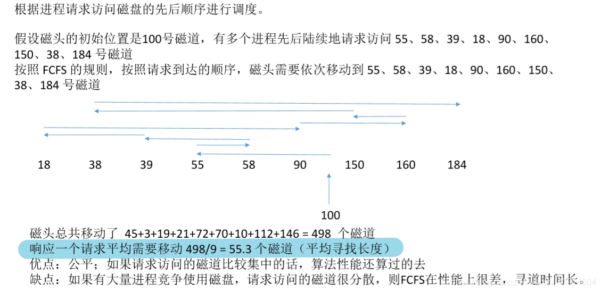
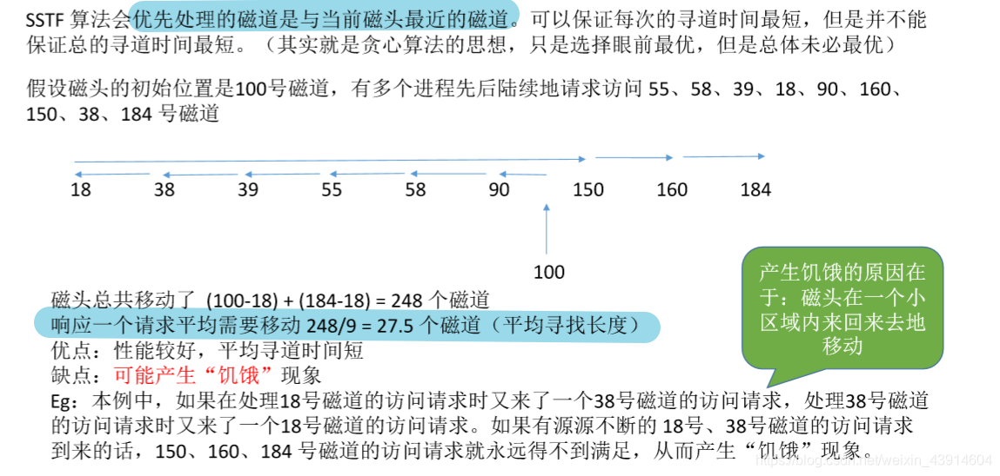
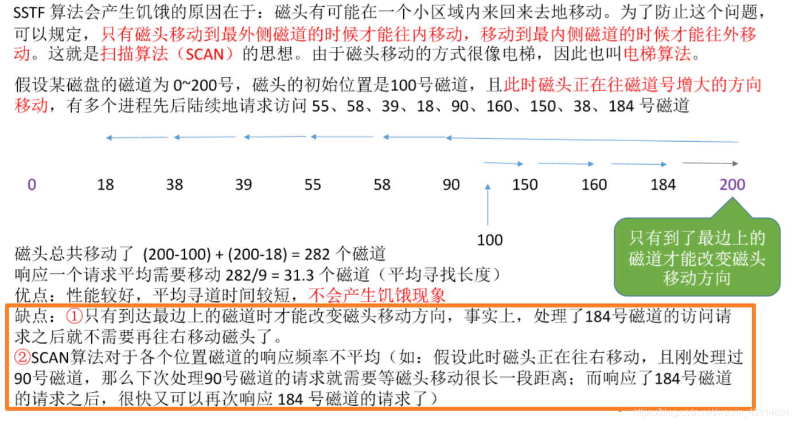
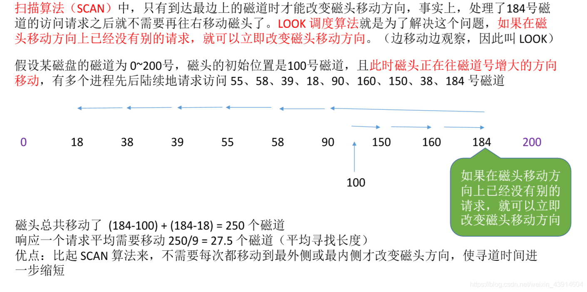
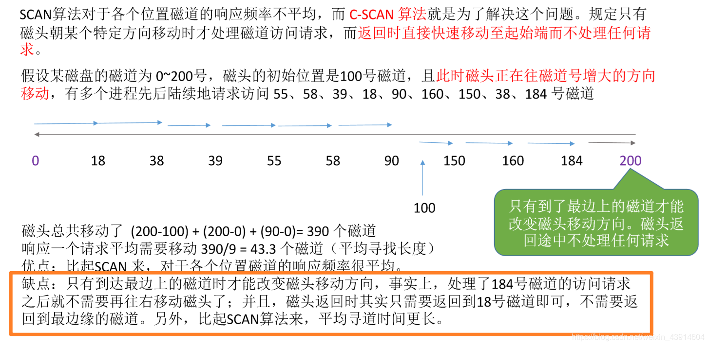
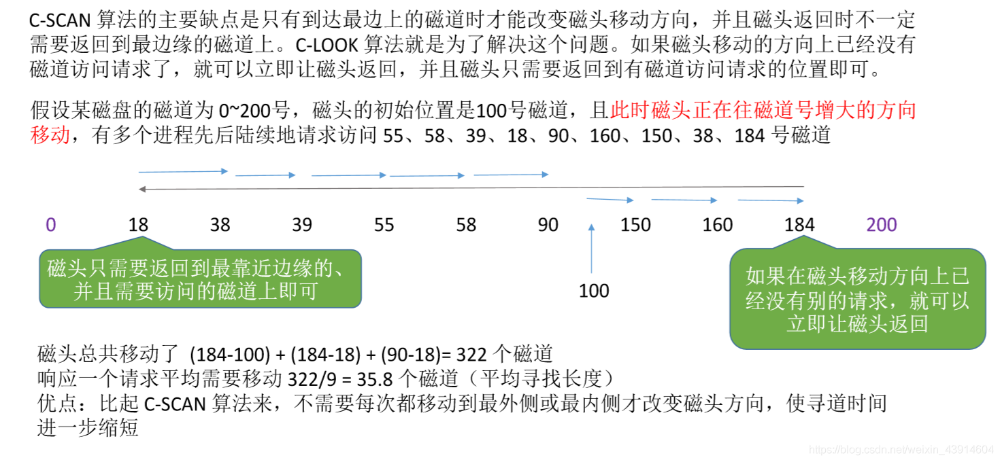
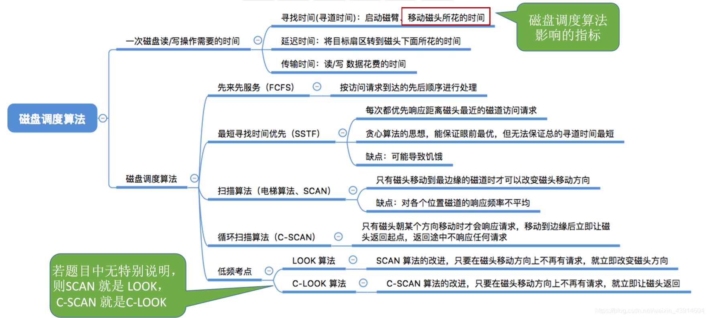

# 磁盘调度算法

图1.本节总览

在<计算机组成原理>—12IO系统—1203外存储器，中有相关内容，甚至更详细。

## 一. 一次读/写的耗时

图2.一次读/写耗时

总耗时：

1. 寻找时间（寻道时间） $T_s$ ：

   磁头移动到对应柱面（磁道）的时间。

   其中包含：

   ​	1.1 启动磁头臂的时间s

   ​	1.2 移动磁头的时间，假设匀速移动，跨越一个磁道耗时m，需要跨越n个磁道，则耗时m*n。

    $T_s=s+m\times n$ 。

2. 延迟时间 $T_R$ ：

   旋转磁盘，使磁头定位到指定扇区的时间。

   假设磁盘转速为r，则平均耗时：$T_R=\frac{1}{2}\cdot\frac{1}{r}=\frac{1}{2r}$ 。

3. 传输时间 $T_t$ ：

   从开始读/写到完成的时间。

   假设磁盘转速为r，此次要读/写字节数为b，每个磁道上总字节数为N。

    $T_t=\frac{1}{r}\frac{b}{N}=\frac{b}{rN}$ 。

总的平均存取时间： $T_a=T_s+\frac{1}{2r}+\frac{b}{rN}$ 。

可以看出，延迟时间、传输时间只与硬件的固有属性有关，所以操作系统只能通过一些调度算法，来减少寻找时间。

## 二. 磁盘调度算法

### 2.1 先来先服务（FCFS）

图3.先来先服务FCFS

就是按先来后到的顺序。

优点：公平，如果访问的磁道比较集中，算法性能还行。
缺点：如果有大量进程竞争使用磁盘，请求访问的磁道很分散，则性能很差，寻道时间长。

### 2.2 最短寻找时间优先（SSTF）

图4.最短寻找时间优先SSTF

优先处理离当前磁头最近的磁道。

优点：性能较好，平均寻道时间短。
缺点：可能出现饥饿现象。

连续的访问请求，可能导致访问离磁头远的磁道的请求一直无法被满足。

### 2.3 扫描算法（SCAN）

图5.扫描算法SCAN

为了避免最短寻找时间算法可能出现饥饿，出现扫描算法，又叫**电梯算法**。

规定：只有磁头移动到最边上才能改变移动方向。
也就是，磁头只能往一个方向移动，直到到了最内/外圈，才能反向移动，且反向移动后，还是只能往一个方向移动，直到到了最内/外圈，才能反向移动......

感觉就和扫描一样。

优点：性能较好，不会产生饥饿现象。
缺点：只有到了最边上才能改变磁头运动方向，而有时往内/外，已经没有需要处理的请求，但为了转向，还是得先往内/外到最边上才能转向。
对每个磁道的响应频率不均，比如在靠近内/外圈的磁道，磁头往外圈移动，刚过这个磁道，然后到最外圈反向，马上又经过了这个磁道，但下次需要到最内圈反向折回才能再次到改磁道。而靠近中间的磁道的响应频率就比较正常。

### 2.4 LOOK算法

图6.LOOK算法

解决SCAN磁头转向的问题。

LOOK算法规定，当移动方向的磁头已经没有需要处理的请求时，则可以立即改变磁头移动方向。

优点：比起SCAN算法，不需要每次都移动到最内/外圈才改变磁头方向，使寻道时间进一步缩短。

### 2.5 C-SCAN算法

图7.C-SCAN算法

解决SCAN算法的不同位置相应频率不均的问题。

C-SCAN算法，规定，磁头往特定方向移动时才处理请求，而返回时不处理，直接返回初始位置，然后又往特定方向移动时才处理请求。

优点：对比SCAN，C-SCAN算法对于各个位置的磁道响应频率平均。
缺点：只有到达了最边上才能改变磁头移动方向。如果移动方向已经没有请求了，那就白白浪费时间多走了一段路。

### 2.6 C-LOOK算法

图8.C-LOOK算法

结合SCAN、LOOK、C_SCAN算法，提出C-LOOK算法。

磁头往特定方向移动时才处理请求，而返回时不处理，直接返回初始位置，然后又往特定方向移动时才处理请求。
若移动方向已无请求，则可以立即返回。

优点：比起C-SCAN算法，不需要每次移动到尽头才返回，缩短了寻道时间。

## 三. 本节回顾

图9.本节回顾

如果题目没有特殊说明，则默认：**题目的SCAN算法是这节的LOOK算法，题目的C-SCAN算法就是这节的C-LOOK算法。**

2020.10.22