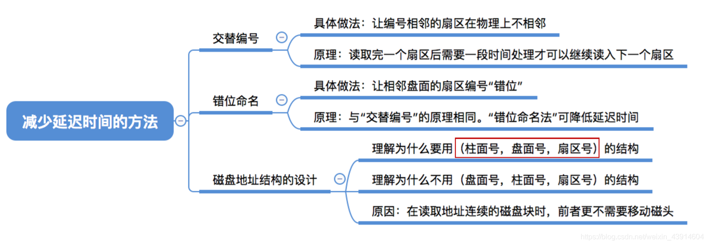
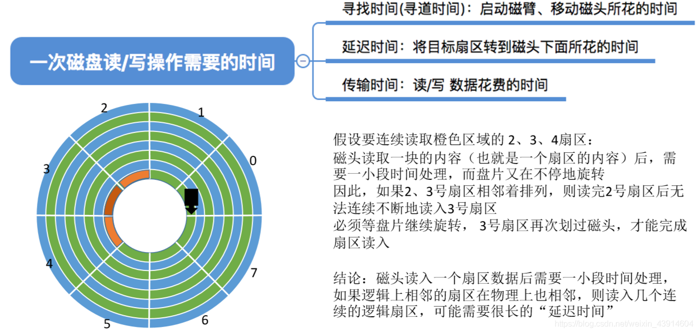
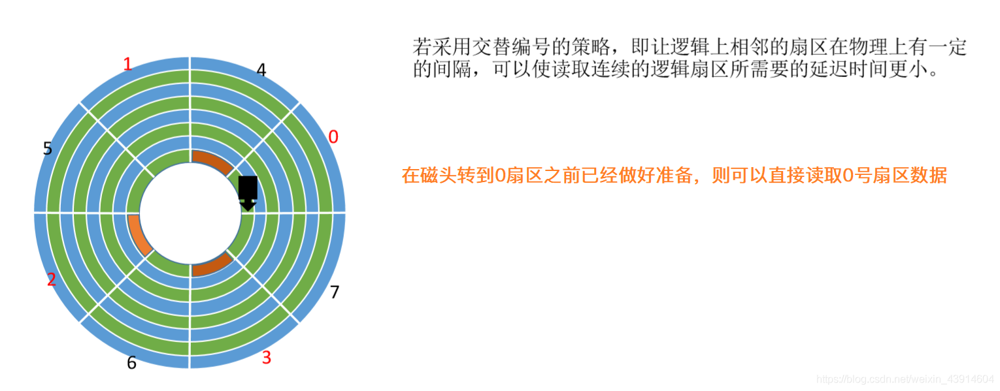
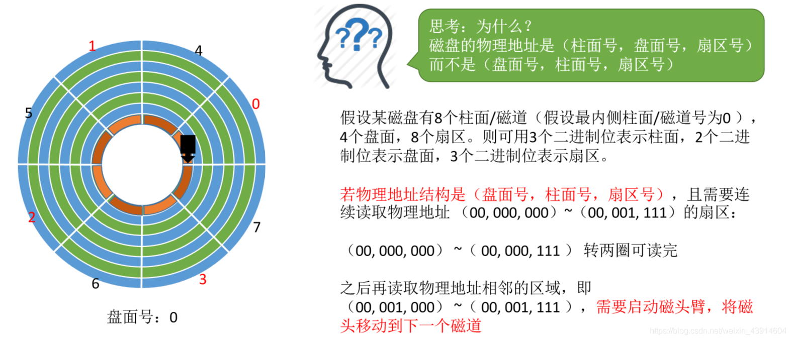
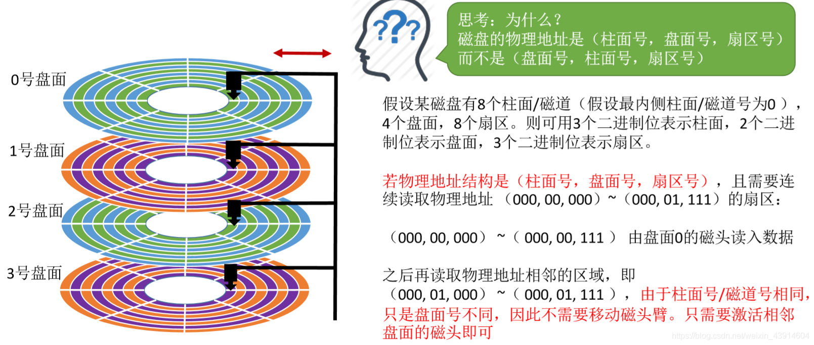
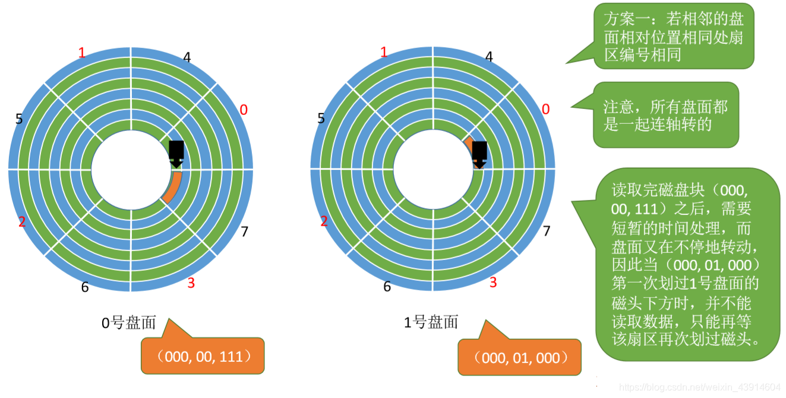
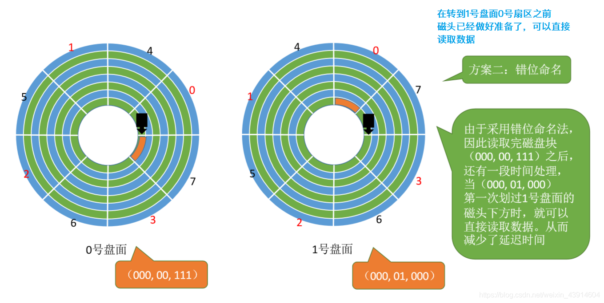

# 减少磁盘延迟时间的方法

图1.本节总览

## 一. 交替编号

图2.连续编号存在的问题

读/写是以扇区为单位的。

每次读/写完一个扇区后，需要一段时间处理，而盘片是在不断旋转的。

而如果逻辑上相邻的扇区在物理上也相邻，那么当连续读/写时，读/写完1号扇区，处理，想接着写2号扇区，而2号扇区在处理的时间中已经错过了，不得不等待盘片再转完一圈到2号扇区才能开始读/写。

图3.交替编号

所以，对扇区采用交替编号的方式。

这样，在处理时间结束后，可能还没有错过下一个编号的扇区。从而减少了连续读/写的延迟时间。

## 二. 磁盘地址结构的设计

图4.假设使用（盘面号、柱面号、扇区号）

假设使用（盘面号、柱面号、扇区号），如图4，假设有8个扇区，则扇区号占3个二进制位，当连续读取00,000,000~00,000,111，没问题，再继续读呢，00,001,000，就需要移动磁头，换磁道了。

图5.使用（柱面号、盘面号、扇区号）

使用（柱面号、盘面号、扇区号），连续读取00,000,000~00,000,111，没问题，再继续读，00,001,000，则不需要移动磁头，而是继续直接再另一个盘面上读取。只需要激活相邻盘面的磁头。

所以为什么使用（柱面号、盘面号、扇区号），就是为了减少移动磁头的耗时。

## 三. 错位命名

图6.盘面间扇区号编号相同

如果盘面间扇区号编号相同，则当00,000,111到00,001,000，切换盘面时，由于7到0是连续的，而读/写一个扇区又需要短暂时间来处理，导致会出现前面所说的，错过了扇区，多等待一圈。

图7.错位命名，盘面间扇区号编号不同

于是采用错位命名，盘面间的扇区号编号不同，错开。

这样切换盘区时就减少了延迟时间。

## 四. 本节回顾

图8.本节回顾

2020.10.22