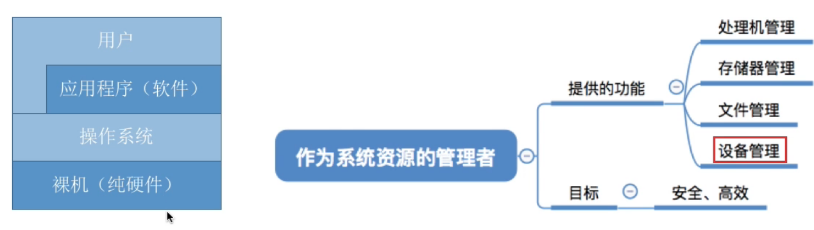
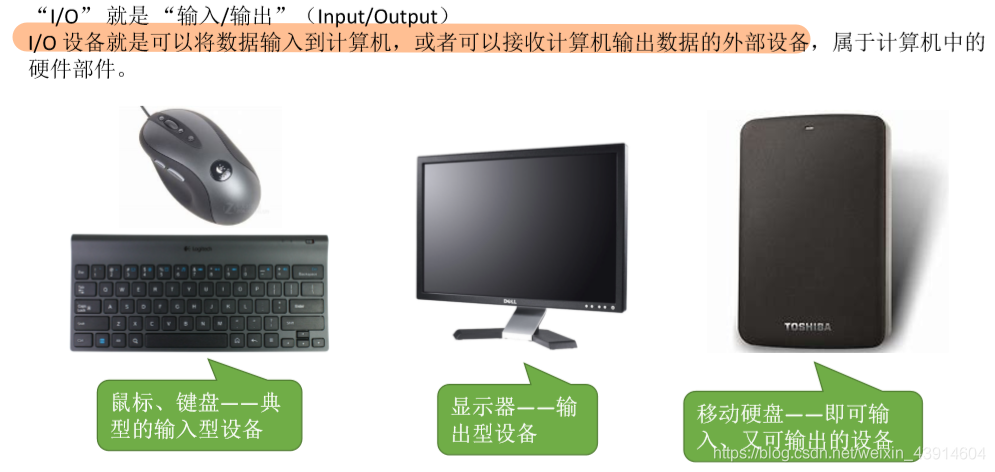
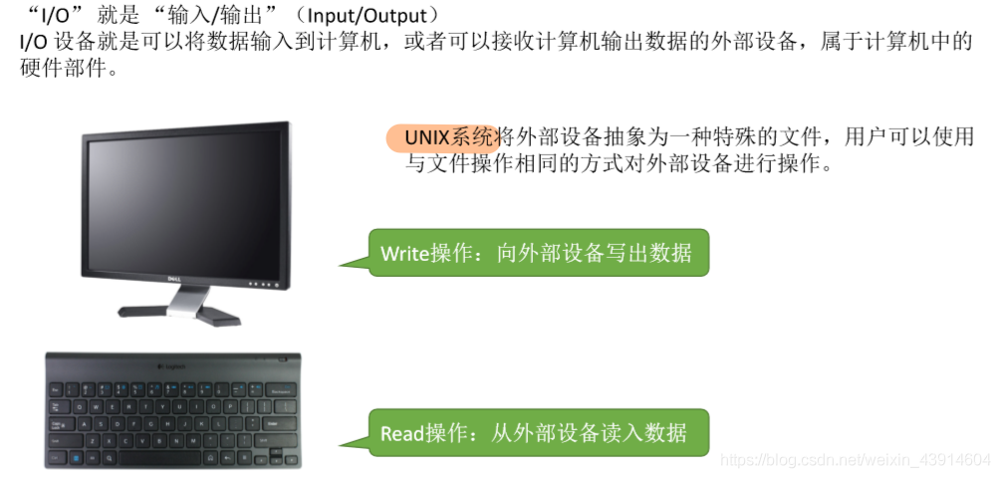
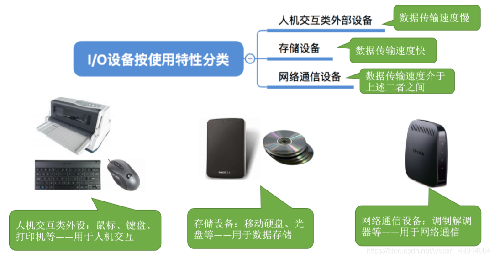
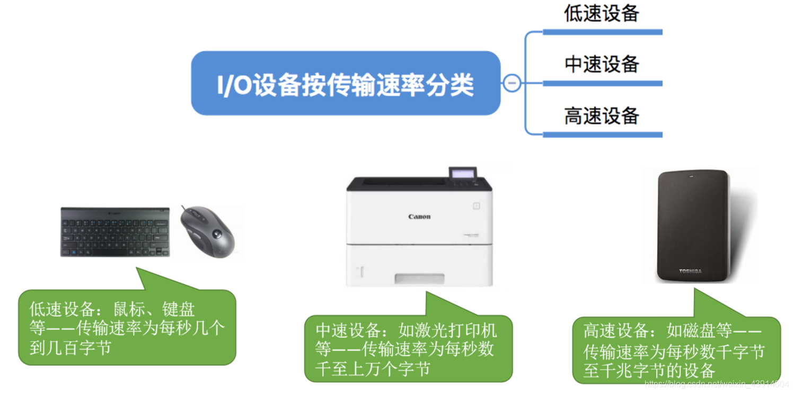
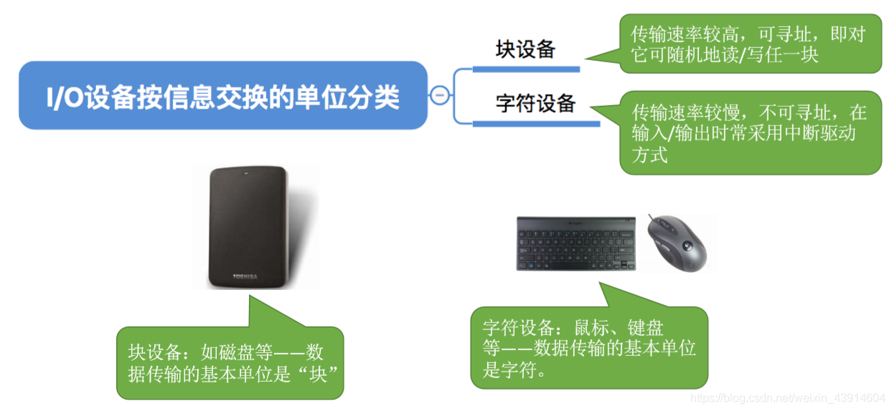
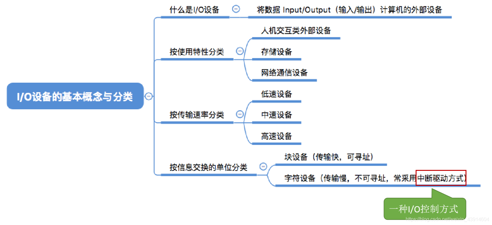

# I/O设备的概念与分类

图1.本节总览

这一章，学习最后一个，操作系统对设备的管理。

So，这一节先介绍I/O设备的概念与分类。

我想说<计算机组成原理>—12I/O设备，有相关内容。

## 一. I/O设备

图2.I/O设备

图3.I/O设备

UNIX系统将外部设备抽象为一种特殊的文件，用户可以使用与文件操作相同的方式对外部设备进行操作。

## 二. I/O设备的分类

### 2.1 按使用特性分类

图4.按使用特性分类

按使用特性分类：

1. 人机交互类设备：

   速度慢，用于人机交互。

2. 存储设备：

   速度快，用于数据存储。

3. 网络通信设备：

   速度介于中间，用于网络通信。

### 2.2 按传输速率分类

图5.按传输速率分类

按传输速率分类：

1. 低速设备
2. 中速设备
3. 高速设备

### 2.3 按信息交换单位分类

图6.按信息交换单位分类

按信息交换单位分类：

1. 块设备

   数据传输基本单位是块，传输速度快，可寻址（可随机读/写）。

2. 字符设备

   数据传输基本单位是字符，传输速度慢，不可寻址，在输入输出时常采用中断驱动方式。

## 三. 本节回顾

图7.本节回顾

2020.10.22