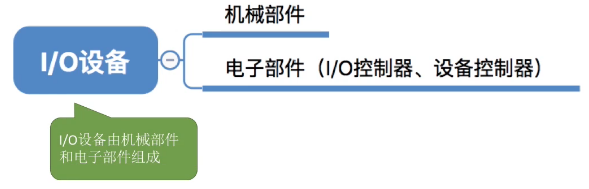
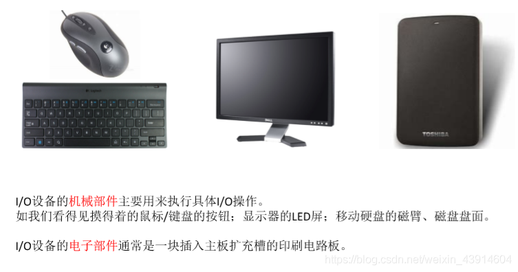
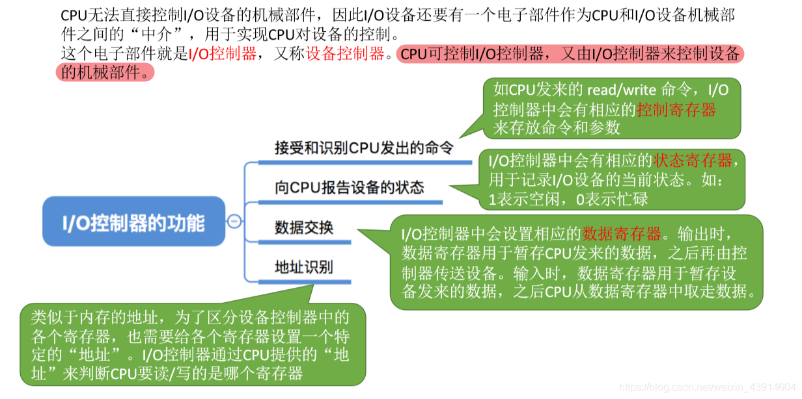
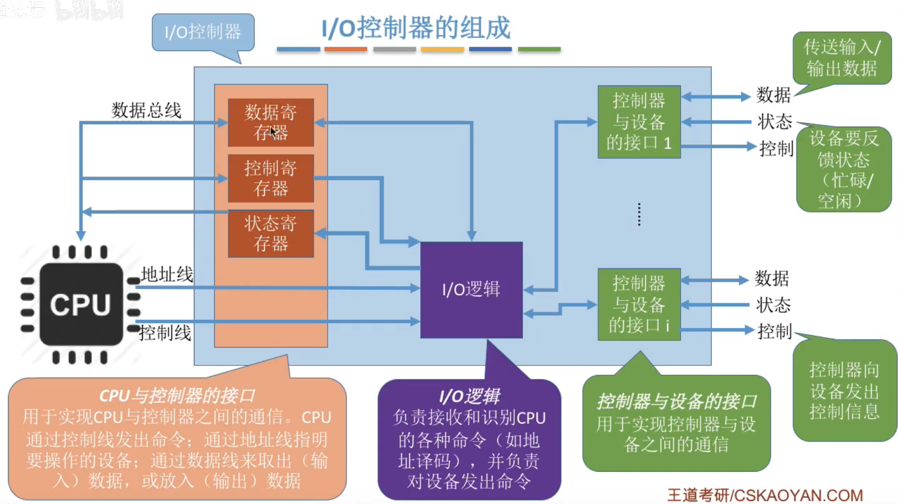
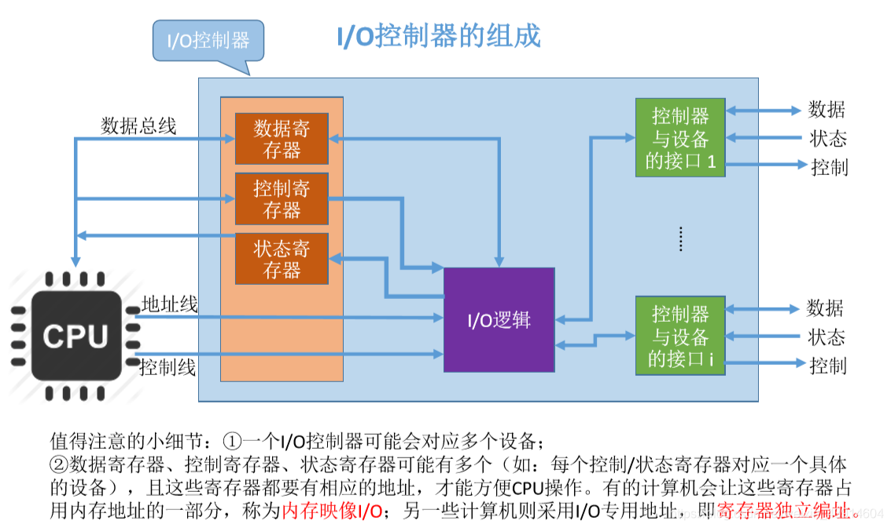
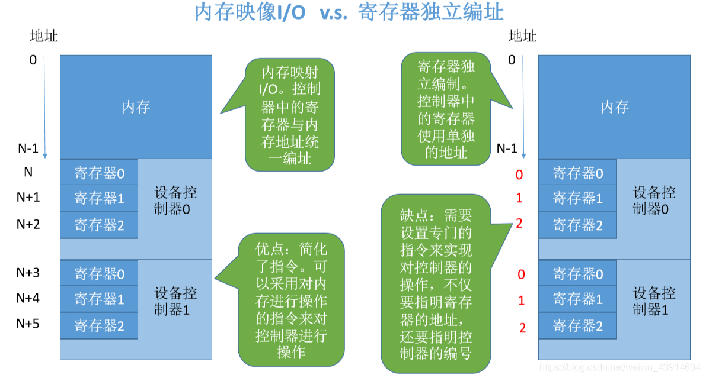
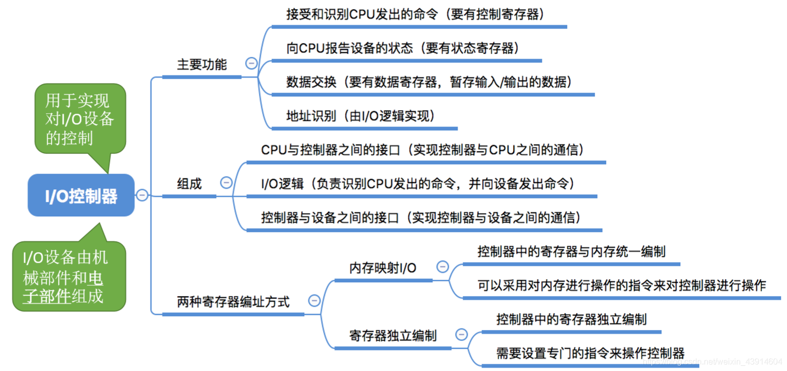

# I/O控制器

## 一. I/O设备的组成

图1.I/O设备的组成

I/O设备由机械部件和电子部件组成。

### 1. 机械部件

图2.机械部件

机械部件，主要用于执行具体的I/O操作。
比如，鼠标/键盘的按键、显示器的LED屏、硬盘的磁臂、磁盘的盘面。

### 2. 电子部件（I/O控制器）

**此节可以结合<计算机组成原理>—12I/O系统—1204I/O接口，从而理解。**

因为CPU无法直接控制I/O设备的机械部件，于是在CPU和机械部件之间，存在一个电子部件（I/O控制器），以实现CPU—I/O控制器—机械部件的控制。

#### 2.1 I/O控制器的功能

图3.I/O控制器的功能

I/O控制器的功能：

1. 接受和识别CPU发出的命令：

   比如I/O控制器接受CPU发出read/write命令，从而执行相应命令。

2. 向CPU报告设备的状态

   I/O控制器中有状态寄存器，用于记录设备当前状态，如1表示空闲，0表示忙碌。

3. 数据交换

   I/O控制器中有数据寄存器，从I/O设备读数据到数据寄存器，再通过总线传到CPU；从主机的数据传到I/O控制器中的数据寄存器，再写入I/O设备。

4. 地址识别

   I/O控制器中有设备选址电路，类似于地址，用于区别不同的I/O设备。通过不同的I/O设备"地址"，来控制指定的I/O设备。

详细还是看<计算机组成原理>—12I/O系统—1204I/O接口。

#### 2.2 I/O控制器的组成

图4.I/O控制器的组成

操作系统与计组的划分不同，
在<计算机组成原理>中，I/O接口指不包含设备控制器（图4中的控制器与设备接口）。
在<操作系统>中，I/O控制器包含了设备控制器。

I/O控制器的组成：

1. I/O逻辑：

   负责接收和识别CPU的各种命令，并负责对设备发出命令。

2. CPU与控制器的接口：

   用于实现CPU与控制器之间的通信。CPU通过控制线发出命令；通过地址线说明要操作的设备；通过数据线来传输数据。
   相关的有数据寄存器、控制寄存器、状态寄存器等。

3. 控制器与设备的接口：

   用于实现控制器与设备的接口。
   一个I/O控制器可以控制多个I/O设备，CPU通过地址线传递给I/O逻辑，说明要控制的I/O设备。

图5.一些细节

一些小细节：

1. 一个I/O控制器可能对应多个设备。

2. 显然如果对应多个设备，则每个设备的状态、"地址"都是不同的。所以数据寄存器、状态寄存器也会有多个。

3. 为了使用这些寄存器，也需要给寄存器编址，编址分为两种方式：

   使用内存地址的一部分，成为**内存映像I/O**；
   使用I/O专用地址，即**寄存器独立编址**。

#### 3. I/O控制器中寄存器的两种编址方式

图6.内存映像I/O，寄存器独立编址

此处寄存器编址方式可以查看<计算机组成原理>—12I/O系统—1204I/O接口，更详细。

## 二. 本节回顾

图7.本节回顾

2020.11.26