# I/O控制方式

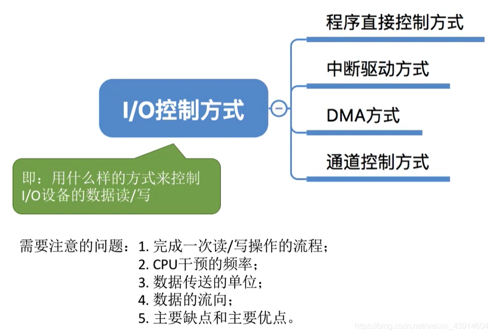

图1.本节总览

感觉和计组一样的呢？只是<操作系统>讲的要大概一点，<计组>详细一点。

详细可以看<计算机组成原理>—12I/O系统，里的内容。

## 一. 程序直接控制方式

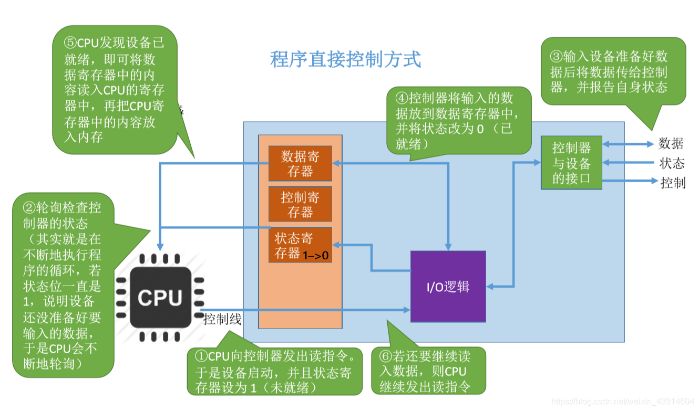

图2.程序直接控制方式

对应<计组>中的**程序查询方式**。

也就是在I/O设备忙碌状态时，CPU不做其他事，一直查询I/O设备的状态是否已经就绪。

程序查询方式一次读操作过程：

1. CPU向I/O控制器发出读指令，设备启动，修改状态寄存器为1表示未就绪。
2. CPU**轮询**检查控制器的状态，也就是查询状态寄存器，如果为1则继续轮询查询。
3. 输入设备准备好数据后，将数据传递给控制器，并报告自身状态。
4. I/O控制器将数据暂存至数据寄存器，然后修改状态寄存器修改为0表示就绪。
5. CPU轮询查到状态寄存器为0，将数据寄存器中的数据读出，**放到CPU的寄存器中，再从CPU的寄存器放入内存**。

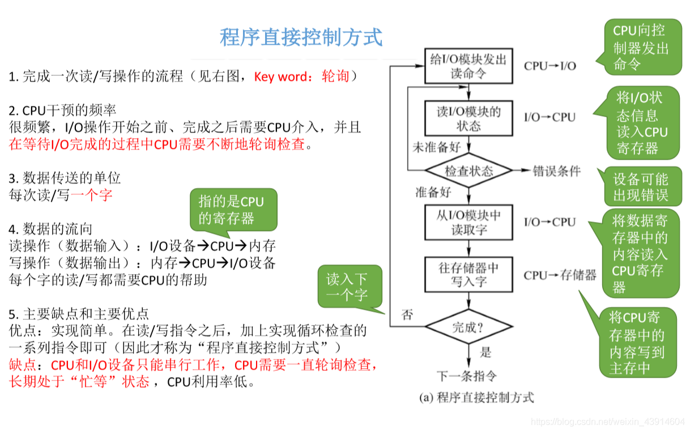

图3.程序直接控制方式的流程图与分析

程序直接控制方式的流程图，如图3右方流程图。

分析：

每次I/O操作开始前、完成后需要CPU介入。
CPU干预频繁，而且在等待I/O完成的过程中，CPU需要不断轮询检查。

每次只能读/写**一个字**。

内存到I/O设备之间都需要经过CPU的寄存器。

优点：实现简单。
缺点：CPU和I/O设备都只能串行工作，CPU长期处于"忙等"状态，利用率低。

## 二. 中断驱动方式

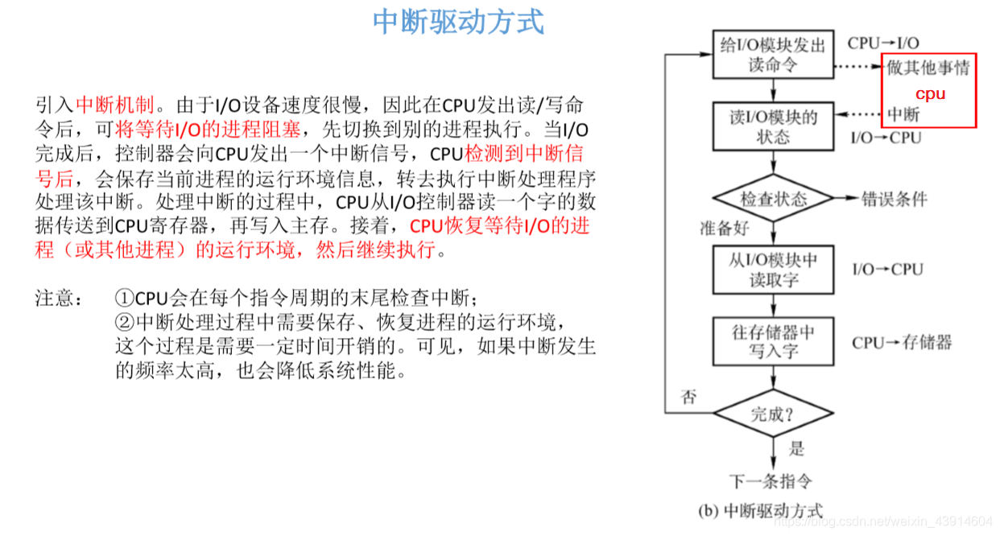

图4.中断驱动方式

中断驱动方式过程：

1. CPU向I/O控制器发出读命令后，可将等待I/O的进程阻塞，切换到别的进程执行。
2. 当I/O就绪后，I/O控制器会向CPU发出一个中断信号，CPU检测到中断信号后，保存当前执行进程的环境，转而去执行中断处理程序来处理该中断。
3. 处理该中断过程中，完成此次I/O，从I/O控制器的数据寄存器中读出数据至CPU中的寄存器，然后至主存。
4. 接着恢复被中断的进程的运行环境，继续执行。

注意：

1. CPU会在每个指令周期的末尾检查中断。

   复习一下：取址周期—（间址周期）—执行周期—（中断周期）。

2. 中断处理过程中需要保存、恢复进程的运行环境，其保存、恢复的操作也是需要时间开销的，所以中断频率不能太高，反而降低系统性能。

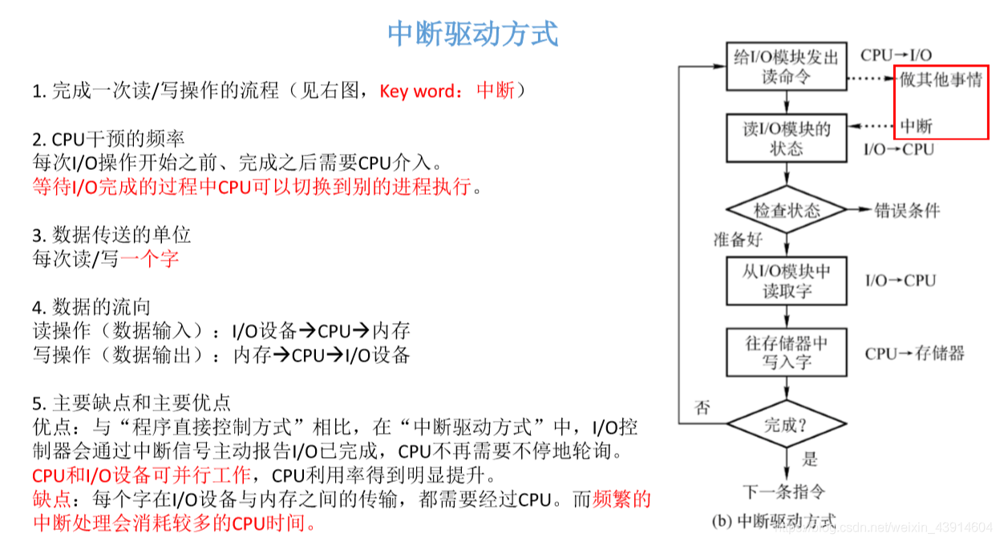

图5.中断驱动方式的分析与优缺点

分析：

每次I/O操作开始前、完成后需要CPU介入。
等待I/O完成的过程中CPU可以切换到别的进程执行。

每次读写**一个字**。

内存到I/O设备之间都需要经过CPU的寄存器。

优点：CPU不再需要不停的轮询检查，CPU和I/O设备可以并行工作，CPU利用率明显提升。
缺点：每个字在I/O设备与内存之间的传输，都需要经过CPU的寄存器，而且如果中断太频繁会消耗较多的CPU时间。

## 三. DMA方式

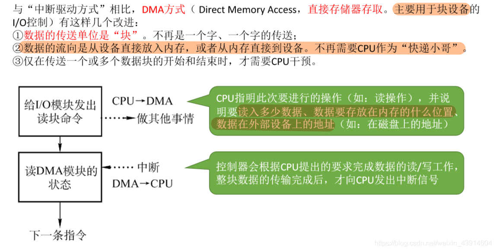

图6.DMA方式

DMA方式，直接存储器存取。

DMA方式过程：

1. CPU将本次的任务交给DMA，把要进行的操作（比如读操作）、读入的数据、数据的存放地址、要存入的地址都传递给DMA。

   可以注意到，一次可以交代的传输的数据就不止一个字了。

2. 然后CPU可以去做其他事情。

3. 由DMA控制器来控制设备，完成CPU交代的任务。

4. DMA控制器完成任务后，向CPU发出中断信号，由CPU来处理中断。

这里复制一下我在<计组>中的笔记：

> DMA方式的运行逻辑是，I/O设备通过DMA控制器向CPU提出DMA传送请求，CPU响应后将让出系统总线，由DMA控制器接管总线进行数据传送。
> 在DMA控制器控制数据传送的过程中，如果CPU不需要访存，那就可以进行自己的程序；如果CPU需要访存，则需要等待DMA控制器将系统总线使用权交还给CPU，再进行。
>
> 该中断服务程序的主要内容是，一方面是检验一下刚才的数据传送有没有错误，检验方法就是依靠校验位来检验；另一方面是如果CPU还有一块数据仍然需要这个设备进行传送，那么就在这个中断服务程序中进行下一次的预处理。

详细还是看<计组>里的DMA方式。

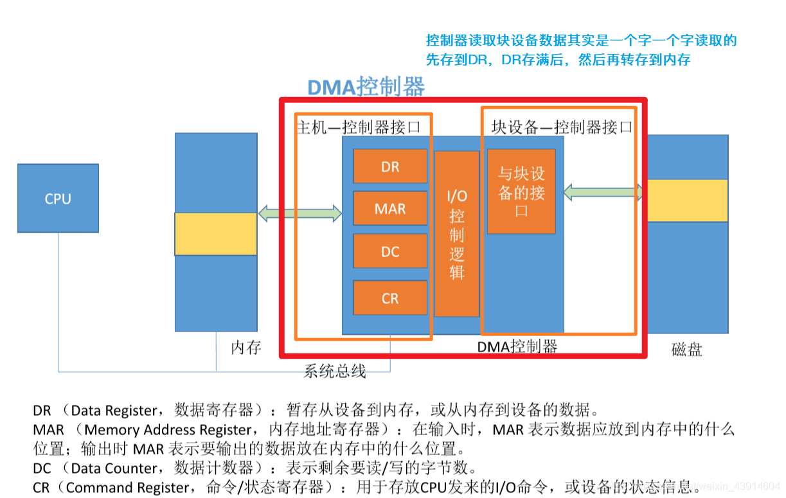

图7.DMA控制器

DR：数据寄存器，暂存要传输的数据。
MAR：内存地址寄存器，指出数据存入或读出的所在内存地址。
DC：数据计数器，其值表明剩余还需要传输的数据的字节数。
CR：命令/状态寄存器，用于存放CPU发来的I/O命令，或设备状态信息。

**详细查看：<计算机组成原理>—12I/O系统—1208DMA方式**。

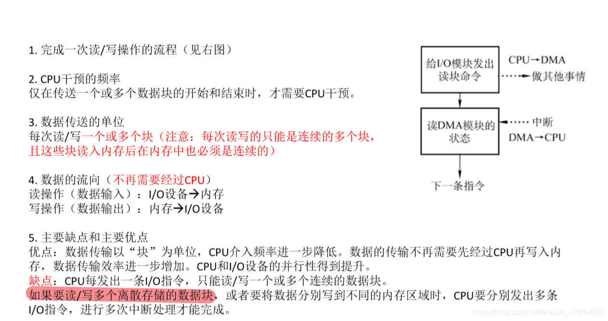

图8.DMA控制器的分析与优缺点

分析：

仅再传送一个或多个数据块的开始和结束时，才需要CPU干预。

每次读写**一个或多个块**。
注意，多块必须是连续的块，读入内存后也必须是连续的。

内存到I/O设备之间都**不需要**经过CPU的寄存器。

优点：传输数据以块为单位，数据传输不再需要经过CPU寄存器。
缺点：每次只能读/写一个或多个连续的数据块，如果需要读/写多个离散存储的数据块，或将数据离散存入内存时，CPU需要发出多条I/O指令，进行多次中断处理才能完成。

## 四. 通道控制方式

可看<计算机组成原理>—12I/O系统—1201基本概念，其中有有关通道的内容。

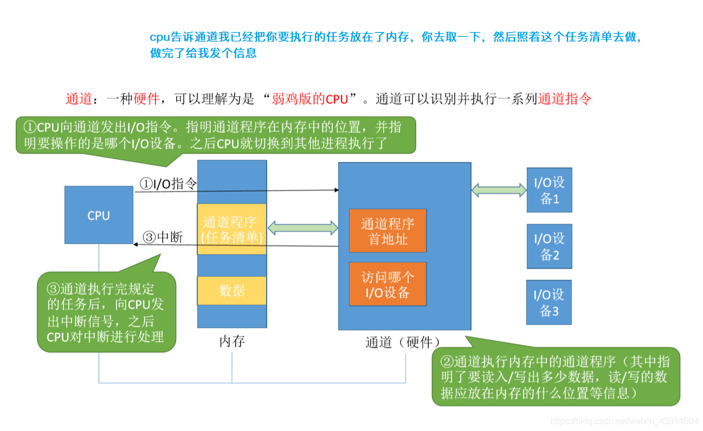

图9.通道控制方式

通道，是一种硬件，可以理解为弱化版的CPU，可以识别并执行一系列**通道指令**。

通道方式过程：

1. CPU向通道发出I/O指令，指明通道程序在内存中的位置、要操作的I/O设备。然后CPU可以切换到其他进程执行。
2. 通道执行内存中的通道程序，该通道程序中有读/写、数据大小、读/写位置、存放位置等信息。
3. 通道执行完成后，向CPU发出中断信号，由CPU来处理中断。

**一个通道，可以控制多个I/O控制器；一个I/O控制器，可以控制多个I/O设备。**

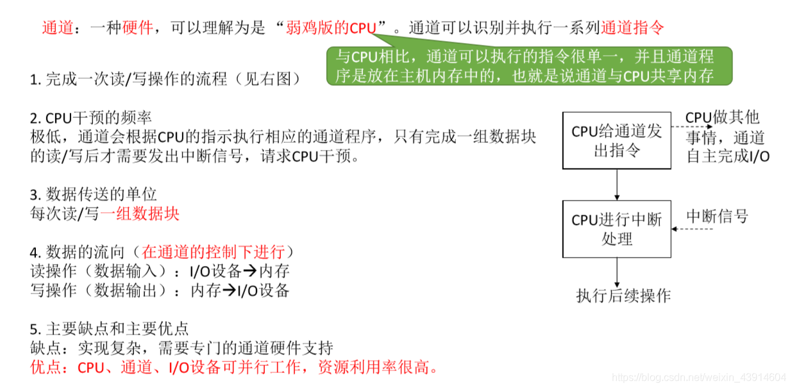

图10.通道控制方式的分析与优缺点

分析：

CPU干预I/O操作频率极低。
通道会按照CPU的指示执行相应的通道程序，只有完成一组数据块的读写后才发出中断信号，请求CPU干预。

每次读/写**一组数据块**。
注意，是一组，并不需要连续，因为在通道程序中指出需要传输的数据，所以可以不连续。

数据在通道的控制下进行，不需要经过CPU的寄存器。

优点：CPU、通道、I/O设备可以并行工作，资源利用率高。
缺点：实现复杂，需要专门的通道硬件支持。

## 五. 本节回顾

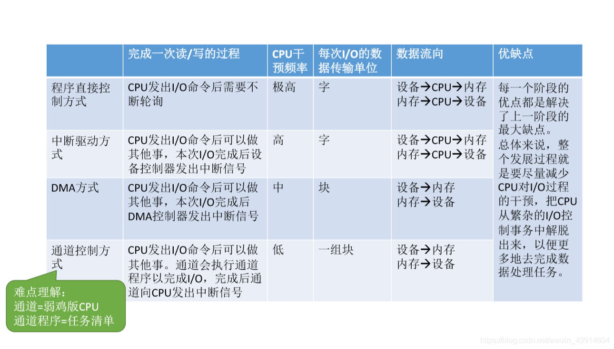

图11.本节回顾

顺带，之前闲着写的东西：

最开始，是CPU直接控制外部设备进行工作的，外部设备比如键盘、鼠标、U盘什么的。
但是呢，因为外部设备的运行速度比起CPU来说太慢了，CPU发出一个命令出去，要等很久才能够接收到反馈信号。

（DMA）
于是某一天，在CPU和外设之间，出现了一个中间装置。
此时的中间装置还很简单，只会跟着CPU照猫画虎，
CPU把需要控制外设执行的任务给它演示一遍，然后CPU就可以去干其他事了，由中间装置来慢慢地控制外设工作。

（I/O通道）
但是，这样的结构还是很慢，毕竟CPU每次都需要给它演示一遍这个任务要怎样怎样按步骤去做。
于是，CPU教会了它一些简单的操作，通过这些操作的排列组合，就可以完成不同的任务。
以后CPU就只用告诉它，你先用降龙十八掌四式，再用打狗棒法第八招......
这样就不用CPU每次都自己演示一遍了，省下了很多力气。

（I/O处理器）
再后来，CPU又教会了它更难的、更复杂的功能，现在暂且把这个中间装置给予名字"I/O处理机"。
随着时间的发展，I/O处理机学会了越来越多的东西，它的工作速度也越来越接近CPU，或者说一直以来，它与CPU越来越像了。
甚至某一天，I/O处理机达到了与CPU同样级别的运算速度。

在某些计算机中，如果CPU某天坏了，I/O处理机能够接替CPU，使得计算机继续运行下去。

这是一个什么样的故事呢。

2020.11.26