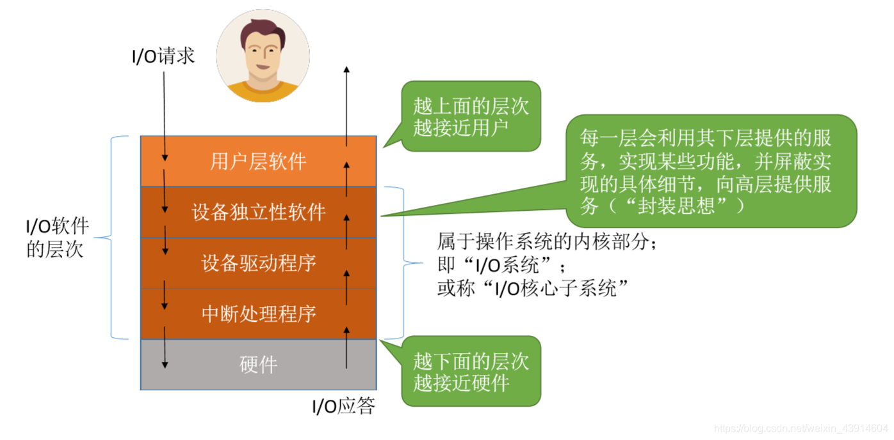
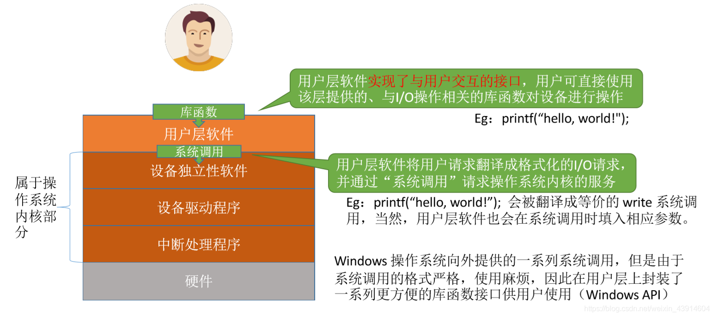
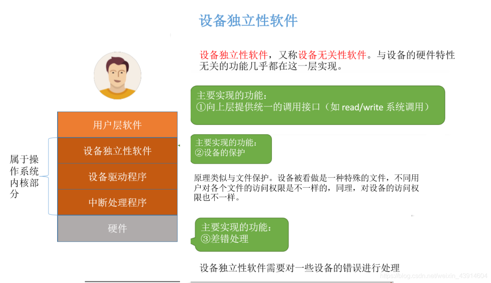
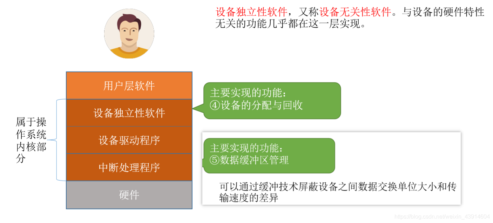
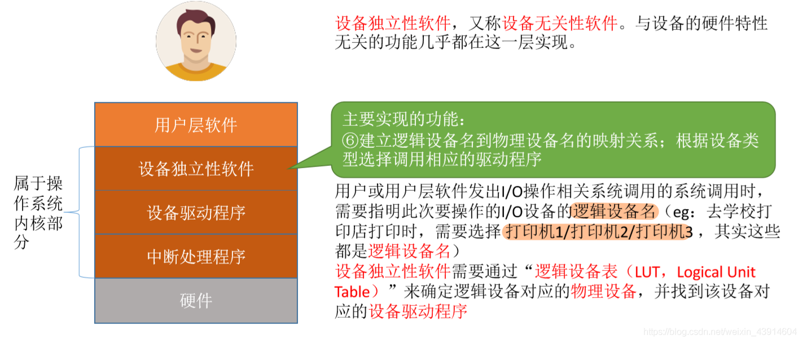
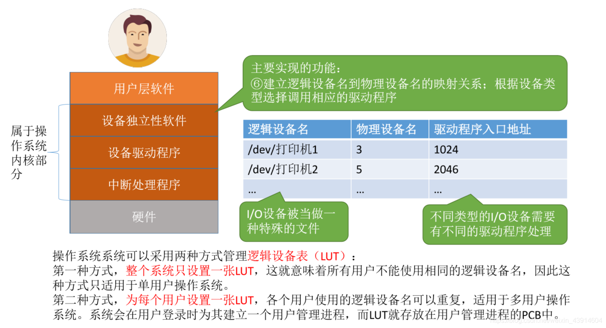
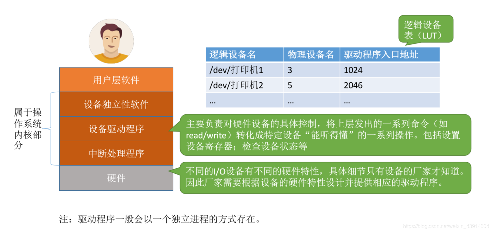
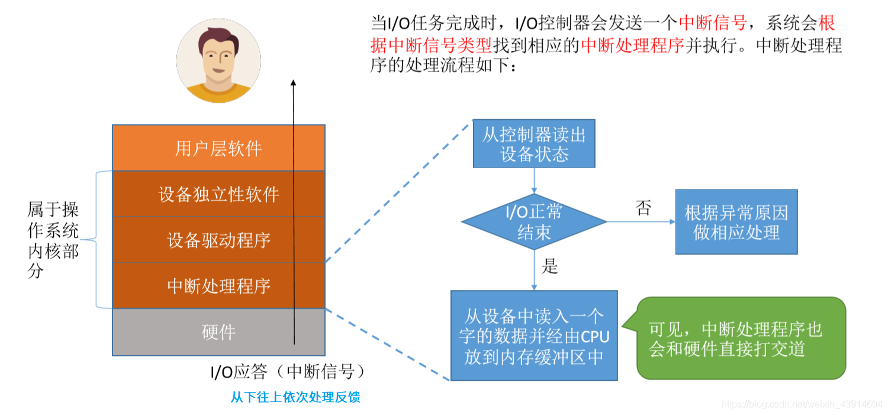
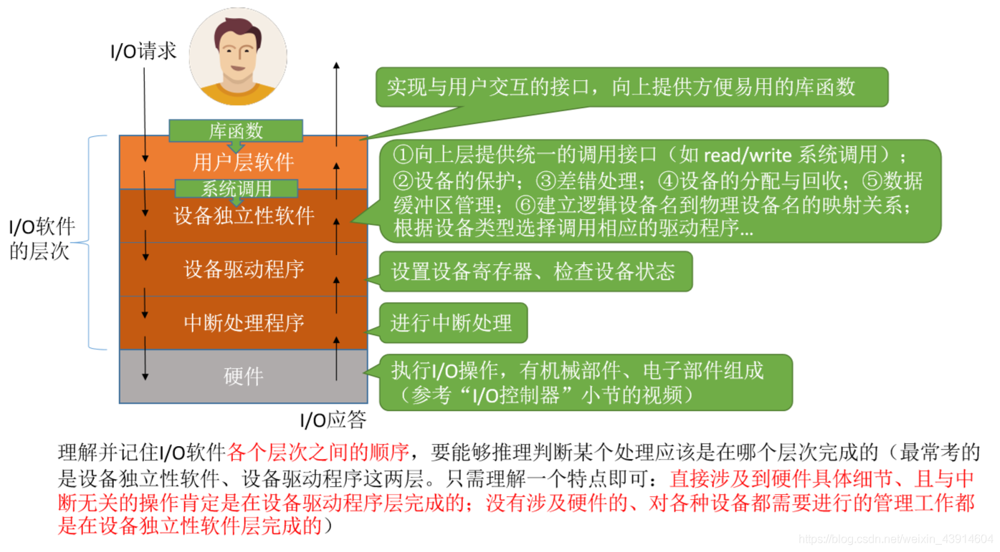

# I/O软件层次结构

图1.本节总览

I/O软件的层次中：浅橙色属于用户层部分；深橙色属于操作系统内核部分，称为"I/O系统"，"I/O核心子系统"。

每层会利用下层提供的服务来实现功能，为上层提供服务（封装的思想）。

## 一. 用户层软件

图2.用户层软件

用户层软件，向用户提供与用户交互的接口，用户可以直接使用该层提供的、与I/O操作相关的库函数对设备进行操作。

比如用户使用C语言中的printf()，用户层软件会将用户请求翻译为格式化的I/O请求，并通过系统调用请求操作系统内核的服务。

Windows操作系统向外提供了一系列系统调用，但是......太麻烦繁琐了，所以在用户层提供了一系列库函数接口供用户使用（Windows API）

## 二. 设备独立性软件

**设备独立性软件**，又称**设备无关性软件**，与设备的硬件特性无关的功能几乎都在这一层实现。

这一层主要实现六个功能：

图3.设备独立性软件

1. 向上一层提供统一的接口调用：

   比如read/write系统调用

2. 设备的保护：

   原理类似文件保护，设备被看作是一种特殊的文件，不同用户对各个设备的访问权限不一样。

3. 差错处理：

   设备独立性软件需要对设备的一些错误进行处理。

图4.设备独立性软件

4. 设备的分配与回收

5. 数据缓冲区管理：

   可以通过缓冲技术屏蔽设备之间数据交换单位大小和传输速度的差异。

图5.设备独立性软件

6. 建立逻辑设备名到物理设备名的映射关系；根据设备类型悬着调用相应的驱动程序：

   用户或用户层软件发出I/O操作相关系统调用的系统调用是，需要指明此次操作的I/O设备的**逻辑设备名**，比如打印机1/打印机2/打印机3......。
   设备独立性软件通过**逻辑设备表LUT**来确定逻辑设备对应的物理设备，并找到该设备对应的**设备驱动程序**。

### 逻辑设备表（LUT，Logical Unit Table）

图6.逻辑设备表

操作系统可以采用两种方式管理逻辑设备表LUT：

1. 整个系统只设置一张逻辑设备表LUT：

   意味着所有用户不能使用相同的逻辑设备名，所以只适用于单用户操作系统。

2. 为每个用户设置一张逻辑设备表LUT：

   各个用户使用的逻辑设备名可以重复，适用于多用户操作系统。
   操作系统会在用户登录时为其建立一个用户管理进程，LUT就在用户管理进程的PCB中。

## 三. 设备驱动程序

由于不同的设备，其设计可能不同，比如设备的电子部件（I/O控制器）中的数据寄存器数量不同，状态寄存器使用0表示就绪也可能是使用1表示就绪......

以及其内部硬件特性也不同，这就只有厂家才知道了。

所以需要厂家提供对应的设备驱动程序，CPU执行驱动程序的指令序列，来完成设置设备寄存器、检查设备状态等操作。

图7.设备驱动程序

设备驱动程序：

主要复杂对硬件设备的具体控制，将上一层的一系列指令（如read/write），转化为特定设备能听得懂的一系列操作。包括设备寄存器、检查设备状态等。

驱动程序一般会以一个独立进程的方式存在。

所以为什么逻辑设备表LUT不同设备单独一个表项，表项里还有驱动程序入口地址这一项。
因为不同设备的内部设计不同，所以驱动程序不同，单独一个表项，通过驱动程序入口地址来执行驱动程序。

## 四. 中断处理程序

图8.中断处理程序

当I/O任务完成时，I/O控制器发出一个中断信号，系统会根据中断信号的类型找到对应的中断处理程序并执行。

处理流程：

1. 从控制器读出设备状态
2. 判断I/O是否正常结束。
   有异常则根据异常原因做相应处理。
3. I/O正常结束，则从设备读入一个字的数据并经CPU放到内存缓冲区中。

I/O正常结束，数据放到内存缓冲区后，交由上一层设备驱动程序继续处理，设备驱动程序处理后，由交由上一层设备独立性软件继续处理，同样地最后是返回给用户。

## 五. 本节回顾

图9.本节回顾

不涉及硬件的：用户层软件、设备独立性软件。

直接涉及硬件，但与中断无关的：设备驱动程序。

直接涉及硬件，与中断有关的：中断处理程序。

2020.11.26