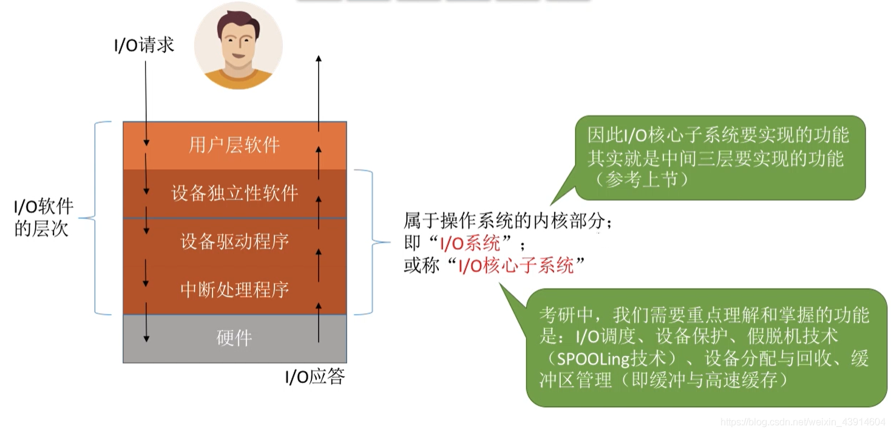
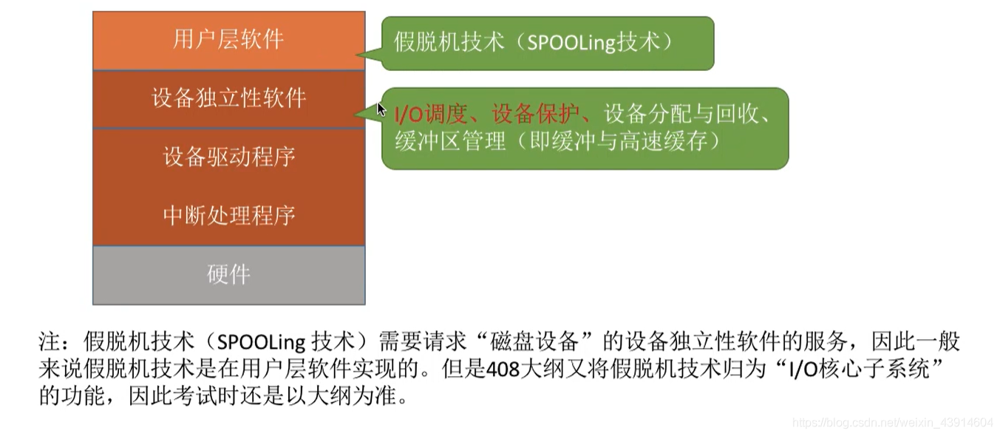
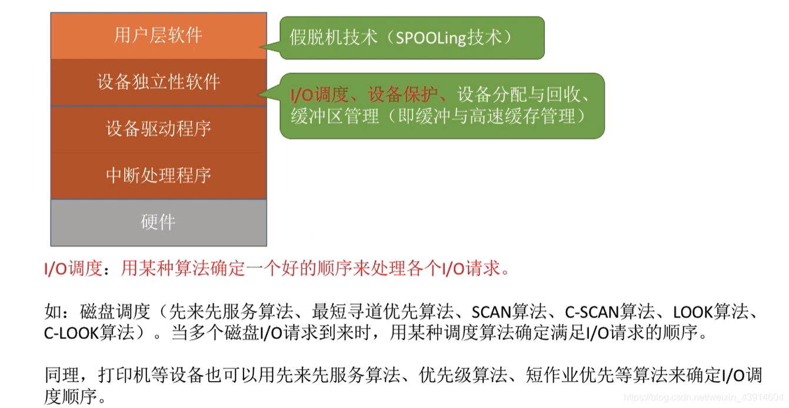
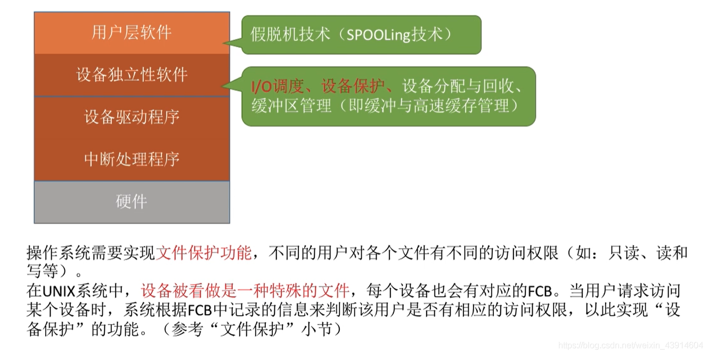

# I/O核心子系统

图1.本节总览

上一节讲的I/O软件的层次，其中属于操作系统内核部分的三层，称为"I/O系统"，或者"I/O核心子系统"。

所以学习I/O核心子系统的功能，也就是上一节中讲到的这三层需要实现的功能。

考研中重点就是：I/O调度、设备保护、假脱机技术（SPOOLing技术）、设备分配与回收、缓冲区管理（缓冲与告诉缓存）。

这节就简单介绍一下。

## 一. 实现的层次

图2.各个技术实现的层次

假脱机技术（SPOOLing技术）：用户层软件。

I/O调度、设备保护、设备分配与回收、缓冲区管理（缓冲与高速缓存）：设备独立性软件。

**注意：假脱机技术一般来说是在用户层软件实现的，但大纲中归为了I/O核心子系统的功能**。

I/O调度和设备保护与前面内容类似，所以简略提一下，后面三节讲假脱机技术、设备的分配与回收、缓冲区管理。

## 二. I/O调度

图3.I/O调度

I/O调度：用某种算法确定一个好的顺序来处理各个I/O请求。

类似磁盘调度算法，先来先服务、SCAN算法等等。

## 三. 设备保护

图4.设备保护

类似于文件保护。

特别的，在UNIX系统中，设备本就被看作是一种特殊的文件，每个设备也有对应的FCB。

当用户请求访问某个设备时，系统根据FCB中的信息判断该用户是否有相应的访问权限，以此实现设备保护功能。

2020.11.26
