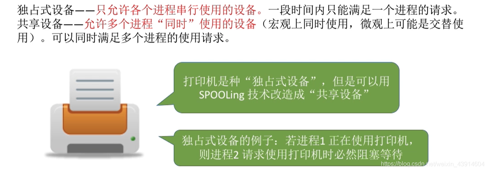

# 假脱机技术（SPOOLing技术）

## 一. 脱机输入/输出技术

图2.脱机输入/输出技术

在一开始讲过，为了解决纸带输入/输出的慢速与CPU高速的矛盾，在批处理阶段引入了外围控制机，通过外围控制机，讲纸带上的信息输入到磁带上，主机从磁带上读/写，提升运行速度。

而且，
即便CPU处于忙碌状态，外围控制机也能进行往磁带的输入；
即便慢速的输出设备正在运行，外围控制机也能进行往磁带的写出；
也就是并行运行嘛。

**脱机**，就是指输入/输出的操作脱离了主机控制进行。

原本纸带直接与主机交互，输入/输出，而像批处理阶段这样，输入/输出不再由主机控制进行。

## 二. 假脱机技术

**假脱机技术**，就是指用软件的方式来模拟脱机技术，
所以是"假"脱机技术。

### 2.1 输入井、输出井

图3.假脱机技术—输入井、输出井

系统在磁盘上开辟出两个存储区域：输入井、输出井。

输入井：模拟脱机输入时的磁带，用于收容I/O设备输入的数据。
输出井：模拟脱机输出时的磁带，用于收容用户进程输出的数据。

### 2.2 输入进程、输出进程

图4.假脱机技术—输入进程、输出进程

输入进程：模拟输入时的外围控制机。
输出进程：模拟输出时的外围控制机。

显然，要实现SPOOLing技术，**必须要有多道程序技术的支持**。
系统会建立输入进程和输出进程。

### 2.3 输入缓冲区、输出缓冲区

图5.假脱机技术—输入缓冲区、输出缓冲区

输入缓冲区：在输入进程的控制下，用于暂存输入设备输入的数据，之后再转存到输入井中。
输出缓冲区：在输出进程的控制下，用于暂存输出井送来的数据，之后再输出到输出设备上。

输入/输出缓冲区都是**在内存中**的缓冲区。

## 三. 假脱机技术的应用—共享打印机

图6.独占式设备、共享式设备

独占式设备：只运行各个进程串行使用的设备。一段时间只能满足一个进程的请求。
共享式设备：允许多个进程同时使用的设备（宏观上同时，微观上可能交替使用），可满足多个进程的使用请求。

图7.使用假脱机技术将独占式打印机改为共享式

用户进程提出打印请求，系统答应请求。
但并非真的把打印机分配给用户进程，而是由假脱机管理进程做：

1. 在磁盘输出井中为进程申请一个存储空间，并将要打印的数据传输到其中。
2. 为用户进程申请一张空白的打印请求表，并将用户的打印请求填入表中，将该表挂到**假脱机文件队列**上。

当打印机空闲时，输出进程会从文件队列的对头取出一张打印申请表，根据表中的信息，将要打印的数据从输出井传输到输出缓冲区，在传输到打印机进行打印。

图8.假脱机技术—打印机

这样，虽然只有一台打印机，但每个进程的打印申请，系统都会为其在输出井中分配一个存储空间，使得每个用户进程将要输出的数据输出到为其分配的存储空间中，从而使得每个用户进程都觉得自己独占了一台打印机，实现了对打印机的共享。

## 四. 本节回顾

图9.本节回顾

2020.11.26

