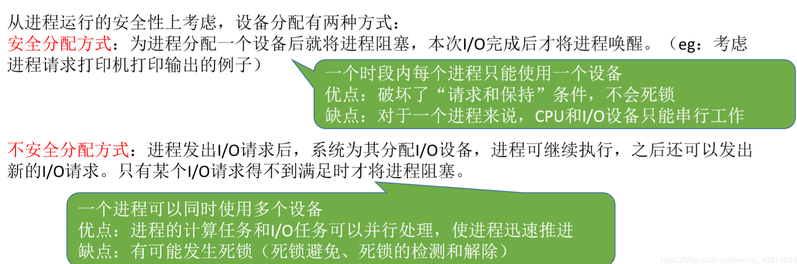
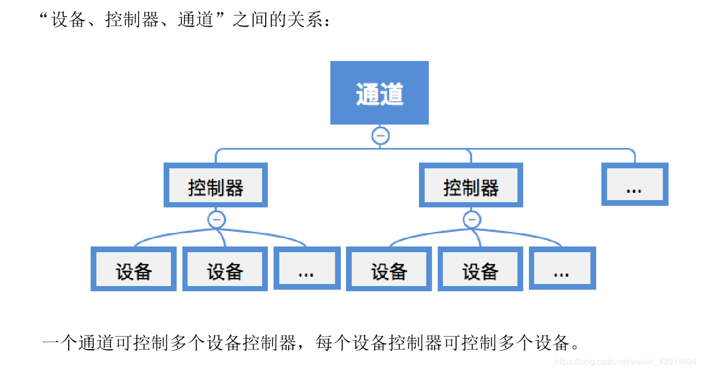
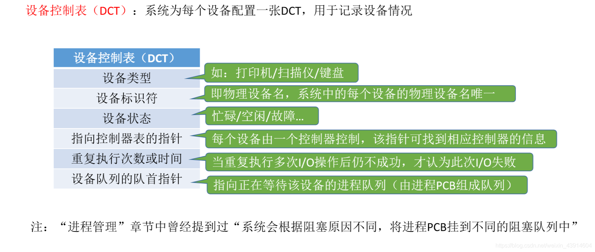
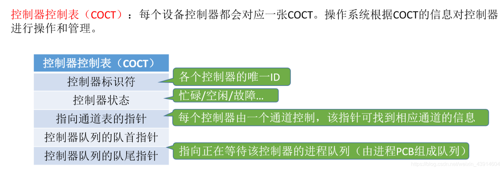
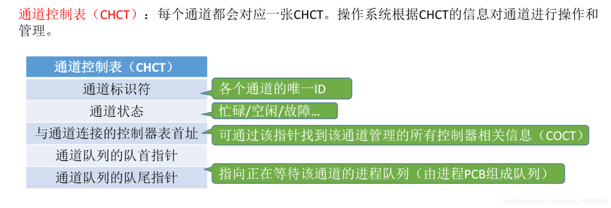
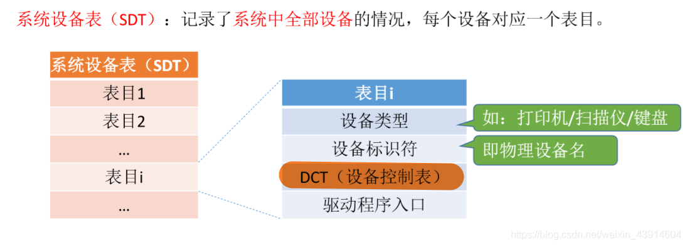
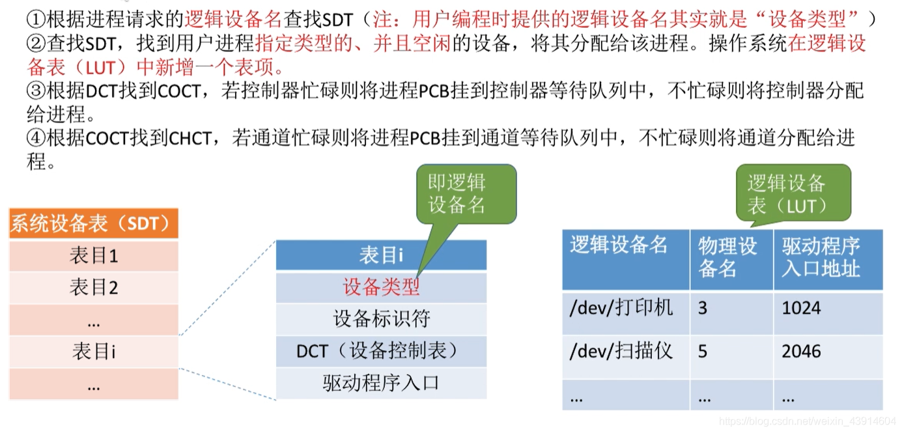
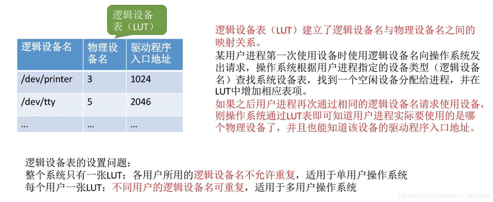
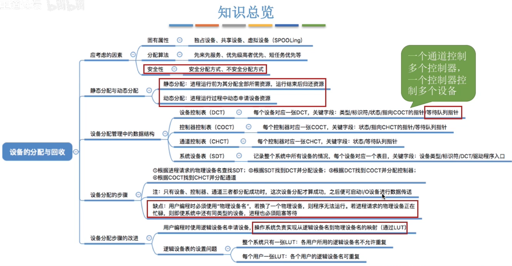

# 设备的分配与回收

图1.本节总览

## 一. 设备分配时考虑的因素

### 1.1 设备的固有属性

图3.固有属性

设备的固有属性分为：

1. 独占设备：一段时间只能分配给一个进程使用（如打印机）。
2. 共享设备：可同时分配给多个进程使用（如硬盘，可同时读）。
3. 虚拟设备：由SPOOLing技术将独占设备改造成虚拟的贡献设备（如共享打印机）。

### 1.2 设备分配算法

比如：

先来先服务
优先级高者优先
短任务优先
......

### 1.3 设备分配中的安全性

图4.安全性

安全性：

1. 安全分配方式：

   为进程分配一个设备后就将进程阻塞，本次I/O完成后才将进程唤醒。

   优点：破坏了"请求和保持"条件，不会死锁。
   缺点：对于一个进程来说，CPU和I/O设备只能串行工作。

2. 不安全分配方式：

   进程发出I/O请求后，系统为其分配I/O设备，进程可继续执行，之后还可以发出新的I/O请求。只有某个I/O请求得不到满足时才将进程阻塞。

   优点：进程的计算任务和I/O任务可以并行处理，使进程迅速推进。
   缺点：有可能发生死锁。

## 二. 静态分配与动态分配

图5.静态、动态分配

静态分配：进程运行前为其分配全部所需资源，运行结束后归还资源。（破坏了"请求和保持"条件，不会死锁。）

动态分配：进程运行过程中动态申请设备资源。（有可能死锁。）

## 三. 设备分配管理中的数据结构

图6.设备、控制器、通道之间的关系

一个通道可以控制多个设备控制器、一个设备控制器可以控制多个设备。

### 3.1 设备控制表DCT

图7.设备控制表DCT

设备队列的队首指针，指向正在等待该设备的进程队列（由进程PCB组成的队列）。

在进程管理中提到过，系统会根据阻塞原因不同，将进程PCB挂到不同阻塞队列中。

### 3.2 控制器控制表COCT

图8.控制器控制表COCT

### 3.3 通道控制表CHCT

图9.通道控制表CHCT

### 3.4 系统设备表SDT

图10.系统设备表SDT

系统设备表SDT：记录了**系统中全部设备**的情况，每个设备对于一个表目。

## 四. 设备分配的步骤

设备分配的步骤：

1. 根据进程请求的**物理设备名**，查找系统设备表SDT。

   物理设备名，是进程请求分配设备时提供的参数。

2. 根据系统设备表SDT找到设备控制表DCT，若设备忙碌则将进程PCB挂到**设备等待队列**中；不忙碌则将设备分配给进程。

3. 根据设备控制表DCT找到控制器控制表COCT，若控制器忙碌着将进程PCB挂到**控制器等待队列**中；不忙碌则将控制器分配给进程。

4. 根据控制器控制表COCT找到通道控制表CHCT，若通道忙碌着将进程PCB挂到**通道等待队列**中；不忙碌则将通道分配给进程。

只有设备、控制器、通道三者都分配成功，此次设备分配才算成功，之后便可启动I/O设备进行数据传送。

## 五. 设备分配步骤的改进方法

缺点：

1. 用户编程时必须使用物理设备名，底层细节对用户不透明，不方便编程。
2. 导致如果换了一个物理设备，则程序无法运行。
3. 导致就算有同类设备，而使用物理设备名请求的设备正在忙碌，进程也必须阻塞等待。

改进方法：
建立逻辑设备名与物理设备名的映射机制，用户编程时只需要提供逻辑设备名。
（实际上逻辑设备名也就是一个设备类型）

图11.改进后的设备分配步骤

改进后的设备分配步骤：

1. 根据进程请求的**逻辑设备名**，查找系统设备表SDT。

   注意这里进程请求分配设备时提供的是逻辑设备名了。

2. 根据系统设备表SDT，找到用户进程**指定类型的、并且空闲的**设备的设备控制表DCT，将设备分配给进程。

   **并在逻辑设备表LUT中新增一个表项**。

3. 根据设备控制表DCT找到控制器控制表COCT，若控制器忙碌着将进程PCB挂到**控制器等待队列**中；不忙碌则将控制器分配给进程。（一样的）

4. 根据控制器控制表COCT找到通道控制表CHCT，若通道忙碌着将进程PCB挂到**通道等待队列**中；不忙碌则将通道分配给进程。（一样的）

图12.逻辑设备表LUT

某用户进程第一次使用设备时，系统根据逻辑设备名，为其分配了一个同类型的、空闲的设备，在LUT中新增的相应表项。

此后，如果该用户进程再次通过相同的逻辑设备名请求使用设备，则操作系统通过LUT可以直到该用户进程要使用的是哪台物理设备了，也有该设备的驱动程序入口地址。

可见：
整个系统只有一张LUT：各个用户所用的逻辑设备名不允许重复，适用于单用户操作系统。
每个用户一张LUT：不同用户的逻辑设备名可重复，适用于多用户操作系统。

（毕竟都用一张LUT，重名的话，岂不是很混乱。我只分配给了进程A，结果进程B重名了也能用。）

## 六. 本节回顾

图13.本节回顾

2020.11.26