# 缓冲区管理

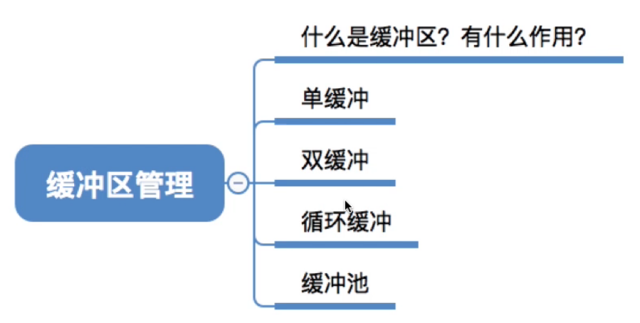

图1.本节总览

## 一. 缓冲区

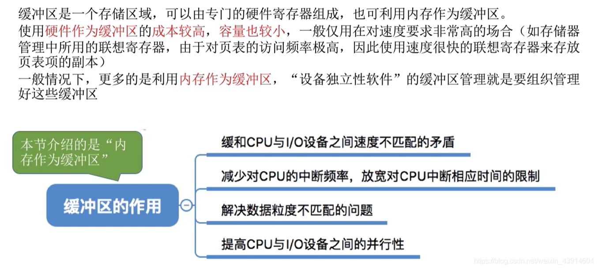

图2.缓冲区

缓冲区，本质就是一块存储区域。
一般情况下，使用**内存作为缓冲区**。

缓冲区的作用：

1. 缓和CPU和I/O设备之间速度不匹配的矛盾。

2. 减少对CPU的中断频率，放宽对CPU中断响应是时间的限制。

3. 解决数据粒度不匹配的问题。

   指进程每次生成一块数据，但每次只能输出一个字符的情况。

4. 提高CPU和I/O设备之间的并行性。

## 二. 单缓冲

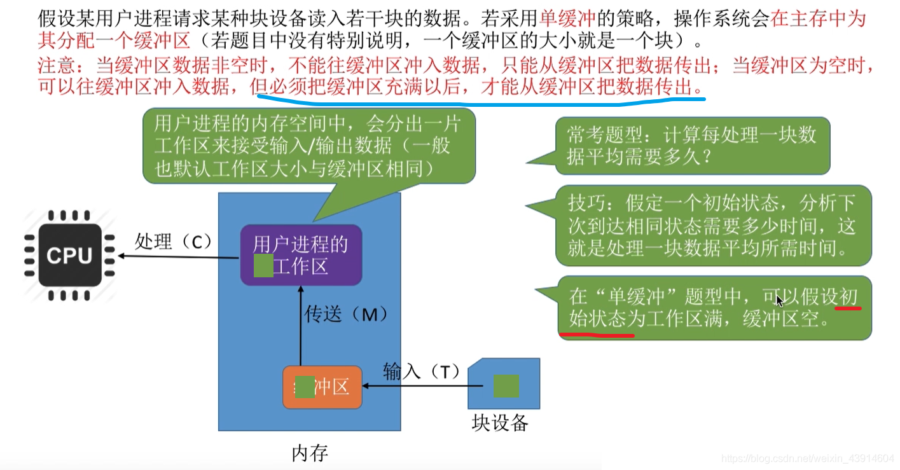

图3.单缓冲

单缓冲，进程只有一个缓冲区。

操作系统为进程在主存中分配一个缓冲区。（无特殊说明，一个缓冲区大小就是一个块）
在用户进程的内存空间中，也会分出一个工作区（一般默认工作区大小与缓冲区大小相同）。

注意的是：
当缓冲区非空时，不能往缓冲区冲入数据，只能从缓冲区把数据传出。
当缓冲区为空时，可以往缓冲区冲入数据，当必须把缓冲区充满后，才能从缓冲区把数据传出。

常考题型，计算每处理一块数据平均时间需要多久。

我们假设初始状态为**工作区满，缓冲区空**，计算下一次达到同样状态的时间：

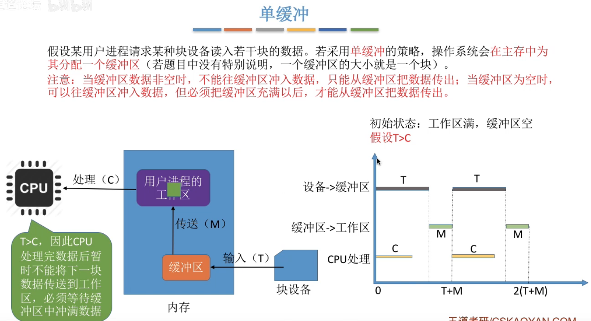

图4.T大于C时

当输入设备输入到缓冲区用时，大于，工作区数据传给CPU用时的情况：

分析：

0 时刻，工作区数据传到CPU，输入设备数据传入缓冲区。

C 时刻，工作区到CPU传输完成，输入设备到缓冲区未完成。

T 时刻，输入设备到缓冲区完成，缓冲区到工作区传输开始。

T+M 时刻，缓冲区到工作区传输完成。

平均用时：T+M。

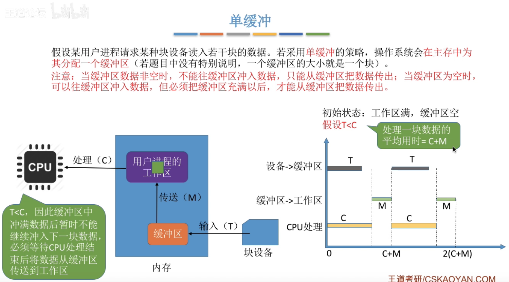

图5.T小于C时

当输入设备输入到缓冲区用时，小于，工作区数据传给CPU用时的情况：

分析：

0 时刻，工作区数据传到CPU，输入设备数据传入缓冲区。

T 时刻，工作区到CPU传输未完成，输入设备到缓冲区完成。

C 时刻，工作区到CPU传输完成，缓冲区到工作区传输开始。

C+M 时刻，缓冲区到工作区传输完成。

平均用时：C+M。

**总结：单缓冲，处理一个数据块的平均用时：max{T,C}+M。**

## 三. 双缓冲

双缓冲，用户进程有两个缓冲区，仍然只有一个工作区。

常考题型，计算每处理一块数据平均需要多久。

我们假设初始状态为**工作区空，缓冲区一满一空**，计算下一次达到同样状态的时间：

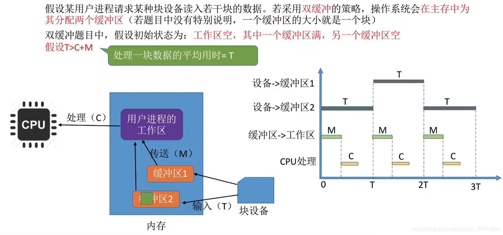

图6.T大于C+M时

当输入设备输入到缓冲区用时，大于，工作区数据传给CPU+缓冲区传给工作区用时的情况：

分析：

0 时刻，缓冲区1传给工作区开始，输入设备传给缓冲区2开始。

M 时刻，缓冲区1传给工作区完成，工作区传给CPU开始，输入设备传给缓冲区2未完成。

M+C 时刻，工作区到CPU传输完成，输入设备到缓冲区2未完成。

T 时刻，输入设备到缓冲区2完成，缓冲区2到工作区传输开始。

平均用时：T。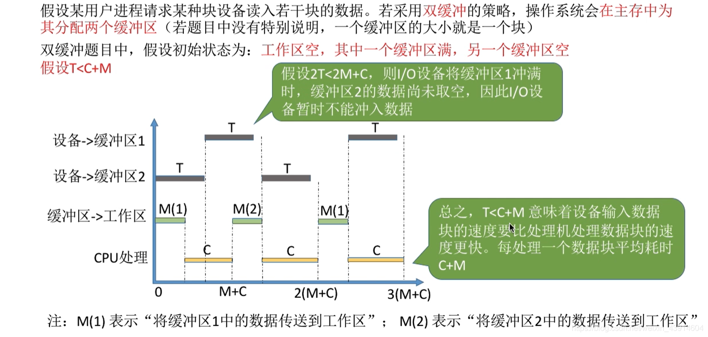

图7.T小于C+M时

当输入设备输入到缓冲区用时，小于，工作区数据传给CPU+缓冲区传给工作区用时的情况：

分析：

0 时刻，缓冲区1传给工作区开始，输入设备传给缓冲区2开始。

M 时刻，缓冲区1传给工作区完成，工作区传给CPU开始，输入设备传给缓冲区2未完成。

T 时刻，工作区传给CPU未完成，输入设备传给缓冲区2完成，输入设备传给缓冲区1开始。

M+C 时刻，工作区传给CPU完成，缓冲区2传给工作区开始，输入设备传给缓冲区1未完成。

平均用时：M+C。

**总结：双缓冲，处理一个数据块的平均用时：max{T,C+M}。**

## 四. 单缓冲与双缓冲，通信时的区别

两台机器通信时，可以配置缓冲区用于数据的发送和接收。

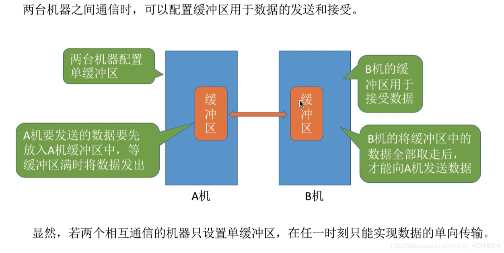

图8.单缓冲通信

显然两台互相通信的机器只设置单缓冲区，则在任一时刻只能实现数据的单向传输。

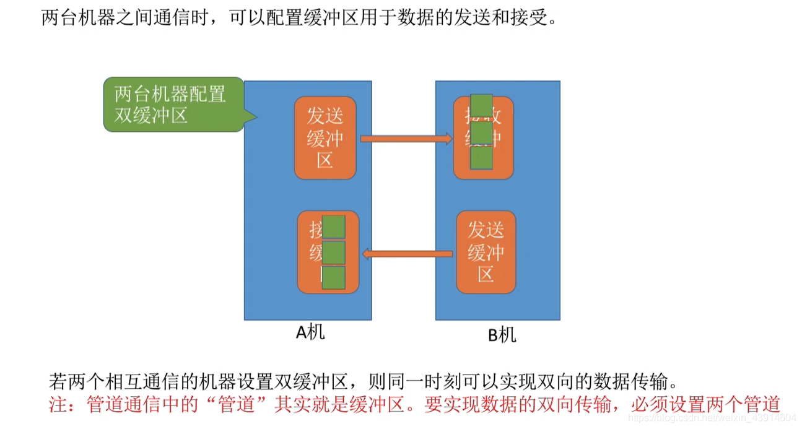

图9.双缓冲通信

而两台机器都设种子双缓冲区，则同一时刻可以实现双向的数据传输。

（管道通信中的管道其实就是缓冲区，要实现数据的双向传输，必须设置两个管道。）

## 五. 循环缓冲

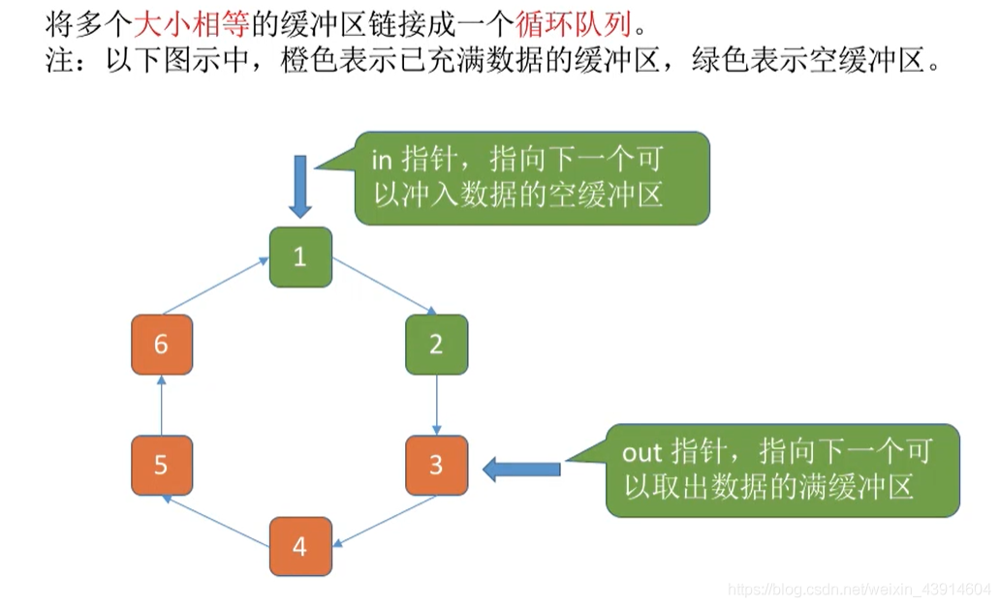

图10.循环缓冲

由多个大小相等的缓冲区链接成一个循环队列。

in指针，指向下一个可以冲入数据的空缓冲区。
out指针，指向下一个可以取出数据的满缓冲区。

## 六. 缓冲池

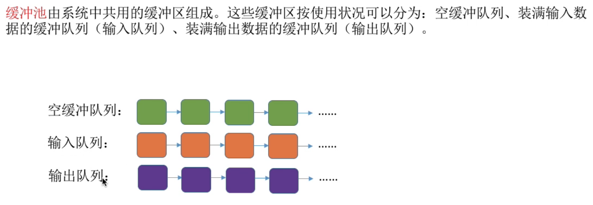

图11.缓冲队列

将系统中的缓冲区根据使用状态，分为：空缓冲队列，输入缓冲队列（装满输入数据），输出缓冲队列（装满输出数据）。

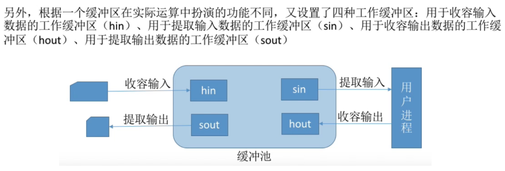

图12.缓冲池

每次按照用户进程需要使用的状态的缓冲区，从队列中取出，放入缓冲池。

根据缓冲区在实际运算中扮演的功能不同，又分为：
用于收容输入数据的工作缓冲区hin；
用于提取输入数据的工作缓冲区sin；
用于收容输出数据的工作缓冲区hout；
用于提取输出数据的工作缓冲区sout。

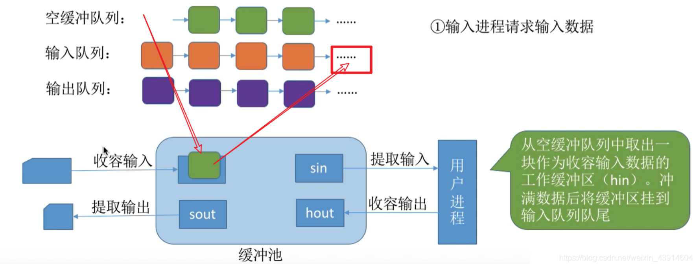

图13.接收输入设备的数据

当输入进程请求输入数据时，从空缓冲队列中取出一块缓冲区作为hin，充满数据后挂到输入队列队尾。

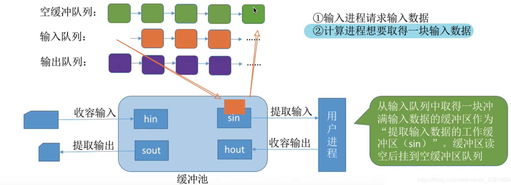

图14.用户进程提取数据

当计算进程想要取得一块输入数据时，从输入队列中取出一块缓冲区作为sin，读空数据后挂到空缓冲队列。

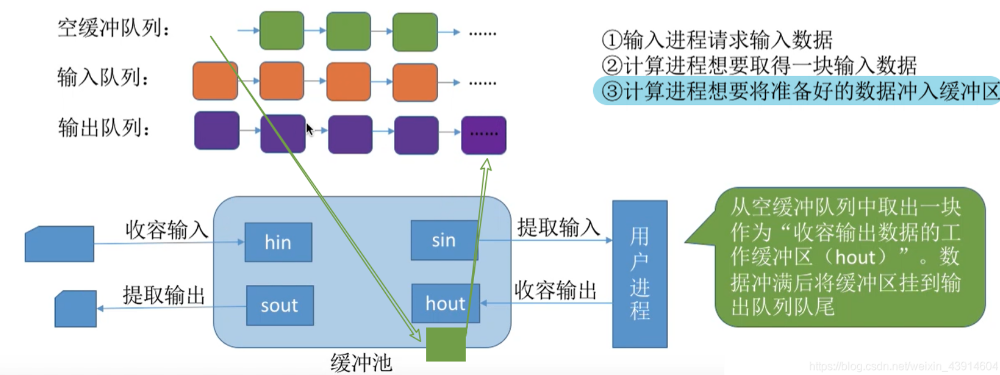

图15.用户进程输出数据

当计算进程想要将准备好的数据冲入缓冲区时，从空缓冲队列中取出一块缓冲区作为hout，冲满数据后挂到输出队列。

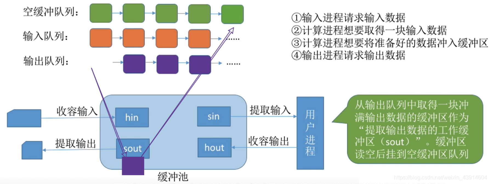

图16.对外部设备输出数据

当输出进程请求输出数据时，从输出队列中取出一块缓冲区作为sout，读空数据后挂到空缓冲队列。

## 七. 本节回顾

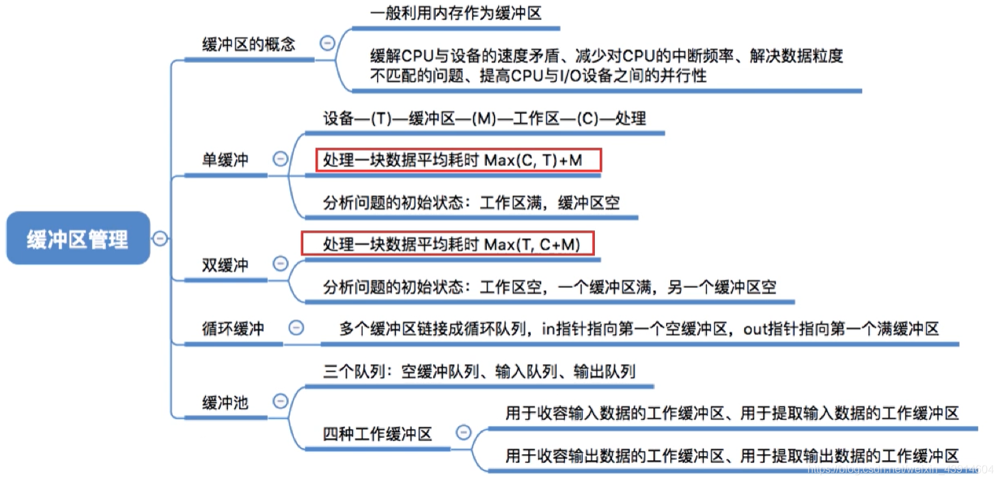

图17.本节回顾

2020.11.27

