# 操作系统的概念、功能和目标

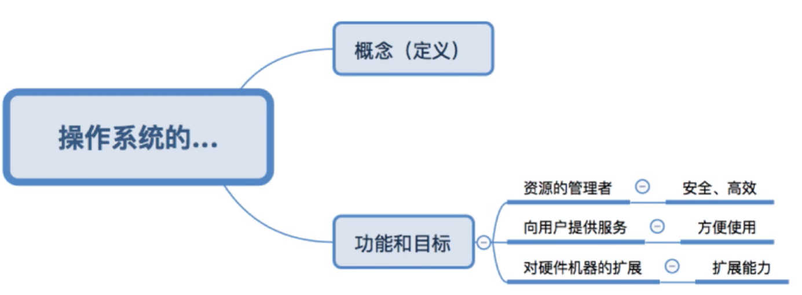

图1.本节总览

这一节，讲操作系统的概念（定义），以及操作系统的功能与目标。

## 一. 操作系统的概念

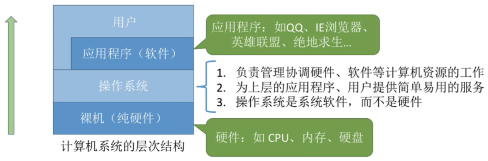

图2.操作系统中的计算机系统层次

注意，这里与<计算机组成原理>中划分的层次不同。

从图中可以看出

1. 操作系统负责管理协调硬件、软件等计算机资源的工作。
2. 操作系统为上层的应用程序、用户提供简单易用的服务。
3. 操作系统是系统**软件**不是硬件。

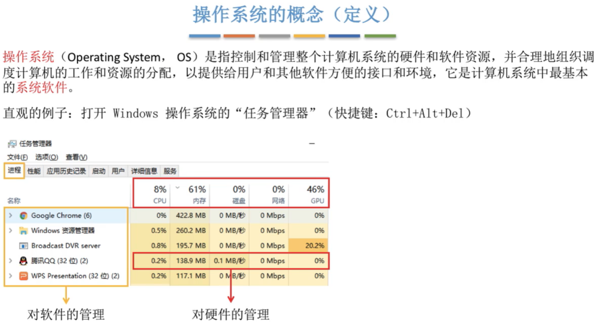

图3.操作系统的概念（定义）

综上，可以总结出操作系统的定义：

**操作系统**（Operating System，OS），是指控制和管理整个计算机系统的硬件和软件资源，并合理地组织调度计算机工作和资源的分配，以提供用户和其他软件方便的接口和环境，它是计算机系统中最基本的**系统软件**。

打开任务管理器就可以看到，操作系统管控着软件、硬件。

## 二. 操作系统的功能与目标

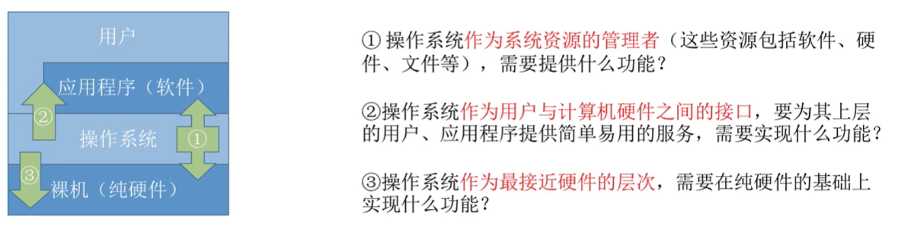

接着思考，操作系统那么重要，那么它应该具有什么样的功能呢。

可拆分成三个方面来分析：

1. 操作系统-应用程序：作为系统资源的管理者，
2. 操作系统-用户：作为用户与计算机硬件之间的接口，
3. 操作系统-裸机：作为最接近硬件的层次，

那么这三个方面各自需要什么样的功能。

### 2.1 操作系统-应用程序：作为系统资源的管理者

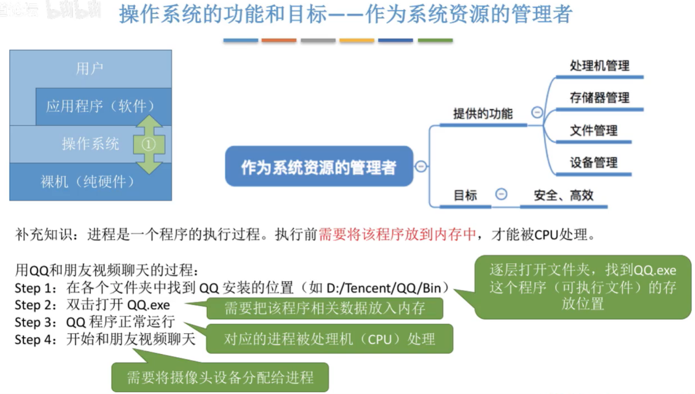

图5.操作系统-应用程序

先补充概念，**进程**，是一个程序的执行过程。执行前需要将该程序放入内存中，才能被CPU处理。

1. 文件管理：

   文件是以计算机硬盘为载体的存储在计算机上的信息集合。在用户进行输入/输出的时候，以文件为基本单位。这些文件的存储，读写等，需要操作系统来管理。

2. 存储器管理：

   指对内存的管理，简单的说就是在<计算机组成原理>中学过，不可能把所有程序及其要用到的数据都调入内存，所以设及到内存管理。

3. 处理机管理：

   对于进程如何管理，尤其是同时运行多个进程时。

4. 设备管理：

   主要完成用户的I/O请求，方便用户使用各种设备，并提高设备的利用率。

这四个方面的管理，就是后面会分为四个章节来学习，也就是操作系统的内容（考研范围）。

### 2.2 操作系统-用户：作为用户与计算机硬件之间的接口

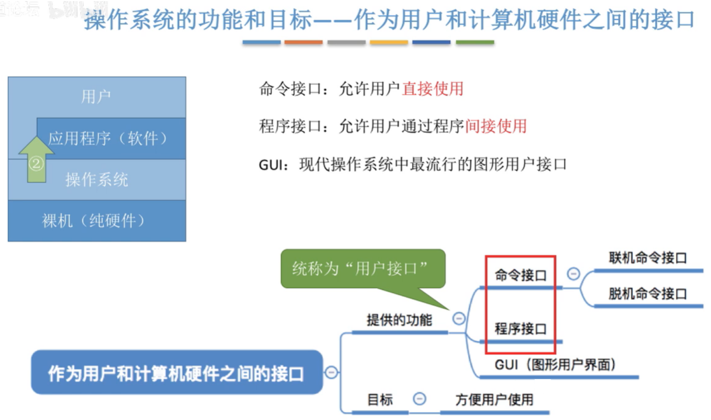

图6.操作系统-用户

为了让用户方便、快捷、可靠地操纵计算机硬件并运行自己的程序，操作系统提供了用户接口和GUI（图形用户界面），用于与用户通信：
$$
\begin{cases}用户接口\begin{cases}命令接口\begin{cases}联机命令接口\\脱机命令接口\end{cases}\\程序接口\end{cases}\\GUI(图形用户界面)\end{cases}
$$

#### 2.2.1 用户接口-命令接口

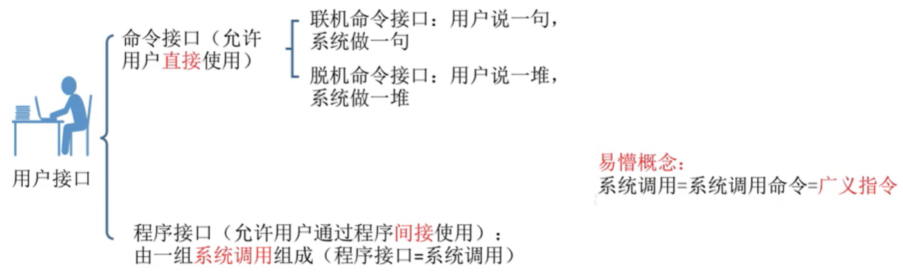

图7.命令接口

命令接口，分为联机命令接口和脱机命令接口。
是用户可以**直接使用**的。

程序接口，是一组系统调用组成。
用户只能**间接使用**。

系统调用，又称广义指令。

##### 2.2.1.1 联机命令接口

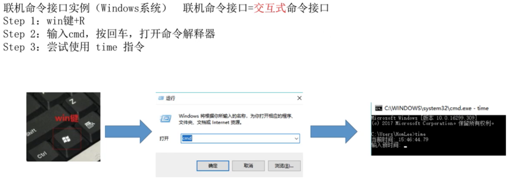

图8.联机命令接口

**联机命令接口**，又称**交互式命令接口**。

特点为，用户每输入一条命令，控制权就转给操作系统的命令解释程序，然后由命令解释程序解释并执行输入的命令，完成指定的功能后，控制权转会控制台或终端，此时用户又可以输入下一条命令。

如图8打开CMD，输入time查看时间，命令执行完毕，显示了时间后，用户才又可以输入下一条命令。

##### 2.2.1.2 脱机命令接口

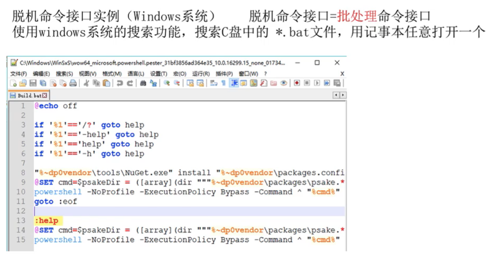

图9.脱机命令接口

**脱机命令接口**，又称**批处理命令接口**。

用户事先先用相应的作业控制命令写成一份作业操作说明书，连通作业一提交给操作系统，操作系统调度到该作业时，由系统中的命令解释程序逐条解释执行作业说明书上的命令。

说的这么复杂，起始就是把命令写在一个文件里，比如.bat文件，然后操作系统依次逐条解释执行。

#### 2.2.2 用户接口-程序接口

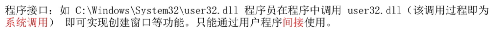

图10.程序接口

程序接口，是由一系列**系统调用**组成。用户是无法直接使用的，而是用户通过在程序中使用这些系统调用来请求操作系统为其服务。
所以是**间接使用**的。

比如常见到的dll文件。

#### 2.2.3 GUI

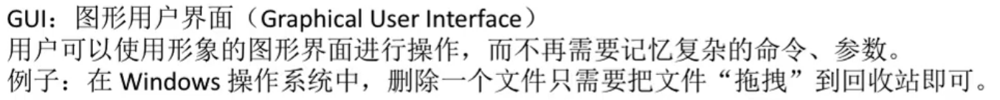

图11.GUI

GUI图形用户界面。

就是通过图标来进行操作。

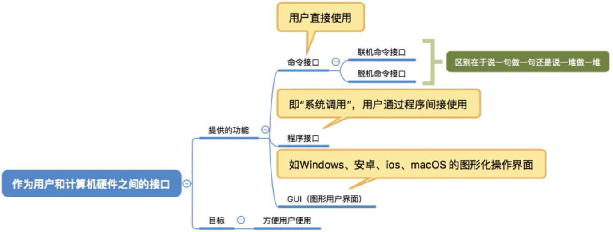

图12.总结一下

把2.3操作系统-用户，总结一下。

### 2.3 操作系统-裸机：作为最接近硬件的层次

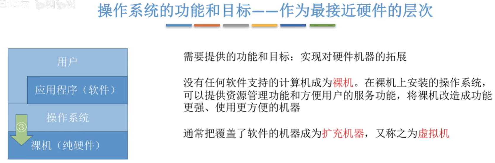

图13.操作系统-裸机

**裸机**，指没有任务软件支持的计算机。

通常把覆盖了软件的机器称为扩充机器，又称为虚拟机。

在裸机上安装操作系统，就可以提供资源管理功能和方便用户的服务功能，将逻辑改造称功能更强调、使用更方便的机器。

## 三. 本节回顾

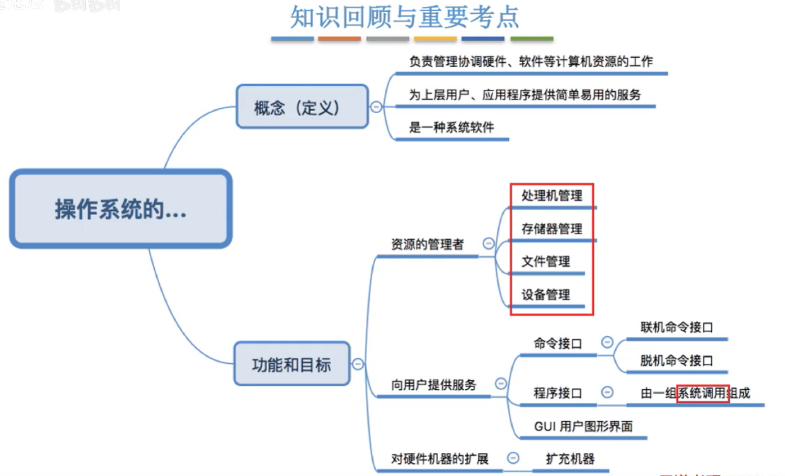

图14.本节回顾

本课程主要关注的是操作系统作为资源的管理者，其处理机管理、存储器管理、文件管理、设备管理的功能。
后面也是对这四个功能进行分章节学习。

而后面对用户、对硬件的功能，有个印象就行。
倒是系统调用在考研选择题出现频率比较高，还是记一下。

2020.09.28

